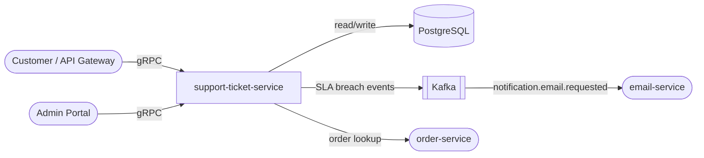

# support-ticket-service

> Customer support ticketing with SLA tracking, agent assignment, and priority queuing.

## Overview

The support-ticket-service is the central hub for customer support operations. It manages the full ticket lifecycle from submission through resolution, enforcing SLA deadlines and routing tickets to available agents based on category and skill tags. Breach alerts are published to Kafka so dashboards and on-call workflows can react in real time.

## Architecture



## Tech Stack

| Component | Technology |
|---|---|
| Language | Java 21 |
| Framework | Spring Boot 3, Spring Data JPA |
| Database | PostgreSQL |
| Migrations | Flyway |
| gRPC | grpc-java / spring-grpc |
| Message Broker | Kafka (Spring Kafka) |
| Containerization | Docker |

## Responsibilities

- Create, update, and close support tickets
- Assign priority levels: `LOW`, `MEDIUM`, `HIGH`, `CRITICAL`
- Track SLA deadlines per priority tier and flag breaches
- Assign tickets to agents manually or via round-robin auto-assignment
- Record internal notes and customer replies as a threaded conversation
- Emit SLA breach events for real-time alerting
- Link tickets to orders or products for context
- Support ticket tagging and category taxonomy

## API / Interface

gRPC service: `SupportTicketService` (port 50125)

| Method | Request | Response | Description |
|---|---|---|---|
| `CreateTicket` | `CreateTicketRequest` | `Ticket` | Submit a new support ticket |
| `GetTicket` | `GetTicketRequest` | `Ticket` | Fetch a ticket with conversation thread |
| `UpdateTicket` | `UpdateTicketRequest` | `Ticket` | Update status, priority, or category |
| `AssignTicket` | `AssignTicketRequest` | `Ticket` | Assign ticket to an agent |
| `AddReply` | `AddReplyRequest` | `TicketReply` | Add a reply (customer or agent) |
| `CloseTicket` | `CloseTicketRequest` | `Ticket` | Mark ticket as resolved/closed |
| `ListTickets` | `ListTicketsRequest` | `ListTicketsResponse` | Paginated ticket list (agent view) |
| `ListMyTickets` | `ListMyTicketsRequest` | `ListTicketsResponse` | Customer's own tickets |

## Kafka Topics

| Topic | Direction | Description |
|---|---|---|
| `customerexperience.ticket.created` | Publishes | Fired on new ticket creation |
| `customerexperience.ticket.sla_breached` | Publishes | Fired when SLA deadline is missed |
| `customerexperience.ticket.resolved` | Publishes | Fired when ticket is closed |
| `notification.email.requested` | Publishes | Sends ticket confirmation / agent reply emails |

## Dependencies

Upstream (callers)
- `api-gateway` — customer-facing ticket submission and status checks
- `admin-portal` — agent workbench for managing and replying to tickets

Downstream (calls)
- `order-service` — links tickets to order context
- `user-service` — looks up customer profile for ticket enrichment
- `notification-orchestrator` / Kafka — sends email notifications on ticket events

## Environment Variables

| Variable | Default | Description |
|---|---|---|
| `SERVER_PORT` | `50125` | gRPC server port |
| `SPRING_DATASOURCE_URL` | `jdbc:postgresql://localhost:5432/support` | PostgreSQL JDBC URL |
| `SPRING_DATASOURCE_USERNAME` | `support` | DB username |
| `SPRING_DATASOURCE_PASSWORD` | _(secret)_ | DB password |
| `SPRING_KAFKA_BOOTSTRAP_SERVERS` | `localhost:9092` | Kafka broker list |
| `ORDER_SERVICE_ADDR` | `order-service:50082` | gRPC address for order-service |
| `USER_SERVICE_ADDR` | `user-service:50061` | gRPC address for user-service |
| `SLA_HIGH_HOURS` | `4` | SLA deadline for HIGH priority tickets |
| `SLA_CRITICAL_HOURS` | `1` | SLA deadline for CRITICAL priority tickets |
| `SLA_MEDIUM_HOURS` | `24` | SLA deadline for MEDIUM priority tickets |
| `SLA_LOW_HOURS` | `72` | SLA deadline for LOW priority tickets |
| `LOG_LEVEL` | `INFO` | Logging verbosity |

## Running Locally

```bash
docker-compose up support-ticket-service
```

## Health Check

`GET /healthz` → `{"status":"ok"}`
