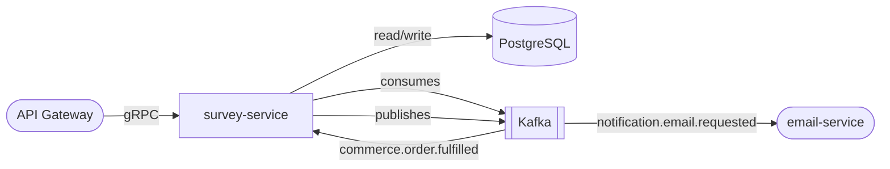

# survey-service

> NPS surveys, feedback forms, and structured response collection with analytics.

## Overview

The survey-service manages the full lifecycle of customer surveys including Net Promoter Score (NPS) campaigns, post-checkout forms, and ad-hoc feedback questionnaires. It provides a flexible question schema supporting multiple answer types and tracks response completion rates. Survey triggers can be event-driven (e.g., 7 days after order delivery) or manually launched by the operations team.

## Architecture



## Tech Stack

| Component | Technology |
|---|---|
| Language | Node.js |
| Framework | Express + gRPC (@grpc/grpc-js) |
| Database | PostgreSQL |
| ORM | Prisma |
| Message Broker | Kafka (KafkaJS) |
| Containerization | Docker |

## Responsibilities

- Create and manage survey definitions with multiple question types (NPS, rating scale, multiple choice, free text)
- Distribute surveys via triggered Kafka events or manual invitations
- Collect and persist responses with user attribution (optional anonymous mode)
- Compute NPS score, response rate, and per-question aggregate statistics
- Support survey versioning — keep historical responses linked to the correct version
- Allow responses to be linked to order IDs or product IDs for contextual analysis
- Enforce one-response-per-user-per-survey rules

## API / Interface

gRPC service: `SurveyService` (port 50129)

| Method | Request | Response | Description |
|---|---|---|---|
| `CreateSurvey` | `CreateSurveyRequest` | `Survey` | Define a new survey |
| `UpdateSurvey` | `UpdateSurveyRequest` | `Survey` | Update a draft survey |
| `PublishSurvey` | `PublishSurveyRequest` | `Survey` | Activate a survey for distribution |
| `GetSurvey` | `GetSurveyRequest` | `Survey` | Fetch survey definition |
| `SubmitResponse` | `SubmitResponseRequest` | `SurveyResponse` | Submit a completed response |
| `GetResults` | `GetResultsRequest` | `SurveyResults` | Aggregate results and NPS score |
| `ListResponses` | `ListResponsesRequest` | `ListResponsesResponse` | Paginated raw responses |
| `CloseSurvey` | `CloseSurveyRequest` | `Survey` | Stop accepting responses |

## Kafka Topics

| Topic | Direction | Description |
|---|---|---|
| `commerce.order.fulfilled` | Consumes | Triggers post-purchase NPS survey invitation |
| `notification.email.requested` | Publishes | Sends survey invitation emails |
| `customerexperience.survey.completed` | Publishes | Fired when a response is submitted |

## Dependencies

Upstream (callers)
- `api-gateway` — exposes survey submission endpoint to customers
- `admin-portal` — survey creation and results dashboard

Downstream (calls)
- `notification-orchestrator` / Kafka — sends survey invitation emails
- `order-service` — links survey responses to specific orders

## Environment Variables

| Variable | Default | Description |
|---|---|---|
| `PORT` | `50129` | gRPC server port |
| `DATABASE_URL` | `postgresql://localhost:5432/surveys` | PostgreSQL connection string |
| `KAFKA_BROKERS` | `localhost:9092` | Comma-separated Kafka broker list |
| `KAFKA_GROUP_ID` | `survey-service` | Kafka consumer group |
| `NPS_TRIGGER_DELAY_DAYS` | `7` | Days after fulfillment to send NPS survey |
| `SURVEY_RESPONSE_TTL_DAYS` | `365` | Days to retain raw responses |
| `ANONYMOUS_RESPONSES` | `false` | Allow anonymous survey submissions |
| `LOG_LEVEL` | `info` | Logging verbosity |

## Running Locally

```bash
docker-compose up survey-service
```

## Health Check

`GET /healthz` → `{"status":"ok"}`
