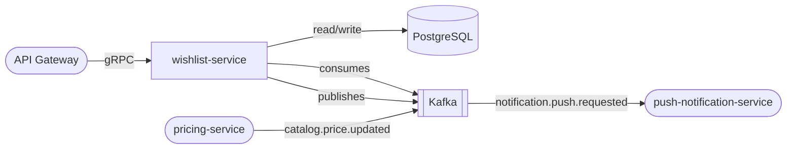

# wishlist-service

> User wishlists with multi-list support, public sharing, and price-drop notifications.

## Overview

The wishlist-service lets authenticated users curate named wishlists of products and share them publicly via a unique link. It monitors price changes for wishlisted items and publishes price-drop events that trigger user notifications. Multiple wishlists per user are supported, and items can be moved between lists.

## Architecture



## Tech Stack

| Component | Technology |
|---|---|
| Language | Go |
| Framework | gRPC (google.golang.org/grpc) |
| Database | PostgreSQL |
| Migrations | golang-migrate |
| Message Broker | Kafka (confluent-kafka-go) |
| Containerization | Docker |

## Responsibilities

- Create, rename, and delete wishlists per user
- Add and remove products from wishlists
- Enforce per-user wishlist and item count limits
- Generate shareable public links for wishlists
- Consume `catalog.price.updated` events to detect price drops on wishlisted items
- Publish price-drop notifications to the communications pipeline
- Expose a "move item" operation between wishlists

## API / Interface

gRPC service: `WishlistService` (port 50122)

| Method | Request | Response | Description |
|---|---|---|---|
| `CreateWishlist` | `CreateWishlistRequest` | `Wishlist` | Create a named wishlist |
| `ListWishlists` | `ListWishlistsRequest` | `ListWishlistsResponse` | All wishlists for a user |
| `GetWishlist` | `GetWishlistRequest` | `Wishlist` | Fetch wishlist with items |
| `DeleteWishlist` | `DeleteWishlistRequest` | `Empty` | Delete a wishlist |
| `AddItem` | `AddItemRequest` | `WishlistItem` | Add a product to a wishlist |
| `RemoveItem` | `RemoveItemRequest` | `Empty` | Remove a product from a wishlist |
| `MoveItem` | `MoveItemRequest` | `WishlistItem` | Move item between wishlists |
| `ShareWishlist` | `ShareWishlistRequest` | `ShareResponse` | Generate a public share URL |
| `GetSharedWishlist` | `GetSharedWishlistRequest` | `Wishlist` | Fetch a wishlist by share token |

## Kafka Topics

| Topic | Direction | Description |
|---|---|---|
| `catalog.price.updated` | Consumes | Detects price drops on wishlisted items |
| `notification.push.requested` | Publishes | Triggers price-drop push notification |
| `notification.email.requested` | Publishes | Triggers price-drop email notification |

## Dependencies

Upstream (callers)
- `api-gateway` — routes wishlist CRUD operations

Downstream (calls / consumes)
- `pricing-service` — source of price-update events (via Kafka)
- `notification-orchestrator` — receives price-drop notification requests (via Kafka)
- `product-catalog-service` — validates product IDs on item add

## Environment Variables

| Variable | Default | Description |
|---|---|---|
| `PORT` | `50122` | gRPC server port |
| `DATABASE_URL` | `postgres://localhost:5432/wishlist` | PostgreSQL connection string |
| `KAFKA_BROKERS` | `localhost:9092` | Comma-separated Kafka broker list |
| `KAFKA_GROUP_ID` | `wishlist-service` | Kafka consumer group |
| `CATALOG_SERVICE_ADDR` | `product-catalog-service:50070` | gRPC address for product validation |
| `MAX_WISHLISTS_PER_USER` | `10` | Maximum wishlists per user |
| `MAX_ITEMS_PER_WISHLIST` | `100` | Maximum items per wishlist |
| `SHARE_BASE_URL` | `https://shop.example.com/wishlist/shared` | Base URL for share links |
| `LOG_LEVEL` | `info` | Logging verbosity |

## Running Locally

```bash
docker-compose up wishlist-service
```

## Health Check

`GET /healthz` → `{"status":"ok"}`
