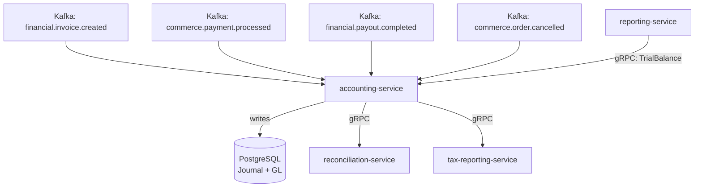

# accounting-service

> Implements double-entry bookkeeping with journal entry management and a general ledger for the ShopOS platform.

## Overview

The accounting-service is the financial core of ShopOS, maintaining a complete double-entry ledger for all monetary movements. It consumes domain events from across the platform (orders, payments, refunds, payouts) and creates corresponding debit/credit journal entries in the general ledger. It provides trial balance, P&L, and balance sheet queries for financial reporting and feeds the reconciliation and tax-reporting services.

## Architecture



## Tech Stack

| Component | Technology |
|---|---|
| Language | Kotlin / Spring Boot 3 |
| Database | PostgreSQL |
| Protocol | gRPC |
| Migrations | Flyway |
| Build Tool | Gradle (Kotlin DSL) |
| Container | Docker (multi-stage, non-root) |

## Responsibilities

- Double-entry journal entry creation for all financial events
- General ledger (GL) account chart of accounts management
- Trial balance generation
- Profit & Loss and balance sheet computation
- Period-end close and lock-out enforcement
- Multi-currency accounting with realized/unrealized FX gains and losses
- Accounting period management (monthly, quarterly, annual)

## API / Interface

```protobuf
service AccountingService {
  rpc CreateJournalEntry(CreateJournalEntryRequest) returns (JournalEntry);
  rpc GetJournalEntry(GetJournalEntryRequest) returns (JournalEntry);
  rpc ListJournalEntries(ListJournalEntriesRequest) returns (ListJournalEntriesResponse);
  rpc GetAccountBalance(GetAccountBalanceRequest) returns (AccountBalance);
  rpc GetTrialBalance(GetTrialBalanceRequest) returns (TrialBalance);
  rpc GetProfitAndLoss(GetPLRequest) returns (ProfitAndLossReport);
  rpc GetBalanceSheet(GetBalanceSheetRequest) returns (BalanceSheetReport);
  rpc ClosePeriod(ClosePeriodRequest) returns (PeriodCloseResult);
  rpc CreateAccount(CreateAccountRequest) returns (Account);
  rpc ListAccounts(ListAccountsRequest) returns (ListAccountsResponse);
}
```

## Kafka Topics

| Topic | Direction | Description |
|---|---|---|
| `financial.invoice.created` | consume | Records accounts-receivable debit |
| `financial.invoice.paid` | consume | Records cash receipt and AR credit |
| `commerce.payment.processed` | consume | Records payment receipt journal entry |
| `commerce.payment.failed` | consume | Reversal entry if payment was pre-recorded |
| `financial.payout.completed` | consume | Records vendor/seller payout as AP credit |
| `financial.journal.posted` | publish | Emitted after each journal entry is committed |

## Dependencies

Upstream (callers)
- Multiple domain Kafka topics (see above)
- `reconciliation-service` — triggers journal queries for reconciliation

Downstream (calls out to)
- `tax-reporting-service` — provides GL data for tax report generation

## Environment Variables

| Variable | Default | Description |
|---|---|---|
| `GRPC_PORT` | `50111` | Port the gRPC server listens on |
| `DB_HOST` | `localhost` | PostgreSQL host |
| `DB_PORT` | `5432` | PostgreSQL port |
| `DB_NAME` | `accounting_db` | Database name |
| `DB_USER` | `accounting_svc` | Database user |
| `DB_PASSWORD` | — | Database password (required) |
| `KAFKA_BROKERS` | `localhost:9092` | Comma-separated Kafka broker list |
| `BASE_CURRENCY` | `USD` | Platform base currency for GL reporting |
| `FISCAL_YEAR_START_MONTH` | `1` | Month (1-12) the fiscal year begins |
| `LOG_LEVEL` | `INFO` | Logging level |

## Running Locally

```bash
docker-compose up accounting-service
```

## Health Check

`GET /healthz` → `{"status":"ok"}`

gRPC health: `grpc.health.v1.Health/Check` → `SERVING`
