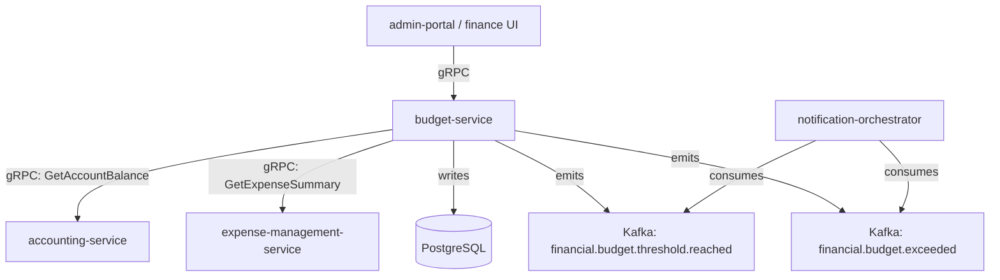

# budget-service

> Creates and tracks departmental budgets, monitors spend against allocations, and raises variance alerts.

## Overview

The budget-service provides fiscal planning and spend-control capabilities for ShopOS internal operations. Finance teams create annual/quarterly budgets by department and cost centre, and the service continuously monitors actual spend (sourced from `accounting-service` GL data) against allocations. When spend approaches or exceeds budget thresholds, it emits alerts to keep teams within financial targets.

## Architecture



## Tech Stack

| Component | Technology |
|---|---|
| Language | Go |
| Database | PostgreSQL |
| Protocol | gRPC |
| Migrations | golang-migrate |
| Build Tool | go build |
| Container | Docker (multi-stage, non-root) |

## Responsibilities

- Budget creation and versioning per department, cost centre, and fiscal period
- Budget allocation to sub-categories (headcount, marketing, infrastructure, etc.)
- Actual vs. budget variance calculation on demand and on schedule
- Configurable alert thresholds (e.g., alert at 80% and 100% utilization)
- Budget revision and reforecasting support
- Multi-currency budget support with base-currency normalisation
- Rollup reporting from cost-centre level to department to company level
- Historical budget vs. actuals archival for year-over-year comparison

## API / Interface

```protobuf
service BudgetService {
  rpc CreateBudget(CreateBudgetRequest) returns (Budget);
  rpc GetBudget(GetBudgetRequest) returns (Budget);
  rpc ListBudgets(ListBudgetsRequest) returns (ListBudgetsResponse);
  rpc UpdateBudget(UpdateBudgetRequest) returns (Budget);
  rpc GetBudgetVariance(GetBudgetVarianceRequest) returns (BudgetVariance);
  rpc GetBudgetUtilization(GetBudgetUtilizationRequest) returns (BudgetUtilization);
  rpc SetAlertThreshold(SetAlertThresholdRequest) returns (BudgetAlert);
  rpc GetBudgetSummaryRollup(GetBudgetSummaryRollupRequest) returns (BudgetSummaryRollup);
}
```

## Kafka Topics

| Topic | Direction | Description |
|---|---|---|
| `financial.budget.threshold.reached` | publish | Spend crosses configured warning threshold (e.g., 80%) |
| `financial.budget.exceeded` | publish | Actual spend exceeds budget allocation (100%+) |

## Dependencies

Upstream (callers)
- `admin-portal` (platform domain) — finance team budget management UI

Downstream (calls out to)
- `accounting-service` — actual GL spend data by cost centre
- `expense-management-service` — approved expense totals by department

## Environment Variables

| Variable | Default | Description |
|---|---|---|
| `GRPC_PORT` | `50117` | Port the gRPC server listens on |
| `DB_HOST` | `localhost` | PostgreSQL host |
| `DB_PORT` | `5432` | PostgreSQL port |
| `DB_NAME` | `budget_db` | Database name |
| `DB_USER` | `budget_svc` | Database user |
| `DB_PASSWORD` | — | Database password (required) |
| `KAFKA_BROKERS` | `localhost:9092` | Comma-separated Kafka broker list |
| `ACCOUNTING_GRPC_ADDR` | `accounting-service:50111` | Address of accounting-service |
| `EXPENSE_GRPC_ADDR` | `expense-management-service:50114` | Address of expense-management-service |
| `DEFAULT_ALERT_THRESHOLD_PCT` | `80` | Default warning threshold as percentage of budget |
| `VARIANCE_REFRESH_CRON` | `0 * * * *` | Cron schedule for hourly variance recalculation |
| `BASE_CURRENCY` | `USD` | Currency for multi-currency budget normalisation |
| `LOG_LEVEL` | `info` | Logging level |

## Running Locally

```bash
docker-compose up budget-service
```

## Health Check

`GET /healthz` → `{"status":"ok"}`

gRPC health: `grpc.health.v1.Health/Check` → `SERVING`
