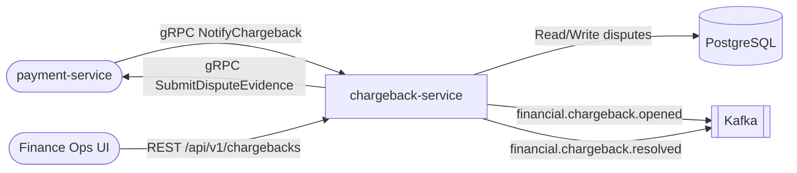

# chargeback-service

> Payment dispute lifecycle management for the ShopOS financial domain.

## Overview

The chargeback-service manages the full payment chargeback (dispute) lifecycle. It receives chargeback notifications from payment processors, tracks evidence submission deadlines, and coordinates with the payment-service for dispute responses. Supports the complete status flow: OPEN → EVIDENCE_REQUIRED → EVIDENCE_SUBMITTED → UNDER_REVIEW → WON/LOST.

## Architecture



## Tech Stack

| Component | Technology |
|---|---|
| Language | Java 21 |
| Framework | Spring Boot 3.4.5 |
| Database | PostgreSQL (JPA + Flyway) |
| Containerization | Docker (distroless) |

## Chargeback Status Flow

```
OPEN → EVIDENCE_REQUIRED → EVIDENCE_SUBMITTED → UNDER_REVIEW → WON / LOST
                                                              ↘ EXPIRED
```

## API Endpoints

| Endpoint | Method | Description |
|---|---|---|
| `/healthz` | GET | Liveness probe |
| `/api/v1/chargebacks` | POST | Open a new chargeback dispute |
| `/api/v1/chargebacks/{id}` | GET | Get chargeback by ID |
| `/api/v1/chargebacks/customer/{customerId}` | GET | Get chargebacks by customer |
| `/api/v1/chargebacks/{id}/evidence` | POST | Mark evidence as submitted |
| `/api/v1/chargebacks/{id}/resolve` | POST | Resolve dispute (WON or LOST) |

## Environment Variables

| Variable | Default | Description |
|---|---|---|
| `DB_URL` | `jdbc:postgresql://localhost:5432/chargeback_db` | PostgreSQL JDBC URL |
| `DB_USER` | `chargeback_user` | Database username |
| `DB_PASSWORD` | _(secret)_ | Database password |
| `SERVER_PORT` | `8310` | HTTP server port |
| `GRPC_PORT` | `50191` | gRPC port |

## Running Locally

```bash
docker-compose up chargeback-service
```

## Health Check

`GET /healthz` → `{"status":"ok"}`
