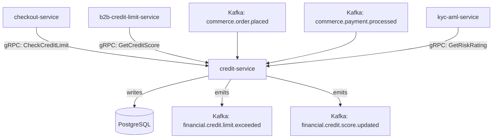

# credit-service

> Manages buyer credit limits, credit scoring, and credit utilization across B2B and consumer accounts.

## Overview

The credit-service is the credit risk management layer of ShopOS, maintaining credit limits and utilization for both B2B organizations and high-value consumer accounts. It calculates credit scores from payment history, order behaviour, and external signals, enforces credit limits at checkout, and integrates with the B2B domain to support trade credit and net payment terms. It communicates credit decisions synchronously so that checkout can block or allow orders in real time.

## Architecture



## Tech Stack

| Component | Technology |
|---|---|
| Language | Go |
| Database | PostgreSQL |
| Protocol | gRPC |
| Migrations | golang-migrate |
| Build Tool | go build |
| Container | Docker (multi-stage, non-root) |

## Responsibilities

- Credit limit creation, update, and suspension per account
- Real-time credit utilization tracking (reserved vs. consumed)
- Credit scoring based on payment history, order frequency, and age of account
- Credit limit enforcement at checkout (reserve on order, release on cancellation)
- Net payment terms management (Net 15, Net 30, Net 60) for B2B accounts
- Credit review triggers and automatic limit increase/decrease recommendations
- Integration with `kyc-aml-service` for risk rating incorporation

## API / Interface

```protobuf
service CreditService {
  rpc GetCreditLimit(GetCreditLimitRequest) returns (CreditLimit);
  rpc SetCreditLimit(SetCreditLimitRequest) returns (CreditLimit);
  rpc CheckCreditAvailability(CheckCreditRequest) returns (CreditCheckResult);
  rpc ReserveCredit(ReserveCreditRequest) returns (CreditReservation);
  rpc ReleaseCredit(ReleaseCreditRequest) returns (google.protobuf.Empty);
  rpc ConsumeCredit(ConsumeCreditRequest) returns (CreditLimit);
  rpc GetCreditScore(GetCreditScoreRequest) returns (CreditScore);
  rpc ListCreditLimits(ListCreditLimitsRequest) returns (ListCreditLimitsResponse);
}
```

## Kafka Topics

| Topic | Direction | Description |
|---|---|---|
| `commerce.order.placed` | consume | Reserves credit against an order |
| `commerce.order.cancelled` | consume | Releases reserved credit on cancellation |
| `commerce.payment.processed` | consume | Reduces outstanding balance, updates score |
| `financial.credit.limit.exceeded` | publish | Credit limit breach attempt detected |
| `financial.credit.score.updated` | publish | Credit score recalculation completed |

## Dependencies

**Upstream (callers)**
- `checkout-service` (commerce domain) — real-time credit availability check
- `b2b-credit-limit-service` (b2b domain) — B2B credit score queries

**Downstream (calls out to)**
- `kyc-aml-service` — risk rating for credit score calculation

## Environment Variables

| Variable | Default | Description |
|---|---|---|
| `GRPC_PORT` | `50115` | Port the gRPC server listens on |
| `DB_HOST` | `localhost` | PostgreSQL host |
| `DB_PORT` | `5432` | PostgreSQL port |
| `DB_NAME` | `credit_db` | Database name |
| `DB_USER` | `credit_svc` | Database user |
| `DB_PASSWORD` | — | Database password (required) |
| `KAFKA_BROKERS` | `localhost:9092` | Comma-separated Kafka broker list |
| `KYC_AML_GRPC_ADDR` | `kyc-aml-service:50116` | Address of kyc-aml-service |
| `DEFAULT_CONSUMER_LIMIT_CENTS` | `0` | Default credit limit for new consumer accounts |
| `DEFAULT_B2B_LIMIT_CENTS` | `500000` | Default credit limit for new B2B accounts |
| `SCORE_RECALC_INTERVAL_HOURS` | `24` | How often credit scores are recalculated |
| `LOG_LEVEL` | `info` | Logging level |

## Running Locally

```bash
docker-compose up credit-service
```

## Health Check

`GET /healthz` → `{"status":"ok"}`

gRPC health: `grpc.health.v1.Health/Check` → `SERVING`
