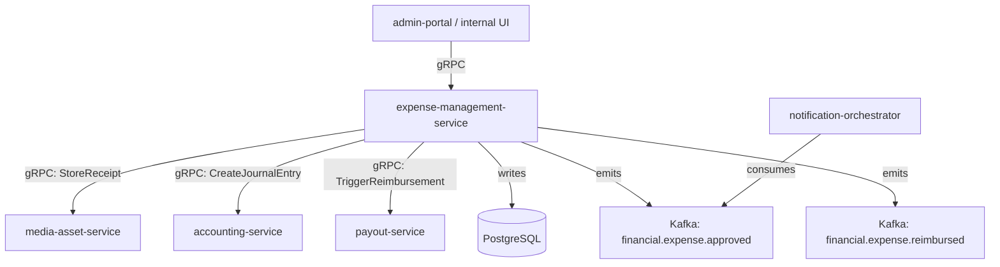

# expense-management-service

> Handles employee expense submission, manager approval workflows, and reimbursement processing.

## Overview

The expense-management-service provides the full expense lifecycle for ShopOS internal operations: expense submission with receipt attachment, configurable approval routing by amount and category, policy enforcement, and reimbursement dispatch. Approved expenses are posted to the general ledger via `accounting-service` and reimbursements are triggered through `payout-service`.

## Architecture



## Tech Stack

| Component | Technology |
|---|---|
| Language | Go |
| Database | PostgreSQL |
| Protocol | gRPC |
| Migrations | golang-migrate |
| Build Tool | go build |
| Container | Docker (multi-stage, non-root) |

## Responsibilities

- Expense report creation with line items and receipt image attachments
- Expense policy enforcement (per-diem limits, category allowances, duplicate detection)
- Multi-level approval routing by expense amount and category
- Rejection with reason codes and resubmission support
- Reimbursement disbursement trigger to `payout-service`
- GL posting of approved expenses to `accounting-service`
- Monthly expense summary reports per department/cost centre
- Expense analytics: spend by category, department, period

## API / Interface

```protobuf
service ExpenseManagementService {
  rpc SubmitExpense(SubmitExpenseRequest) returns (ExpenseReport);
  rpc GetExpenseReport(GetExpenseReportRequest) returns (ExpenseReport);
  rpc ListExpenseReports(ListExpenseReportsRequest) returns (ListExpenseReportsResponse);
  rpc ApproveExpense(ApproveExpenseRequest) returns (ExpenseReport);
  rpc RejectExpense(RejectExpenseRequest) returns (ExpenseReport);
  rpc GetExpensePolicy(GetExpensePolicyRequest) returns (ExpensePolicy);
  rpc UpdateExpensePolicy(UpdateExpensePolicyRequest) returns (ExpensePolicy);
  rpc GetExpenseSummary(GetExpenseSummaryRequest) returns (ExpenseSummary);
}
```

## Kafka Topics

| Topic | Direction | Description |
|---|---|---|
| `financial.expense.submitted` | publish | Expense report submitted for review |
| `financial.expense.approved` | publish | Expense approved, triggers GL post and reimbursement |
| `financial.expense.rejected` | publish | Expense rejected |
| `financial.expense.reimbursed` | publish | Reimbursement payment dispatched |

## Dependencies

Upstream (callers)
- `admin-portal` (platform domain) — internal employee UI

Downstream (calls out to)
- `media-asset-service` (content domain) — receipt image storage
- `accounting-service` — GL journal entry on approval
- `payout-service` — reimbursement disbursement

## Environment Variables

| Variable | Default | Description |
|---|---|---|
| `GRPC_PORT` | `50114` | Port the gRPC server listens on |
| `DB_HOST` | `localhost` | PostgreSQL host |
| `DB_PORT` | `5432` | PostgreSQL port |
| `DB_NAME` | `expense_db` | Database name |
| `DB_USER` | `expense_svc` | Database user |
| `DB_PASSWORD` | — | Database password (required) |
| `KAFKA_BROKERS` | `localhost:9092` | Comma-separated Kafka broker list |
| `MEDIA_ASSET_GRPC_ADDR` | `media-asset-service:50140` | Address of media-asset-service |
| `ACCOUNTING_GRPC_ADDR` | `accounting-service:50111` | Address of accounting-service |
| `PAYOUT_GRPC_ADDR` | `payout-service:50112` | Address of payout-service |
| `MAX_RECEIPT_SIZE_MB` | `10` | Maximum receipt attachment size in MB |
| `AUTO_APPROVE_THRESHOLD_CENTS` | `2500` | Expenses below this amount auto-approve |
| `LOG_LEVEL` | `info` | Logging level |

## Running Locally

```bash
docker-compose up expense-management-service
```

## Health Check

`GET /healthz` → `{"status":"ok"}`

gRPC health: `grpc.health.v1.Health/Check` → `SERVING`
