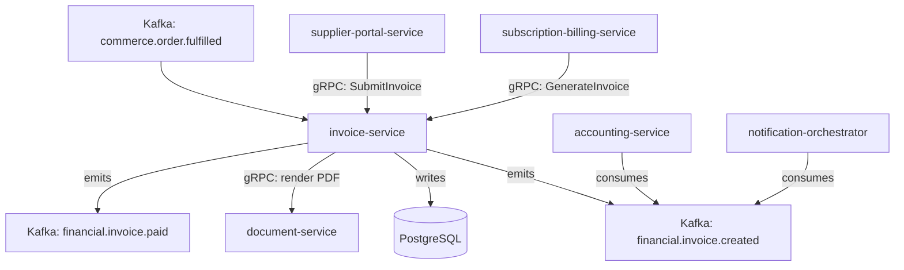

# invoice-service

> Generates, manages, and delivers invoices including PDF rendering and structured e-invoice formats.

## Overview

The invoice-service is the financial document engine for ShopOS. It generates customer-facing and B2B invoices triggered by order fulfilment, subscription billing, and supplier payment events. It supports PDF rendering for human-readable invoices, structured e-invoice formats (UBL, Factur-X, ZUGFeRD), and maintains the full invoice lifecycle from draft through payment-confirmed to void.

## Architecture



## Tech Stack

| Component | Technology |
|---|---|
| Language | Java 21 / Spring Boot 3 |
| Database | PostgreSQL |
| Protocol | gRPC |
| PDF rendering | JasperReports / Apache FOP |
| e-Invoice formats | UBL 2.1, Factur-X, ZUGFeRD 2.x |
| Migrations | Flyway |
| Build Tool | Maven |
| Container | Docker (multi-stage, non-root) |

## Responsibilities

- Invoice generation from order, subscription, and manual triggers
- Sequentially numbered invoice series with configurable prefix/suffix
- PDF generation and attachment for email delivery
- Structured e-invoice output (UBL, Factur-X) for B2B/EDI
- Invoice status tracking: draft → issued → partially_paid → paid → void
- Credit note generation for refunds and adjustments
- Multi-currency invoice support with exchange rate stamping

## API / Interface

```protobuf
service InvoiceService {
  rpc GenerateInvoice(GenerateInvoiceRequest) returns (Invoice);
  rpc GetInvoice(GetInvoiceRequest) returns (Invoice);
  rpc ListInvoices(ListInvoicesRequest) returns (ListInvoicesResponse);
  rpc MarkInvoicePaid(MarkInvoicePaidRequest) returns (Invoice);
  rpc VoidInvoice(VoidInvoiceRequest) returns (Invoice);
  rpc GenerateCreditNote(GenerateCreditNoteRequest) returns (Invoice);
  rpc GetInvoicePDF(GetInvoicePDFRequest) returns (InvoicePDFResponse);
  rpc GetInvoiceEFormat(GetInvoiceEFormatRequest) returns (InvoiceEFormatResponse);
}
```

## Kafka Topics

| Topic | Direction | Description |
|---|---|---|
| `commerce.order.fulfilled` | consume | Triggers customer invoice generation |
| `supplychain.po.approved` | consume | Triggers vendor invoice expectation record |
| `financial.invoice.created` | publish | New invoice issued |
| `financial.invoice.paid` | publish | Invoice marked as fully paid |
| `financial.invoice.voided` | publish | Invoice voided/cancelled |

## Dependencies

**Upstream (callers)**
- `supplier-portal-service` — vendor invoice submission
- `subscription-billing-service` (commerce domain) — recurring billing invoices

**Downstream (calls out to)**
- `document-service` (content domain) — PDF storage in MinIO
- `accounting-service` — journal entry creation on invoice events

## Environment Variables

| Variable | Default | Description |
|---|---|---|
| `GRPC_PORT` | `50110` | Port the gRPC server listens on |
| `DB_HOST` | `localhost` | PostgreSQL host |
| `DB_PORT` | `5432` | PostgreSQL port |
| `DB_NAME` | `invoice_db` | Database name |
| `DB_USER` | `invoice_svc` | Database user |
| `DB_PASSWORD` | — | Database password (required) |
| `KAFKA_BROKERS` | `localhost:9092` | Comma-separated Kafka broker list |
| `DOCUMENT_GRPC_ADDR` | `document-service:50142` | Address of document-service |
| `INVOICE_NUMBER_PREFIX` | `INV-` | Prefix for invoice number series |
| `DEFAULT_CURRENCY` | `USD` | Default invoice currency |
| `LOG_LEVEL` | `INFO` | Logging level |

## Running Locally

```bash
docker-compose up invoice-service
```

## Health Check

`GET /healthz` → `{"status":"ok"}`

gRPC health: `grpc.health.v1.Health/Check` → `SERVING`
