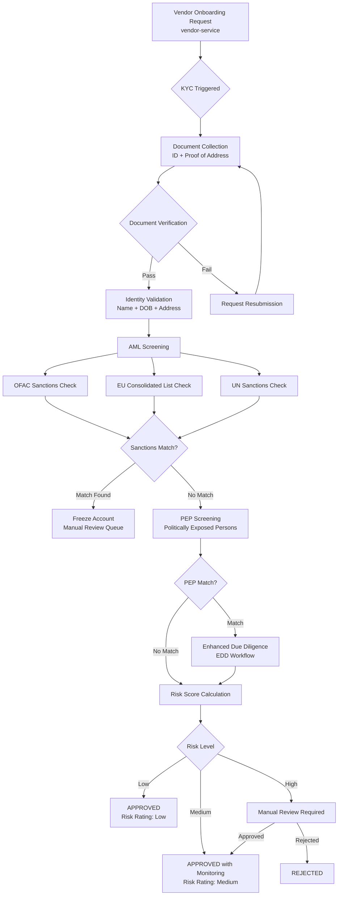

# kyc-aml-service

> Performs KYC identity verification, AML risk screening, and sanction list checks for vendors and high-value accounts.

## Overview

The kyc-aml-service is the compliance gate for onboarding and high-value transactions on the ShopOS platform. It orchestrates document verification, identity validation, and AML screening against international sanction lists (OFAC, EU, UN). Every vendor must pass KYC before receiving payouts, and the credit and payout services check AML status before executing financial operations. The service maintains risk ratings that inform credit scoring and transaction monitoring.

## Architecture



## Tech Stack

| Component | Technology |
|---|---|
| Language | Java 21 / Spring Boot 3 |
| Database | PostgreSQL |
| Protocol | gRPC |
| Sanctions data | OFAC SDN list, EU Consolidated, UN list (periodic sync) |
| Document verification | Integration-ready (Onfido, Jumio adapter pattern) |
| Migrations | Flyway |
| Build Tool | Maven |
| Container | Docker (multi-stage, non-root) |

## Responsibilities

- KYC workflow orchestration: document collection → verification → approval
- Identity document verification (passport, national ID, driving licence)
- Proof of address verification
- AML screening against OFAC, EU Consolidated, and UN sanction lists
- Politically Exposed Person (PEP) screening
- Ongoing transaction monitoring for anomalous patterns
- Risk rating assignment (Low / Medium / High) and periodic re-assessment
- Regulatory Suspicious Activity Report (SAR) flag generation
- Sanction list refresh scheduling (daily sync from official sources)

## API / Interface

```protobuf
service KYCAMLService {
  rpc InitiateKYC(InitiateKYCRequest) returns (KYCCase);
  rpc GetKYCStatus(GetKYCStatusRequest) returns (KYCCase);
  rpc SubmitDocument(SubmitDocumentRequest) returns (KYCCase);
  rpc ScreenForAML(AMLScreeningRequest) returns (AMLScreeningResult);
  rpc GetRiskRating(GetRiskRatingRequest) returns (RiskRating);
  rpc UpdateRiskRating(UpdateRiskRatingRequest) returns (RiskRating);
  rpc ListSanctionedEntities(ListSanctionedEntitiesRequest) returns (ListSanctionedEntitiesResponse);
  rpc FlagForManualReview(FlagForReviewRequest) returns (KYCCase);
}
```

## Kafka Topics

| Topic | Direction | Description |
|---|---|---|
| `financial.kyc.initiated` | publish | KYC process started for an entity |
| `financial.kyc.approved` | publish | Entity passed KYC, cleared for financial ops |
| `financial.kyc.rejected` | publish | Entity failed KYC |
| `financial.aml.alert` | publish | Potential sanctions/PEP match requiring review |
| `security.fraud.detected` | publish | High-confidence sanction match, account frozen |

## Dependencies

**Upstream (callers)**
- `vendor-service` (supply-chain domain) — vendor onboarding KYC trigger
- `payout-service` — pre-payout AML check
- `credit-service` — risk rating for credit scoring

**Downstream (calls out to)**
- `document-service` (content domain) — KYC document storage
- External identity verification API (Onfido/Jumio) when `EXTERNAL_IDV_ENABLED=true`
- OFAC / EU / UN sanction list APIs (scheduled sync)

## Environment Variables

| Variable | Default | Description |
|---|---|---|
| `GRPC_PORT` | `50116` | Port the gRPC server listens on |
| `DB_HOST` | `localhost` | PostgreSQL host |
| `DB_PORT` | `5432` | PostgreSQL port |
| `DB_NAME` | `kyc_aml_db` | Database name |
| `DB_USER` | `kyc_aml_svc` | Database user |
| `DB_PASSWORD` | — | Database password (required) |
| `KAFKA_BROKERS` | `localhost:9092` | Comma-separated Kafka broker list |
| `EXTERNAL_IDV_ENABLED` | `false` | Enable external identity verification provider |
| `ONFIDO_API_KEY` | — | Onfido API key (required if external IDV enabled) |
| `SANCTION_LIST_SYNC_CRON` | `0 0 * * *` | Cron schedule for sanction list refresh |
| `DOCUMENT_GRPC_ADDR` | `document-service:50142` | Address of document-service |
| `FUZZY_MATCH_THRESHOLD` | `0.85` | Minimum similarity score for name matching |
| `LOG_LEVEL` | `INFO` | Logging level |

## Running Locally

```bash
docker-compose up kyc-aml-service
```

## Health Check

`GET /healthz` → `{"status":"ok"}`

gRPC health: `grpc.health.v1.Health/Check` → `SERVING`
