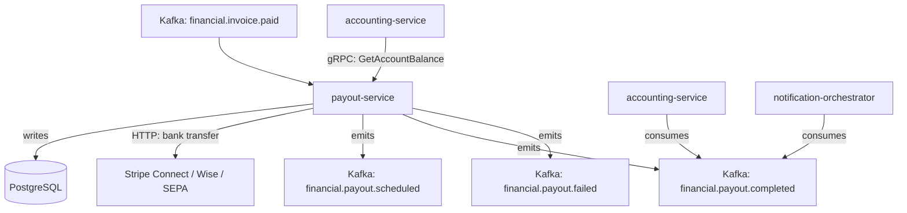

# payout-service

> Schedules and executes vendor and marketplace seller payouts via bank transfer integrations.

## Overview

The payout-service manages the disbursement of funds to vendors and marketplace sellers. It aggregates settled amounts from the accounting ledger, applies configurable payout schedules (daily, weekly, net-30), batches transfers, and integrates with banking APIs (Stripe Connect, Wise, SEPA) to execute the actual fund movements. All payout records are immutable once dispatched, with full audit trails for financial compliance.

## Architecture



## Tech Stack

| Component | Technology |
|---|---|
| Language | Java 21 / Spring Boot 3 |
| Database | PostgreSQL |
| Protocol | gRPC |
| Banking integrations | Stripe Connect API, Wise API, SEPA XML |
| Migrations | Flyway |
| Build Tool | Maven |
| Container | Docker (multi-stage, non-root) |

## Responsibilities

- Payout schedule management per vendor (daily, weekly, net-30, manual)
- Settled balance aggregation and payout batch creation
- Bank transfer execution via integrated payment providers
- Payout status tracking: scheduled → processing → completed / failed
- Retry logic with exponential backoff for failed transfers
- Payout holds for vendors under review or with active disputes
- Withholding tax calculation and reporting
- Payout history and statement generation

## API / Interface

```protobuf
service PayoutService {
  rpc CreatePayoutSchedule(CreatePayoutScheduleRequest) returns (PayoutSchedule);
  rpc GetPayoutSchedule(GetPayoutScheduleRequest) returns (PayoutSchedule);
  rpc TriggerPayout(TriggerPayoutRequest) returns (Payout);
  rpc GetPayout(GetPayoutRequest) returns (Payout);
  rpc ListPayouts(ListPayoutsRequest) returns (ListPayoutsResponse);
  rpc HoldPayout(HoldPayoutRequest) returns (Payout);
  rpc ReleasePayoutHold(ReleasePayoutHoldRequest) returns (Payout);
  rpc GetPayoutStatement(GetPayoutStatementRequest) returns (PayoutStatement);
}
```

## Kafka Topics

| Topic | Direction | Description |
|---|---|---|
| `financial.invoice.paid` | consume | Accumulates settled amounts toward next payout |
| `financial.payout.scheduled` | publish | Payout batch created and scheduled |
| `financial.payout.completed` | publish | Bank transfer confirmed successful |
| `financial.payout.failed` | publish | Bank transfer failed, retry or manual action needed |

## Dependencies

Upstream (callers)
- `supplier-portal-service` (supply-chain domain) — vendor payout status reads

Downstream (calls out to)
- `accounting-service` — settled balance query
- `kyc-aml-service` — vendor compliance status check before payout release
- External banking APIs (Stripe Connect, Wise, SEPA)

## Environment Variables

| Variable | Default | Description |
|---|---|---|
| `GRPC_PORT` | `50112` | Port the gRPC server listens on |
| `DB_HOST` | `localhost` | PostgreSQL host |
| `DB_PORT` | `5432` | PostgreSQL port |
| `DB_NAME` | `payout_db` | Database name |
| `DB_USER` | `payout_svc` | Database user |
| `DB_PASSWORD` | — | Database password (required) |
| `KAFKA_BROKERS` | `localhost:9092` | Comma-separated Kafka broker list |
| `STRIPE_CONNECT_SECRET_KEY` | — | Stripe Connect API secret key |
| `WISE_API_KEY` | — | Wise (TransferWise) API key |
| `PAYOUT_RETRY_MAX_ATTEMPTS` | `3` | Maximum retry attempts for failed transfers |
| `PAYOUT_RETRY_DELAY_SECONDS` | `300` | Initial retry delay (exponential backoff base) |
| `KYC_AML_GRPC_ADDR` | `kyc-aml-service:50116` | Address of kyc-aml-service |
| `LOG_LEVEL` | `INFO` | Logging level |

## Running Locally

```bash
docker-compose up payout-service
```

## Health Check

`GET /healthz` → `{"status":"ok"}`

gRPC health: `grpc.health.v1.Health/Check` → `SERVING`
