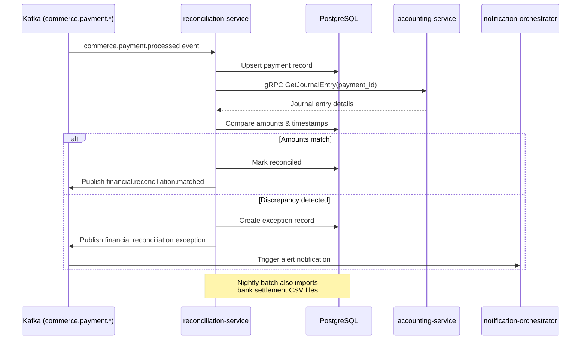

# reconciliation-service

> Reconciles platform payment records against bank and payment-processor statements, detecting and flagging discrepancies.

## Overview

The reconciliation-service continuously consumes payment events from the commerce domain and compares them against imported bank/processor settlement files. It identifies mismatches, missing transactions, and duplicate entries, raising exceptions for human review. It is the financial control layer that ensures every commerce payment event has a corresponding settled amount in the platform's books.

## Architecture



## Tech Stack

| Component | Technology |
|---|---|
| Language | Kotlin / Spring Boot 3 |
| Database | PostgreSQL |
| Protocol | Kafka (async consumer/producer) |
| Migrations | Flyway |
| Build Tool | Gradle (Kotlin DSL) |
| Container | Docker (multi-stage, non-root) |

## Responsibilities

- Real-time consumption of payment events for ledger matching
- Batch import of bank/processor settlement CSV and CAMT.053 files
- Three-way matching: order amount vs. payment event vs. bank settlement
- Exception creation and categorisation (amount mismatch, missing transaction, duplicate)
- Exception aging and escalation tracking
- Daily and monthly reconciliation summary reports
- Automatic resolution of cleared exceptions

## API / Interface

This service is primarily event-driven. It does not expose a gRPC endpoint but consumes and publishes Kafka topics.

Internal scheduled jobs:
- Nightly bank statement import: `0 1 * * *`
- Daily reconciliation summary: `0 6 * * *`

## Kafka Topics

| Topic | Direction | Description |
|---|---|---|
| `commerce.payment.processed` | consume | Payment processed event from payment-service |
| `commerce.payment.failed` | consume | Failed payment event |
| `financial.payout.completed` | consume | Payout settled event for bank side matching |
| `financial.reconciliation.matched` | publish | Transaction successfully reconciled |
| `financial.reconciliation.exception` | publish | Discrepancy detected requiring review |
| `financial.reconciliation.resolved` | publish | Previously raised exception resolved |

## Dependencies

**Upstream (callers)**
- Kafka events from `payment-service` (commerce domain)
- Kafka events from `payout-service`

**Downstream (calls out to)**
- `accounting-service` — journal entry lookup for cross-referencing
- `notification-orchestrator` (communications domain) — exception alerts to finance team (via Kafka)

## Environment Variables

| Variable | Default | Description |
|---|---|---|
| `DB_HOST` | `localhost` | PostgreSQL host |
| `DB_PORT` | `5432` | PostgreSQL port |
| `DB_NAME` | `reconciliation_db` | Database name |
| `DB_USER` | `reconciliation_svc` | Database user |
| `DB_PASSWORD` | — | Database password (required) |
| `KAFKA_BROKERS` | `localhost:9092` | Comma-separated Kafka broker list |
| `KAFKA_GROUP_ID` | `reconciliation-consumer` | Kafka consumer group ID |
| `ACCOUNTING_GRPC_ADDR` | `accounting-service:50111` | Address of accounting-service |
| `STATEMENT_IMPORT_PATH` | `/data/statements` | Volume path for bank statement file drops |
| `AMOUNT_TOLERANCE_CENTS` | `0` | Acceptable amount difference before raising exception |
| `EXCEPTION_ESCALATION_HOURS` | `48` | Hours before unresolved exception escalates |
| `LOG_LEVEL` | `INFO` | Logging level |

## Running Locally

```bash
docker-compose up reconciliation-service
```

## Health Check

`GET /healthz` → `{"status":"ok"}`
