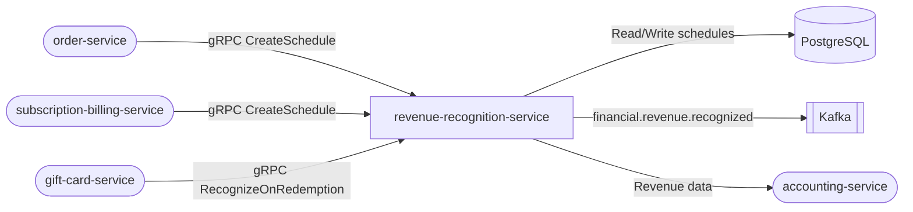

# revenue-recognition-service

> ASC 606 / IFRS 15 compliant revenue recognition for the ShopOS financial domain.

## Overview

The revenue-recognition-service manages deferred revenue schedules and recognition for all revenue-bearing instruments in ShopOS: subscriptions (straight-line), one-time sales (point-in-time), gift cards (redemption-based), and multi-element arrangements. It ensures compliance with ASC 606 and IFRS 15 by tracking performance obligations, recognition start/end dates, and deferred vs. recognized amounts.

## Architecture



## Tech Stack

| Component | Technology |
|---|---|
| Language | Kotlin 2.1 / JVM 21 |
| Framework | Spring Boot 3.4.5 |
| Database | PostgreSQL (JPA + Flyway) |
| Containerization | Docker (distroless) |

## Contract Types

| Type | Recognition Method | Standard |
|---|---|---|
| `ONE_TIME` | Point-in-time at delivery | ASC 606 / IFRS 15 |
| `SUBSCRIPTION` | Straight-line over subscription period | ASC 606 / IFRS 15 |
| `GIFT_CARD` | At redemption (breakage estimate applied) | ASC 606 |
| `MULTI_ELEMENT` | Allocated across performance obligations | ASC 606 |

## Revenue Schedule Status Flow

```
PENDING → IN_PROGRESS → FULLY_RECOGNIZED
        ↘ CANCELLED
```

## API Endpoints

| Endpoint | Method | Description |
|---|---|---|
| `/healthz` | GET | Liveness probe |
| `/api/v1/revenue/schedules` | POST | Create a revenue recognition schedule |
| `/api/v1/revenue/schedules/{id}` | GET | Get schedule by ID |
| `/api/v1/revenue/schedules/order/{orderId}` | GET | Get all schedules for an order |
| `/api/v1/revenue/schedules/{id}/recognize` | POST | Run recognition pass as of a date |

## Environment Variables

| Variable | Default | Description |
|---|---|---|
| `DB_URL` | `jdbc:postgresql://localhost:5432/revrec_db` | PostgreSQL JDBC URL |
| `DB_USERNAME` | `revrec_user` | Database username |
| `DB_PASSWORD` | _(secret)_ | Database password |
| `SERVER_PORT` | `8311` | HTTP server port |
| `GRPC_PORT` | `50192` | gRPC port |

## Running Locally

```bash
docker-compose up revenue-recognition-service
```

## Health Check

`GET /healthz` → `{"status":"ok"}`
