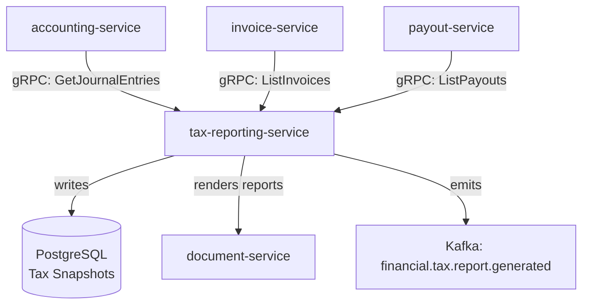

# tax-reporting-service

> Generates tax compliance reports and filing-ready exports including VAT returns and 1099 forms.

## Overview

The tax-reporting-service aggregates transactional tax data from across the platform to produce jurisdiction-specific tax reports. It supports VAT/GST returns for EU/UK markets, US sales tax summaries, and 1099-K/1099-MISC generation for marketplace sellers. Reports are rendered as structured XML/JSON for e-filing systems and as PDF documents for manual submission.

## Architecture



## Tech Stack

| Component | Technology |
|---|---|
| Language | Go |
| Database | PostgreSQL |
| Protocol | gRPC |
| Report formats | PDF, HMRC MTD XML, EU OSS XML, IRS 1099 CSV |
| Migrations | golang-migrate |
| Build Tool | go build |
| Container | Docker (multi-stage, non-root) |

## Responsibilities

- VAT return generation for UK (HMRC MTD), EU (OSS), and per-country submissions
- US sales tax summary reports by state/jurisdiction
- 1099-K and 1099-MISC report generation for marketplace sellers
- Tax period snapshot creation and immutable storage
- Correction and amendment report generation
- Filing deadline tracking and alert publishing
- Multi-jurisdiction tax position aggregation

## API / Interface

```protobuf
service TaxReportingService {
  rpc GenerateVATReturn(GenerateVATReturnRequest) returns (TaxReport);
  rpc GenerateSalesTaxSummary(GenerateSalesTaxSummaryRequest) returns (TaxReport);
  rpc Generate1099Report(Generate1099Request) returns (TaxReport);
  rpc GetTaxReport(GetTaxReportRequest) returns (TaxReport);
  rpc ListTaxReports(ListTaxReportsRequest) returns (ListTaxReportsResponse);
  rpc GetTaxReportFile(GetTaxReportFileRequest) returns (TaxReportFileResponse);
  rpc GetTaxPosition(GetTaxPositionRequest) returns (TaxPosition);
}
```

## Kafka Topics

| Topic | Direction | Description |
|---|---|---|
| `financial.tax.report.generated` | publish | Tax report created and available for filing |
| `financial.tax.deadline.approaching` | publish | Filing deadline alert (T-7 days) |

## Dependencies

Upstream (callers)
- Finance team tooling / admin portal via gRPC

Downstream (calls out to)
- `accounting-service` — journal entry data for tax period aggregation
- `invoice-service` — invoice line-item tax amounts
- `payout-service` — seller payout data for 1099 generation
- `document-service` (content domain) — PDF/XML report storage

## Environment Variables

| Variable | Default | Description |
|---|---|---|
| `GRPC_PORT` | `50113` | Port the gRPC server listens on |
| `DB_HOST` | `localhost` | PostgreSQL host |
| `DB_PORT` | `5432` | PostgreSQL port |
| `DB_NAME` | `tax_reporting_db` | Database name |
| `DB_USER` | `tax_reporting_svc` | Database user |
| `DB_PASSWORD` | — | Database password (required) |
| `KAFKA_BROKERS` | `localhost:9092` | Comma-separated Kafka broker list |
| `ACCOUNTING_GRPC_ADDR` | `accounting-service:50111` | Address of accounting-service |
| `INVOICE_GRPC_ADDR` | `invoice-service:50110` | Address of invoice-service |
| `PAYOUT_GRPC_ADDR` | `payout-service:50112` | Address of payout-service |
| `DOCUMENT_GRPC_ADDR` | `document-service:50142` | Address of document-service |
| `DEFAULT_TAX_JURISDICTION` | `US` | Default jurisdiction for report generation |
| `LOG_LEVEL` | `info` | Logging level |

## Running Locally

```bash
docker-compose up tax-reporting-service
```

## Health Check

`GET /healthz` → `{"status":"ok"}`

gRPC health: `grpc.health.v1.Health/Check` → `SERVING`
