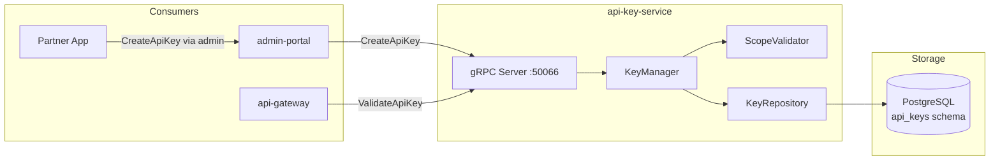

# api-key-service

> API key creation, rotation, scope management, and validation for machine-to-machine access.

## Overview

The api-key-service enables machine-to-machine (M2M) access to ShopOS APIs. It issues
opaque API keys with configurable scopes, expiry, and rate-limit tiers, making them
suitable for partner integrations, webhook consumers, and CI/CD pipelines. Keys are stored
as bcrypt hashes — the plaintext is shown only once at creation time. The api-gateway calls
this service to validate incoming `Authorization: ApiKey <key>` headers.

## Architecture



## Tech Stack

| Component | Technology |
|---|---|
| Language | Go 1.22 |
| Database | PostgreSQL |
| Protocol | gRPC |
| Port | 50066 |
| gRPC Framework | google.golang.org/grpc |
| DB Driver | pgx/v5 |
| Key Hashing | bcrypt (cost 12) |

## Responsibilities

- Generate cryptographically random API keys (prefix-typed, e.g., `sk_live_...`)
- Store only the bcrypt hash of the key; return plaintext exactly once
- Associate keys with an owner (user or organization), scopes, and expiry
- Validate incoming API keys: hash comparison, expiry check, scope match
- Support key rotation — generate new key, deprecate old key with grace period
- Revoke keys immediately on security incidents
- Track key last-used timestamp for audit purposes
- Enforce per-key rate-limit tier metadata (enforced by rate-limiter-service)

## API / Interface

```protobuf
service ApiKeyService {
  rpc CreateApiKey(CreateApiKeyRequest) returns (CreateApiKeyResponse);
  rpc ValidateApiKey(ValidateApiKeyRequest) returns (ValidateApiKeyResponse);
  rpc RevokeApiKey(RevokeApiKeyRequest) returns (RevokeApiKeyResponse);
  rpc RotateApiKey(RotateApiKeyRequest) returns (RotateApiKeyResponse);
  rpc ListApiKeys(ListApiKeysRequest) returns (ListApiKeysResponse);
  rpc GetApiKey(GetApiKeyRequest) returns (GetApiKeyResponse);
}
```

| Method | Description |
|---|---|
| `CreateApiKey` | Generate a new API key, return plaintext once |
| `ValidateApiKey` | Verify key hash, expiry, and scope |
| `RevokeApiKey` | Immediately invalidate a key |
| `RotateApiKey` | Issue replacement key with optional overlap period |
| `ListApiKeys` | Return all keys for an owner (metadata only, no hash) |
| `GetApiKey` | Return metadata for a single key by ID |

## Kafka Topics

Not applicable — api-key-service is gRPC-only.

## Dependencies

Upstream (calls these):
- None — api-key-service has no outbound service calls

Downstream (called by these):
- `api-gateway` — `ValidateApiKey` for every request using ApiKey auth
- `admin-portal` — key management UI for operators and partners
- `rate-limiter-service` — reads key tier to apply correct rate limits

## Environment Variables

| Variable | Default | Description |
|---|---|---|
| `DATABASE_URL` | — | PostgreSQL connection string |
| `GRPC_PORT` | `50066` | gRPC listening port |
| `KEY_PREFIX_LIVE` | `sk_live_` | Prefix for production API keys |
| `KEY_PREFIX_TEST` | `sk_test_` | Prefix for sandbox API keys |
| `KEY_BYTE_LENGTH` | `32` | Random bytes used for key generation |
| `BCRYPT_COST` | `12` | bcrypt work factor |
| `DEFAULT_EXPIRY_DAYS` | `365` | Default key expiry if none specified |
| `ROTATION_GRACE_PERIOD_HOURS` | `24` | Hours old key stays valid after rotation |

## Running Locally

```bash
docker-compose up api-key-service
```

## Health Check

`GET /healthz` — `{"status":"ok"}`

gRPC health protocol: `grpc.health.v1.Health/Check` on port `50066`
