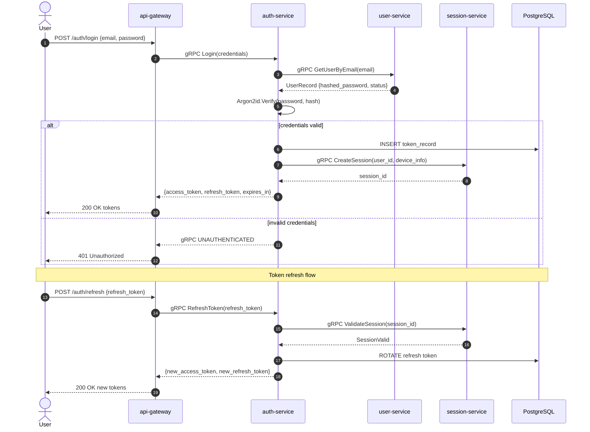

# auth-service

> JWT/OAuth2 token issuance and validation with Argon2 password hashing.

## Overview

The auth-service is the trust anchor of the ShopOS identity domain. It issues short-lived JWT
access tokens and long-lived refresh tokens after verifying credentials, and validates tokens
presented by downstream services. All passwords are hashed using Argon2id — the memory-hard
algorithm recommended by OWASP for credential storage.

## Architecture



## Tech Stack

| Component | Technology |
|---|---|
| Language | Rust (edition 2021) |
| Database | PostgreSQL |
| Protocol | gRPC |
| Port | 50060 |
| Password Hashing | Argon2id (argon2 crate) |
| JWT Library | jsonwebtoken crate |
| gRPC Framework | tonic |
| DB Driver | sqlx (async) |

## Responsibilities

- Issue JWT access tokens (short-lived, 15 min) after credential verification
- Issue opaque refresh tokens (long-lived, 7 days) and store their hashes in Postgres
- Validate and parse incoming JWTs for other services
- Hash passwords with Argon2id on registration (delegated write via user-service)
- Rotate refresh tokens on each use (refresh token rotation)
- Revoke all sessions for a user (logout-everywhere)
- Emit `identity.user.registered` Kafka event on first successful authentication post-signup

## API / Interface

```protobuf
service AuthService {
  rpc Login(LoginRequest) returns (LoginResponse);
  rpc RefreshToken(RefreshTokenRequest) returns (RefreshTokenResponse);
  rpc ValidateToken(ValidateTokenRequest) returns (ValidateTokenResponse);
  rpc Logout(LogoutRequest) returns (LogoutResponse);
  rpc LogoutAll(LogoutAllRequest) returns (LogoutAllResponse);
  rpc ChangePassword(ChangePasswordRequest) returns (ChangePasswordResponse);
}
```

| Method | Description |
|---|---|
| `Login` | Verify credentials, issue access + refresh tokens |
| `RefreshToken` | Exchange valid refresh token for a new token pair |
| `ValidateToken` | Parse and verify JWT signature + expiry |
| `Logout` | Revoke a specific refresh token |
| `LogoutAll` | Revoke all refresh tokens for a user |
| `ChangePassword` | Verify current password, re-hash and store new password |

## Kafka Topics

| Topic | Direction | Description |
|---|---|---|
| `identity.user.registered` | Publish | Emitted after first successful login post-account creation |
| `security.login.failed` | Publish | Emitted after repeated failed login attempts (brute-force signal) |

## Dependencies

Upstream (calls these):
- `user-service` — fetch user record and hashed password by email
- `session-service` — create/validate/revoke sessions
- `mfa-service` — verify MFA challenge before issuing tokens (when MFA is enabled)
- `device-fingerprint-service` — attach device context to session

Downstream (called by these):
- `api-gateway` — validates every inbound JWT
- All protected services — call `ValidateToken` to authenticate requests

## Environment Variables

| Variable | Default | Description |
|---|---|---|
| `DATABASE_URL` | — | PostgreSQL connection string |
| `JWT_SECRET` | — | HMAC-SHA256 signing secret for access tokens (min 32 bytes) |
| `JWT_EXPIRY_SECONDS` | `900` | Access token lifetime in seconds |
| `REFRESH_TOKEN_EXPIRY_SECONDS` | `604800` | Refresh token lifetime (7 days) |
| `ARGON2_MEMORY_KB` | `65536` | Argon2id memory cost (64 MB) |
| `ARGON2_ITERATIONS` | `3` | Argon2id iteration count |
| `ARGON2_PARALLELISM` | `4` | Argon2id parallelism factor |
| `GRPC_PORT` | `50060` | Listening port |
| `USER_SERVICE_ADDR` | `user-service:50061` | User service gRPC address |
| `SESSION_SERVICE_ADDR` | `session-service:50062` | Session service gRPC address |
| `MFA_SERVICE_ADDR` | `mfa-service:50064` | MFA service gRPC address |
| `KAFKA_BROKERS` | `kafka:9092` | Kafka broker list |

## Running Locally

```bash
docker-compose up auth-service
```

## Health Check

`GET /healthz` — `{"status":"ok"}`

gRPC health protocol: `grpc.health.v1.Health/Check` on port `50060`
