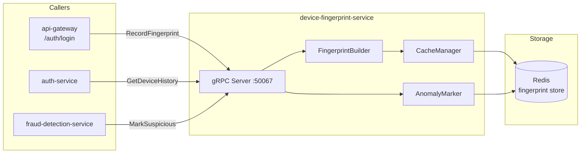

# device-fingerprint-service

> Device fingerprinting for fraud detection and anomalous login identification.

## Overview

The device-fingerprint-service collects and hashes a set of browser or client signals
(user-agent, screen resolution, timezone, installed fonts, canvas fingerprint, etc.) to
produce a stable device identifier. This identifier is attached to each session and shared
with the fraud-detection-service to flag logins from unrecognized devices or impossible
travel scenarios. Fingerprint records are stored in Redis with a configurable retention TTL.

## Architecture



## Tech Stack

| Component | Technology |
|---|---|
| Language | Go 1.22 |
| Database | Redis 7 |
| Protocol | gRPC |
| Port | 50067 |
| gRPC Framework | google.golang.org/grpc |
| Redis Client | go-redis/v9 |
| Hashing | SHA-256 (fingerprint digest) |

## Responsibilities

- Accept raw device signal bundles from the client (via api-gateway)
- Produce a deterministic fingerprint hash from normalized signals
- Store fingerprint record keyed by `device:{fingerprint_hash}` with user association
- Maintain per-user device history: list of known device fingerprints
- Detect first-time device logins and flag them for fraud review
- Detect impossible travel (same user, two geographically distant logins in short succession)
- Expose device history to auth-service so it can trigger step-up MFA for new devices
- Accept suspicious-device marks from fraud-detection-service

## API / Interface

```protobuf
service DeviceFingerprintService {
  rpc RecordFingerprint(RecordFingerprintRequest) returns (RecordFingerprintResponse);
  rpc GetDeviceHistory(GetDeviceHistoryRequest) returns (GetDeviceHistoryResponse);
  rpc IsKnownDevice(IsKnownDeviceRequest) returns (IsKnownDeviceResponse);
  rpc MarkSuspicious(MarkSuspiciousRequest) returns (MarkSuspiciousResponse);
  rpc RemoveDevice(RemoveDeviceRequest) returns (RemoveDeviceResponse);
}
```

| Method | Description |
|---|---|
| `RecordFingerprint` | Hash device signals and store with user association |
| `GetDeviceHistory` | Return list of known devices for a user |
| `IsKnownDevice` | Check if fingerprint belongs to user's known device list |
| `MarkSuspicious` | Flag a fingerprint for elevated fraud risk |
| `RemoveDevice` | Remove a device from trusted list (user-initiated) |

## Kafka Topics

| Topic | Direction | Description |
|---|---|---|
| `security.fraud.detected` | Subscribe | Receives fraud events to auto-mark suspicious devices |

## Dependencies

**Upstream** (calls these):
- None — device-fingerprint-service has no outbound gRPC calls

**Downstream** (called by these):
- `auth-service` — `IsKnownDevice` to decide if step-up MFA is required
- `fraud-detection-service` — reads device history as a fraud signal, calls `MarkSuspicious`
- `api-gateway` — forwards client fingerprint signals on login requests

## Environment Variables

| Variable | Default | Description |
|---|---|---|
| `REDIS_ADDR` | `redis:6379` | Redis server address |
| `REDIS_PASSWORD` | — | Redis AUTH password |
| `REDIS_DB` | `1` | Redis DB index (separate from session-service) |
| `FINGERPRINT_TTL_DAYS` | `90` | How long device records are retained |
| `MAX_DEVICES_PER_USER` | `20` | Maximum stored devices before oldest is evicted |
| `GRPC_PORT` | `50067` | gRPC listening port |
| `KAFKA_BROKERS` | `kafka:9092` | Kafka broker list |

## Running Locally

```bash
docker-compose up device-fingerprint-service
```

## Health Check

`GET /healthz` — `{"status":"ok"}`

gRPC health protocol: `grpc.health.v1.Health/Check` on port `50067`
