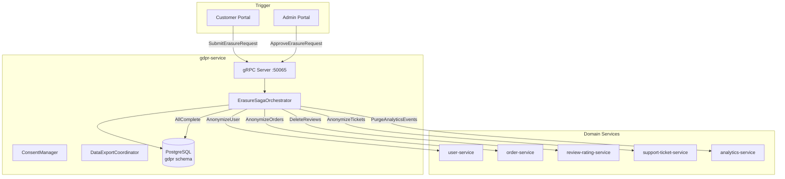

# gdpr-service

> Data erasure requests, consent tracking, and GDPR compliance orchestration.

## Overview

The gdpr-service is the compliance hub for all GDPR and privacy-regulation obligations on
the ShopOS platform. It handles the right-to-erasure (Article 17) by orchestrating
anonymization across every domain that holds personal data, manages consent records
(Article 7) with full audit history, and produces data portability exports (Article 20).
It acts as a saga orchestrator for cross-domain erasure, ensuring all downstream services
complete their anonymization before the request is marked fulfilled.

## Architecture



## Tech Stack

| Component | Technology |
|---|---|
| Language | Go 1.22 |
| Database | PostgreSQL |
| Protocol | gRPC |
| Port | 50065 |
| gRPC Framework | google.golang.org/grpc |
| DB Driver | pgx/v5 |

## Responsibilities

- Accept and track data erasure requests (Right to be Forgotten)
- Orchestrate erasure saga across all data-holding services
- Maintain consent records: what was consented to, when, and from which IP
- Record consent withdrawals with timestamp
- Provide a data portability export (JSON/CSV) of all personal data
- Enforce erasure deadlines (GDPR mandates response within 30 days)
- Maintain an immutable audit log of all GDPR actions
- Block erasure for accounts with pending financial obligations (legal hold)

## API / Interface

```protobuf
service GDPRService {
  rpc SubmitErasureRequest(ErasureRequest) returns (ErasureResponse);
  rpc GetErasureStatus(GetErasureStatusRequest) returns (ErasureStatusResponse);
  rpc RecordConsent(RecordConsentRequest) returns (RecordConsentResponse);
  rpc WithdrawConsent(WithdrawConsentRequest) returns (WithdrawConsentResponse);
  rpc GetConsentHistory(GetConsentHistoryRequest) returns (ConsentHistoryResponse);
  rpc RequestDataExport(DataExportRequest) returns (DataExportResponse);
  rpc GetDataExport(GetDataExportRequest) returns (DataExportFileResponse);
}
```

| Method | Description |
|---|---|
| `SubmitErasureRequest` | Register a right-to-erasure request |
| `GetErasureStatus` | Poll the progress of an erasure saga |
| `RecordConsent` | Store a new consent record with version and scope |
| `WithdrawConsent` | Mark consent as withdrawn for a given purpose |
| `GetConsentHistory` | Return full consent audit trail for a user |
| `RequestDataExport` | Initiate a GDPR Article 20 data portability export |
| `GetDataExport` | Retrieve the generated export archive |

## Kafka Topics

| Topic | Direction | Description |
|---|---|---|
| `identity.user.deleted` | Subscribe | Triggers erasure orchestration on user deletion |

## Dependencies

Upstream (calls these):
- `user-service` — anonymize user PII
- `order-service` — anonymize order personal data
- `review-rating-service` — remove user reviews
- `support-ticket-service` — anonymize ticket personal data
- `analytics-service` — purge user-linked analytics events

Downstream (called by these):
- `api-gateway` — consent and erasure endpoints exposed to end-users
- `admin-portal` — manage erasure requests and legal holds

## Environment Variables

| Variable | Default | Description |
|---|---|---|
| `DATABASE_URL` | — | PostgreSQL connection string |
| `GRPC_PORT` | `50065` | gRPC listening port |
| `ERASURE_DEADLINE_DAYS` | `30` | SLA days to complete erasure |
| `KAFKA_BROKERS` | `kafka:9092` | Kafka broker list |
| `USER_SERVICE_ADDR` | `user-service:50061` | User service gRPC address |
| `ORDER_SERVICE_ADDR` | `order-service:50082` | Order service gRPC address |
| `DATA_EXPORT_BUCKET` | — | MinIO/S3 bucket for export archives |

## Running Locally

```bash
docker-compose up gdpr-service
```

## Health Check

`GET /healthz` — `{"status":"ok"}`

gRPC health protocol: `grpc.health.v1.Health/Check` on port `50065`
