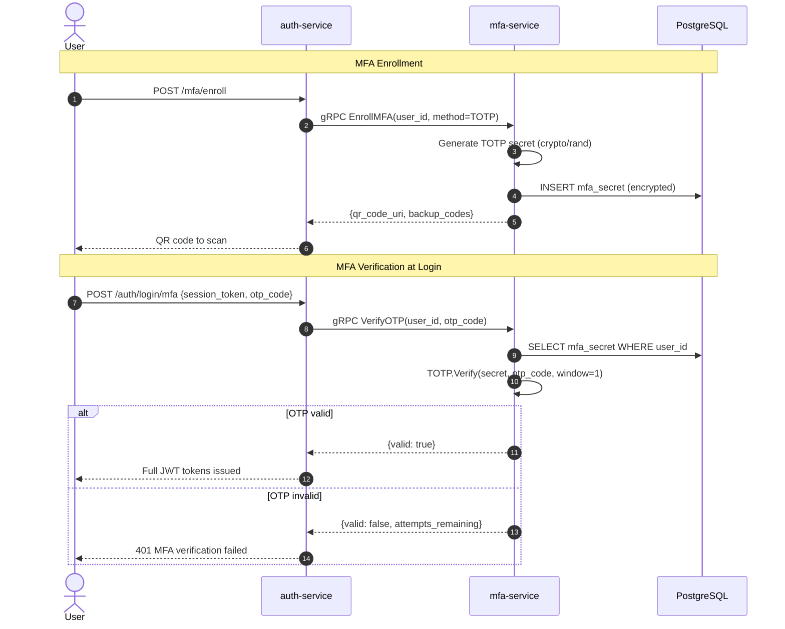

# mfa-service

> TOTP/HOTP multi-factor authentication for step-up and login verification.

## Overview

The mfa-service handles all multi-factor authentication challenges on the ShopOS platform.
It supports Time-based One-Time Passwords (TOTP, RFC 6238) compatible with standard
authenticator apps such as Google Authenticator and Authy, as well as HOTP (counter-based,
RFC 4226). The service manages secret provisioning, QR code URI generation, and challenge
verification so that auth-service can enforce MFA before issuing tokens.

## Architecture



## Tech Stack

| Component | Technology |
|---|---|
| Language | Go 1.22 |
| Database | PostgreSQL |
| Protocol | gRPC |
| Port | 50064 |
| TOTP Library | pquerna/otp |
| gRPC Framework | google.golang.org/grpc |
| DB Driver | pgx/v5 |

## Responsibilities

- Provision TOTP secrets during MFA enrollment (cryptographically random, base32-encoded)
- Generate otpauth:// URI for QR code display in authenticator apps
- Generate and store hashed backup codes for account recovery
- Verify TOTP codes with a ±1 window tolerance for clock skew
- Track failed verification attempts and enforce lockout after N failures
- Support MFA method status per user: disabled, pending-activation, active
- Allow backup code redemption (single-use, marks code as consumed)

## API / Interface

```protobuf
service MFAService {
  rpc EnrollMFA(EnrollMFARequest) returns (EnrollMFAResponse);
  rpc ConfirmEnrollment(ConfirmEnrollmentRequest) returns (ConfirmEnrollmentResponse);
  rpc VerifyOTP(VerifyOTPRequest) returns (VerifyOTPResponse);
  rpc DisableMFA(DisableMFARequest) returns (DisableMFAResponse);
  rpc GetMFAStatus(GetMFAStatusRequest) returns (GetMFAStatusResponse);
  rpc RedeemBackupCode(RedeemBackupCodeRequest) returns (RedeemBackupCodeResponse);
  rpc RegenerateBackupCodes(RegenerateBackupCodesRequest) returns (RegenerateBackupCodesResponse);
}
```

| Method | Description |
|---|---|
| `EnrollMFA` | Generate and store TOTP secret, return QR URI |
| `ConfirmEnrollment` | Verify first OTP to activate MFA for the account |
| `VerifyOTP` | Validate a TOTP code during login |
| `DisableMFA` | Deactivate MFA (requires password re-verification) |
| `GetMFAStatus` | Return current MFA configuration for a user |
| `RedeemBackupCode` | Verify and consume a single-use backup code |
| `RegenerateBackupCodes` | Issue a fresh set of backup codes |

## Kafka Topics

Not applicable — mfa-service is gRPC-only.

## Dependencies

Upstream (calls these):
- None — mfa-service has no outbound service calls

Downstream (called by these):
- `auth-service` — `VerifyOTP` during login when MFA is active
- `user-service` — `EnrollMFA` / `GetMFAStatus` during account settings flows

## Environment Variables

| Variable | Default | Description |
|---|---|---|
| `DATABASE_URL` | — | PostgreSQL connection string |
| `GRPC_PORT` | `50064` | gRPC listening port |
| `TOTP_ISSUER` | `ShopOS` | Issuer label shown in authenticator apps |
| `TOTP_DIGITS` | `6` | OTP code length (6 or 8) |
| `TOTP_PERIOD_SECONDS` | `30` | TOTP period (RFC 6238 standard) |
| `MAX_FAILED_ATTEMPTS` | `5` | Failed OTP attempts before lockout |
| `LOCKOUT_DURATION_MINUTES` | `15` | Duration of OTP lockout |
| `SECRET_ENCRYPTION_KEY` | — | AES-256 key for encrypting stored TOTP secrets |
| `BACKUP_CODES_COUNT` | `10` | Number of backup codes generated per enrollment |

## Running Locally

```bash
docker-compose up mfa-service
```

## Health Check

`GET /healthz` — `{"status":"ok"}`

gRPC health protocol: `grpc.health.v1.Health/Check` on port `50064`
