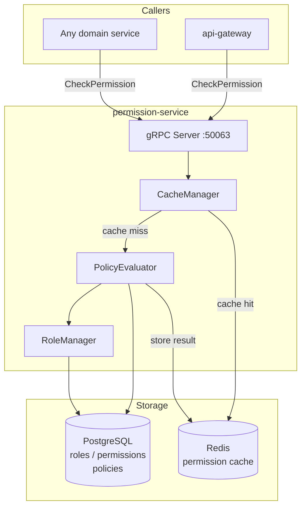

# permission-service

> RBAC permissions, role assignment, and policy evaluation for all platform services.

## Overview

The permission-service is the authorization backbone of ShopOS. It implements Role-Based
Access Control (RBAC) with support for multi-tenancy, allowing fine-grained permission
policies to be defined per role and evaluated at runtime. Services across all domains call
this service to answer the question "is this user allowed to perform this action on this
resource?" before executing sensitive operations.

## Architecture



## Tech Stack

| Component | Technology |
|---|---|
| Language | Go 1.22 |
| Database | PostgreSQL |
| Protocol | gRPC |
| Port | 50063 |
| gRPC Framework | google.golang.org/grpc |
| DB Driver | pgx/v5 |
| Cache | Redis (permission result cache) |

## Responsibilities

- Define and manage roles (e.g., `admin`, `customer`, `vendor`, `support-agent`)
- Assign roles to users (one user may hold multiple roles)
- Define permissions as `{action}:{resource}` pairs (e.g., `order:read`, `catalog:write`)
- Evaluate whether a user has a given permission, considering role hierarchy
- Support tenant-scoped roles for multi-tenant deployments
- Cache evaluated decisions in Redis with short TTL to reduce latency
- Invalidate cache on role/permission mutations

## API / Interface

```protobuf
service PermissionService {
  rpc CheckPermission(CheckPermissionRequest) returns (CheckPermissionResponse);
  rpc AssignRole(AssignRoleRequest) returns (AssignRoleResponse);
  rpc RevokeRole(RevokeRoleRequest) returns (RevokeRoleResponse);
  rpc GetUserRoles(GetUserRolesRequest) returns (GetUserRolesResponse);
  rpc CreateRole(CreateRoleRequest) returns (CreateRoleResponse);
  rpc UpdateRole(UpdateRoleRequest) returns (UpdateRoleResponse);
  rpc DeleteRole(DeleteRoleRequest) returns (DeleteRoleResponse);
  rpc ListPermissions(ListPermissionsRequest) returns (ListPermissionsResponse);
}
```

| Method | Description |
|---|---|
| `CheckPermission` | Evaluate if user_id has permission for action:resource |
| `AssignRole` | Bind a role to a user (optionally scoped to tenant) |
| `RevokeRole` | Remove a role binding from a user |
| `GetUserRoles` | List all roles assigned to a user |
| `CreateRole` | Define a new role with a set of permissions |
| `UpdateRole` | Modify permissions attached to a role |
| `DeleteRole` | Remove a role (cascades to role bindings) |
| `ListPermissions` | Enumerate all defined permissions |

## Kafka Topics

Not applicable — permission-service is gRPC-only.

## Dependencies

**Upstream** (calls these):
- None — permission-service has no outbound service calls

**Downstream** (called by these):
- `api-gateway` — authorization middleware calls `CheckPermission` on every protected route
- Any domain service that enforces fine-grained resource-level access control

## Environment Variables

| Variable | Default | Description |
|---|---|---|
| `DATABASE_URL` | — | PostgreSQL connection string |
| `REDIS_ADDR` | `redis:6379` | Redis address for permission result cache |
| `REDIS_PASSWORD` | — | Redis AUTH password |
| `CACHE_TTL_SECONDS` | `60` | Permission decision cache lifetime |
| `GRPC_PORT` | `50063` | gRPC listening port |

## Running Locally

```bash
docker-compose up permission-service
```

## Health Check

`GET /healthz` — `{"status":"ok"}`

gRPC health protocol: `grpc.health.v1.Health/Check` on port `50063`
