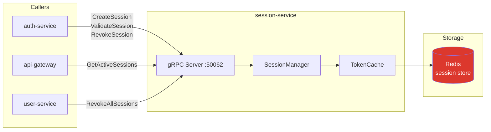

# session-service

> Session lifecycle management with refresh tokens stored in Redis.

## Overview

The session-service manages the active session state for every authenticated user. Sessions
are stored as Redis hashes with a TTL matching the refresh token expiry, enabling instant
revocation without a database query on every request. It tracks device metadata alongside
each session so that users can view and terminate sessions from specific devices.

## Architecture



## Tech Stack

| Component | Technology |
|---|---|
| Language | Go 1.22 |
| Database | Redis 7 |
| Protocol | gRPC |
| Port | 50062 |
| gRPC Framework | google.golang.org/grpc |
| Redis Client | go-redis/v9 |

## Responsibilities

- Create new sessions on successful login, keyed by `session:{session_id}`
- Store session metadata: user ID, device info, IP address, creation time, last-seen time
- Validate that a session exists and has not been revoked or expired
- Update last-seen timestamp on each token refresh
- Revoke individual sessions (single device logout)
- Revoke all sessions for a user (logout-everywhere, triggered by auth-service)
- List active sessions for a user (for the account security UI)

## API / Interface

```protobuf
service SessionService {
  rpc CreateSession(CreateSessionRequest) returns (CreateSessionResponse);
  rpc ValidateSession(ValidateSessionRequest) returns (ValidateSessionResponse);
  rpc RevokeSession(RevokeSessionRequest) returns (RevokeSessionResponse);
  rpc RevokeAllSessions(RevokeAllSessionsRequest) returns (RevokeAllSessionsResponse);
  rpc GetActiveSessions(GetActiveSessionsRequest) returns (GetActiveSessionsResponse);
  rpc TouchSession(TouchSessionRequest) returns (TouchSessionResponse);
}
```

| Method | Description |
|---|---|
| `CreateSession` | Store new session record with TTL |
| `ValidateSession` | Check session exists and is not expired |
| `RevokeSession` | Delete session key from Redis |
| `RevokeAllSessions` | Delete all session keys for a user_id |
| `GetActiveSessions` | Return all non-expired sessions for a user |
| `TouchSession` | Refresh last-seen timestamp and extend TTL |

## Kafka Topics

Not applicable — session-service is gRPC-only.

## Dependencies

Upstream (calls these):
- None — session-service has no outbound service calls

Downstream (called by these):
- `auth-service` — create/validate/revoke sessions during auth flows
- `api-gateway` — fetch active sessions list for account management UI
- `user-service` — revoke all sessions on account deletion

## Environment Variables

| Variable | Default | Description |
|---|---|---|
| `REDIS_ADDR` | `redis:6379` | Redis server address |
| `REDIS_PASSWORD` | — | Redis AUTH password |
| `REDIS_DB` | `0` | Redis logical database index |
| `SESSION_TTL_SECONDS` | `604800` | Session TTL in Redis (7 days) |
| `GRPC_PORT` | `50062` | gRPC listening port |
| `MAX_SESSIONS_PER_USER` | `10` | Maximum concurrent sessions per user |

## Running Locally

```bash
docker-compose up session-service
```

## Health Check

`GET /healthz` — `{"status":"ok"}`

gRPC health protocol: `grpc.health.v1.Health/Check` on port `50062`
