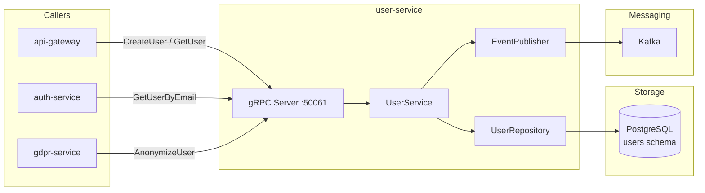

# user-service

> Canonical user account CRUD, profile management, and email verification.

## Overview

The user-service owns the user aggregate — the authoritative record for every registered
account on the platform. It handles account creation, profile updates, email/phone
verification flows, and account status transitions (active, suspended, deleted). Other
identity services treat user-service as the single source of truth for user identity data.

## Architecture



## Tech Stack

| Component | Technology |
|---|---|
| Language | Java 21 (Spring Boot 3) |
| Database | PostgreSQL |
| Protocol | gRPC |
| Port | 50061 |
| gRPC Framework | grpc-spring-boot-starter |
| DB Migrations | Flyway |
| ORM | Spring Data JPA (Hibernate) |

## Responsibilities

- Create, read, update, and soft-delete user accounts
- Manage user profile fields (name, phone, locale, preferences)
- Orchestrate email verification (generate token, validate token)
- Manage phone number verification via OTP handshake with mfa-service
- Enforce unique email constraint and handle duplicate registration errors
- Expose `GetUserByEmail` and `GetUserById` for internal callers
- Publish `identity.user.registered` and `identity.user.deleted` Kafka events

## API / Interface

```protobuf
service UserService {
  rpc CreateUser(CreateUserRequest) returns (CreateUserResponse);
  rpc GetUser(GetUserRequest) returns (UserResponse);
  rpc GetUserByEmail(GetUserByEmailRequest) returns (UserResponse);
  rpc UpdateUser(UpdateUserRequest) returns (UserResponse);
  rpc DeleteUser(DeleteUserRequest) returns (DeleteUserResponse);
  rpc VerifyEmail(VerifyEmailRequest) returns (VerifyEmailResponse);
  rpc ListUsers(ListUsersRequest) returns (ListUsersResponse);
  rpc AnonymizeUser(AnonymizeUserRequest) returns (AnonymizeUserResponse);
}
```

| Method | Description |
|---|---|
| `CreateUser` | Register a new account, trigger email verification |
| `GetUser` | Fetch full user record by ID |
| `GetUserByEmail` | Fetch user record by email (used by auth-service) |
| `UpdateUser` | Partial update of profile fields |
| `DeleteUser` | Soft-delete (sets status=DELETED) |
| `VerifyEmail` | Validate email verification token |
| `ListUsers` | Paginated admin list with filter support |
| `AnonymizeUser` | GDPR erasure — replace PII with anonymized values |

## Kafka Topics

| Topic | Direction | Description |
|---|---|---|
| `identity.user.registered` | Publish | Fired after successful account creation |
| `identity.user.deleted` | Publish | Fired after account deletion or anonymization |

## Dependencies

**Upstream** (calls these):
- `mfa-service` — send OTP for phone verification
- `notification-orchestrator` — request verification emails (via Kafka `notification.email.requested`)

**Downstream** (called by these):
- `auth-service` — `GetUserByEmail` during login
- `gdpr-service` — `AnonymizeUser` during erasure requests
- `api-gateway` — account creation and profile reads
- `permission-service` — resolves user roles

## Environment Variables

| Variable | Default | Description |
|---|---|---|
| `SPRING_DATASOURCE_URL` | — | PostgreSQL JDBC URL |
| `SPRING_DATASOURCE_USERNAME` | — | DB username |
| `SPRING_DATASOURCE_PASSWORD` | — | DB password |
| `GRPC_PORT` | `50061` | gRPC server port |
| `KAFKA_BOOTSTRAP_SERVERS` | `kafka:9092` | Kafka broker list |
| `EMAIL_VERIFICATION_EXPIRY_MINUTES` | `60` | Verification token TTL |
| `MFA_SERVICE_ADDR` | `mfa-service:50064` | MFA service address |

## Running Locally

```bash
docker-compose up user-service
```

## Health Check

`GET /healthz` — `{"status":"ok"}`

gRPC health protocol: `grpc.health.v1.Health/Check` on port `50061`
