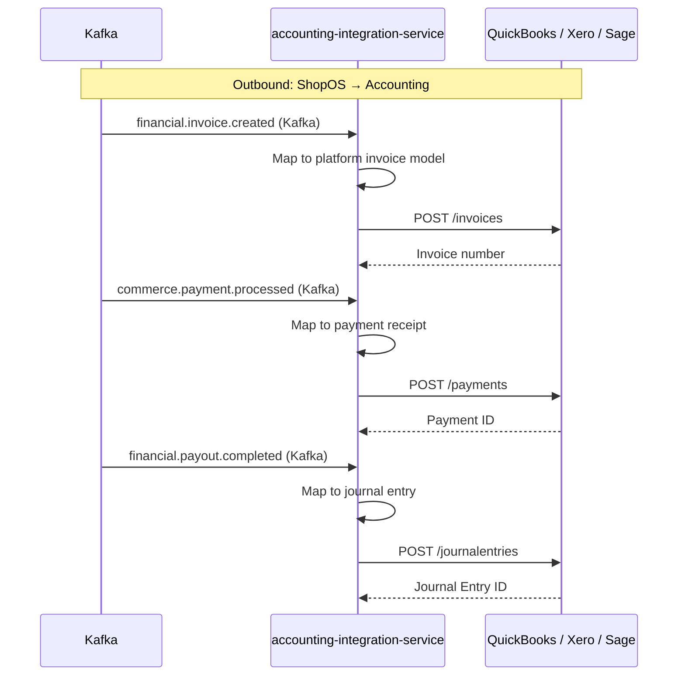

# accounting-integration-service

> Syncs financial transactions and journal entries to accounting platforms (QuickBooks/Xero/Sage-compatible). Consumes financial.* events from Kafka.

## Overview

The accounting-integration-service is a stateless Java adapter that bridges ShopOS's financial domain and external accounting platforms. It consumes `financial.*` Kafka events (invoices created, payments processed, payouts completed, refunds issued) and maps each event to the target accounting platform's API model before posting journal entries, invoices, or payments. It supports QuickBooks Online, Xero, and Sage Intacct via a pluggable adapter pattern — the active adapter is selected at runtime by an environment variable.

## Architecture



## Tech Stack

| Component | Technology |
|---|---|
| Language | Java 21 / Spring Boot 3.4.5 |
| Database | None (stateless adapter) |
| Protocol | Kafka (inbound), REST (accounting platform APIs) |
| Build | Maven |
| Container | Docker (multi-stage, non-root) |

## Responsibilities

- Consume `financial.*` and `commerce.payment.*` Kafka events
- Map ShopOS financial data model to QuickBooks / Xero / Sage invoice, payment, and journal entry schemas
- Post transactions to the configured accounting platform via OAuth 2.0 REST API
- Handle token refresh and re-authentication transparently
- Emit `integrations.accounting.synced` on successful sync
- Dead-letter unprocessable events to `integrations.accounting.dlq`

## Kafka Topics

| Topic | Direction | Description |
|---|---|---|
| `financial.invoice.created` | consume | Triggers invoice creation in accounting platform |
| `financial.payout.completed` | consume | Triggers payout journal entry |
| `commerce.payment.processed` | consume | Triggers payment receipt entry |
| `commerce.order.cancelled` | consume | Triggers credit note / refund entry |
| `integrations.accounting.synced` | publish | Emitted after successful sync |
| `integrations.accounting.dlq` | publish | Dead-letter queue for failed events |

## Dependencies

**Upstream (callers)**
- Kafka topics produced by `invoice-service`, `payout-service`, `payment-service`

**Downstream (calls out to)**
- QuickBooks Online REST API
- Xero API
- Sage Intacct Web Services API

## Environment Variables

| Variable | Default | Description |
|---|---|---|
| `SERVER_PORT` | `50196` | HTTP server port |
| `QBO_CLIENT_ID` | — | QuickBooks OAuth2 client ID |
| `QBO_CLIENT_SECRET` | — | QuickBooks OAuth2 client secret |
| `QBO_REFRESH_TOKEN` | — | QuickBooks long-lived refresh token |
| `QBO_REALM_ID` | — | QuickBooks company realm ID |
| `XERO_CLIENT_ID` | — | Xero OAuth2 client ID |
| `XERO_CLIENT_SECRET` | — | Xero OAuth2 client secret |
| `XERO_TENANT_ID` | — | Xero tenant/organisation ID |
| `SAGE_COMPANY_ID` | — | Sage Intacct company ID |
| `KAFKA_BROKERS` | `localhost:9092` | Comma-separated Kafka broker list |
| `KAFKA_CONSUMER_GROUP` | `accounting-integration-service` | Kafka consumer group ID |
| `SPRING_PROFILES_ACTIVE` | `production` | Active Spring profile |

## Running Locally

```bash
docker-compose up accounting-integration-service
```

## Health Check

`GET /healthz` → `{"status":"ok"}`
