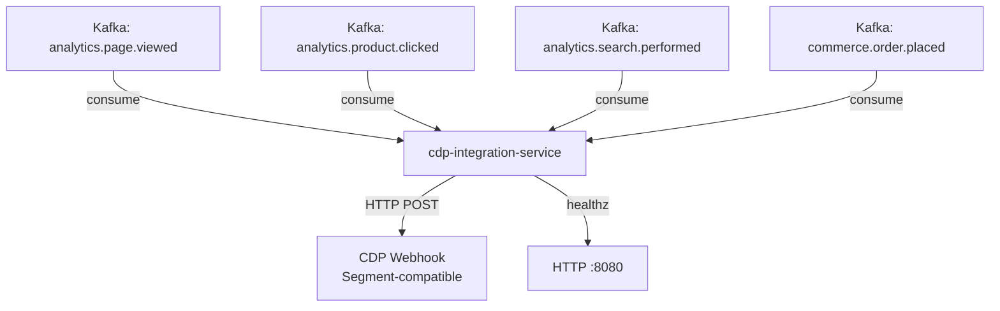

# cdp-integration-service

> Forwards customer behavioural events to Customer Data Platform endpoints (Segment-compatible). Consumes analytics.* Kafka topics and emits to CDP webhook.

## Overview

The cdp-integration-service is a Kafka-to-CDP bridge. It consumes behavioural and transactional events from ShopOS Kafka topics (`analytics.*`, `commerce.order.placed`, etc.) and forwards them to a Segment-compatible Customer Data Platform (CDP) via HTTP webhook. This enables marketing and data teams to activate real-time customer data in external tools (CRMs, ad platforms, email automation) without coupling those tools directly to the ShopOS event bus.

## Architecture



## Tech Stack

| Component | Technology |
|---|---|
| Language | Go |
| Database | None (Kafka consumer only) |
| Protocol | Kafka (inbound), HTTP webhook (outbound) |
| Build Tool | go build |
| Container | Docker (multi-stage, non-root) |

## Responsibilities

- Consume `analytics.*` and selected `commerce.*` Kafka topics
- Map ShopOS event payloads to Segment track/identify/page event schema
- POST events to CDP webhook endpoint with retry and exponential back-off
- Dead-letter undeliverable events to `integrations.cdp.dlq` Kafka topic
- Expose `/healthz` for liveness probing

## Kafka Topics

| Topic | Direction | Description |
|---|---|---|
| `analytics.page.viewed` | consume | Page view events for CDP |
| `analytics.product.clicked` | consume | Product click events for CDP |
| `analytics.search.performed` | consume | Search events for CDP |
| `commerce.order.placed` | consume | Order events for CDP conversion tracking |
| `integrations.cdp.dlq` | publish | Dead-letter queue for failed webhook deliveries |

## Dependencies

Upstream (callers)
- Kafka topics produced by `event-tracking-service` and `analytics-service`

Downstream (calls out to)
- External CDP HTTP webhook (Segment / RudderStack / June / PostHog)

## Environment Variables

| Variable | Default | Description |
|---|---|---|
| `CDP_WEBHOOK_URL` | — | CDP webhook endpoint URL (required) |
| `CDP_WRITE_KEY` | — | CDP write/API key for authentication (required) |
| `KAFKA_BROKERS` | `localhost:9092` | Comma-separated Kafka broker list |
| `KAFKA_CONSUMER_GROUP` | `cdp-integration-service` | Kafka consumer group ID |
| `KAFKA_TOPICS` | — | Comma-separated list of topics to consume |
| `HTTP_PORT` | `8080` | Port for the health check HTTP server |
| `WEBHOOK_RETRY_MAX` | `3` | Maximum webhook delivery retry attempts |
| `WEBHOOK_RETRY_BACKOFF_MS` | `500` | Initial retry back-off in milliseconds |
| `LOG_LEVEL` | `info` | Logging level |

## Running Locally

```bash
docker-compose up cdp-integration-service
```

## Health Check

`GET /healthz` → `{"status":"ok"}`
