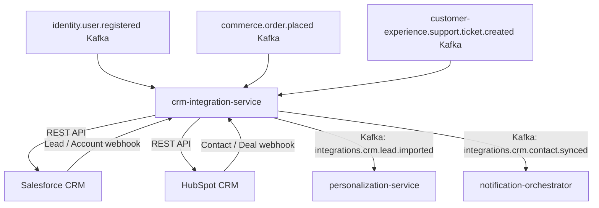

# crm-integration-service

> Synchronizes customer, opportunity, and lead data bidirectionally between ShopOS and CRM platforms (Salesforce, HubSpot).

## Overview

The crm-integration-service keeps ShopOS customer data and CRM records consistent across systems. It pushes customer registrations, order history, and support interactions to the connected CRM so sales and support teams have a full view of each account. Conversely, it pulls leads, opportunities, and account updates created in the CRM back into ShopOS so that marketing and personalization features stay current. A provider-adapter pattern isolates Salesforce and HubSpot API differences from the internal event bus.

## Architecture



## Tech Stack

| Component | Technology |
|---|---|
| Language | Go 1.23 |
| Protocol | gRPC (internal), Salesforce REST/SOAP + HubSpot REST (external) |
| Build | `go build` |
| Container | Docker (multi-stage, non-root) |

## Responsibilities

- Push new ShopOS user registrations to CRM as contacts/accounts
- Sync order history to CRM opportunities or deal records
- Push support ticket creation and resolution events to CRM
- Pull CRM leads and new contacts and emit them as Kafka events for downstream ShopOS services
- Pull CRM deal/opportunity updates and reflect them in customer profiles
- Manage CRM OAuth token lifecycle and connection health
- Deduplicate records using email as the canonical matching key
- Maintain a field-mapping configuration per CRM provider that is changeable without redeploy

## API / Interface

| Method | Request | Response | Description |
|---|---|---|---|
| `GetSyncConfig` | `ConfigRequest` | `SyncConfig` | Fetch field-mapping config for a provider |
| `UpdateSyncConfig` | `UpdateConfigRequest` | `SyncConfig` | Update field mappings |
| `GetConnectionStatus` | `ConnectionRequest` | `ConnectionStatus` | Health of CRM connection |
| `TriggerFullSync` | `FullSyncRequest` | `SyncJob` | Trigger a full contact/account re-sync |
| `GetSyncErrors` | `ErrorRequest` | `SyncErrorList` | List recent sync failures |
| `RetrySync` | `RetryRequest` | `SyncStatus` | Retry a failed sync item |

## Kafka Topics

| Topic | Role | Description |
|---|---|---|
| `integrations.crm.contact.synced` | Producer | Contact/account successfully pushed to CRM |
| `integrations.crm.lead.imported` | Producer | Lead pulled from CRM and available in ShopOS |
| `integrations.crm.sync.failed` | Producer | Fired when a CRM sync fails after retries |
| `identity.user.registered` | Consumer | Triggers contact creation in CRM |
| `identity.user.deleted` | Consumer | Triggers contact deletion (GDPR) |
| `commerce.order.placed` | Consumer | Pushes order to CRM as opportunity/deal |
| `customer-experience.ticket.created` | Consumer | Pushes support ticket to CRM case |

## Dependencies

Upstream (calls this service)
- `admin-portal` — CRM connection config and manual sync

Downstream (this service calls)
- External Salesforce / HubSpot APIs
- `personalization-service` — via Kafka for imported lead data

## Environment Variables

| Variable | Default | Description |
|---|---|---|
| `SERVER_PORT` | `50172` | gRPC server port |
| `KAFKA_BOOTSTRAP_SERVERS` | `localhost:9092` | Kafka broker addresses |
| `CRM_PROVIDER` | `SALESFORCE` | Active CRM adapter (`SALESFORCE` or `HUBSPOT`) |
| `SALESFORCE_INSTANCE_URL` | — | Salesforce instance URL |
| `SALESFORCE_CLIENT_ID` | — | Salesforce Connected App client ID |
| `SALESFORCE_CLIENT_SECRET` | — | Salesforce Connected App client secret |
| `SALESFORCE_REFRESH_TOKEN` | — | Salesforce OAuth2 refresh token |
| `HUBSPOT_ACCESS_TOKEN` | — | HubSpot private app access token |
| `HUBSPOT_PORTAL_ID` | — | HubSpot portal ID |
| `SYNC_RETRY_MAX` | `5` | Maximum retries for failed syncs |
| `DEDUP_KEY` | `email` | Field used for record deduplication |
| `LOG_LEVEL` | `info` | Logging level |

## Running Locally

```bash
docker-compose up crm-integration-service
```

## Health Check

`GET /healthz` → `{"status":"ok"}`

gRPC health: `grpc.health.v1.Health/Check` → `SERVING`
