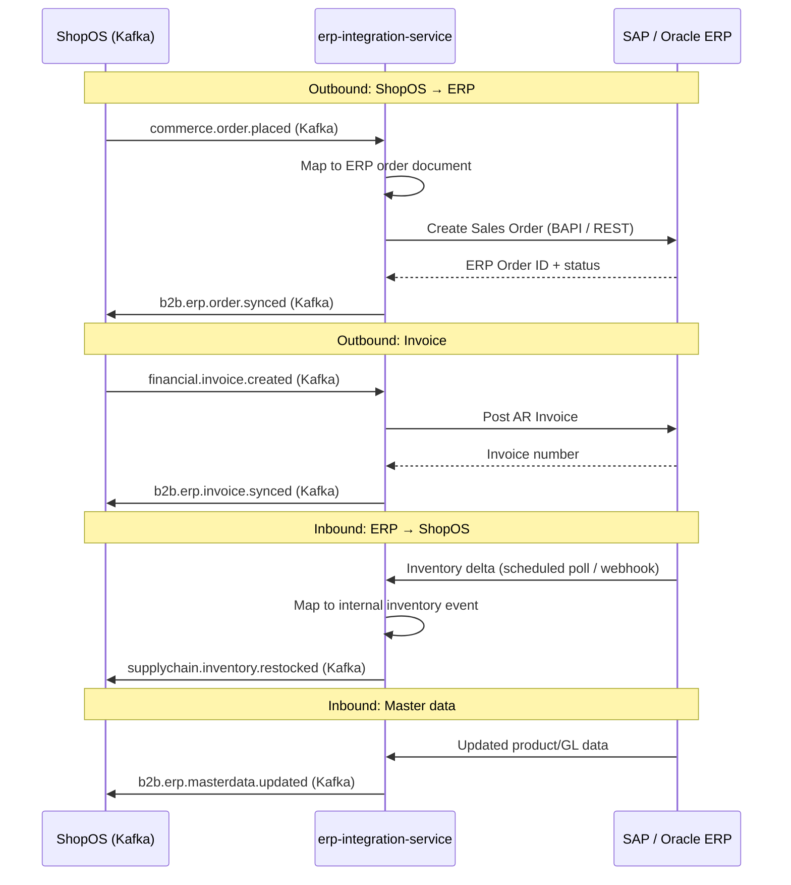

# erp-integration-service

> Provides bidirectional synchronization between ShopOS and external ERP systems (SAP, Oracle), covering orders, inventory, and financial data.

## Overview

The erp-integration-service is the authoritative bridge between ShopOS and enterprise ERP platforms. It consumes internal domain events and pushes the corresponding records (orders, inventory adjustments, invoices) to the connected ERP, and it polls or receives webhooks from the ERP to pull master data updates (products, stock levels, GL codes) back into ShopOS. An adapter pattern isolates ERP-specific protocol details (SAP IDoc/BAPI, Oracle REST/SOAP) from the internal event bus.

## Architecture



## Tech Stack

| Component | Technology |
|---|---|
| Language | Java 21 / Spring Boot 3 |
| Protocol | gRPC (internal), SAP BAPI/IDoc + Oracle REST/SOAP (external) |
| ERP Adapters | SAP JCo (SAP), Oracle REST SDK |
| Build | Maven |
| Migration | Flyway |
| Container | Docker (multi-stage, non-root) |

## Responsibilities

- Push ShopOS orders, invoices, and shipments to the connected ERP system
- Pull inventory levels, product master data, and GL chart-of-accounts from the ERP
- Implement an adapter interface so multiple ERP types (SAP, Oracle) share the same internal contract
- Manage connection credentials and session lifecycle for ERP systems
- Handle retry and idempotency for all ERP calls with exponential backoff
- Maintain a sync-status log for every outbound and inbound record
- Expose a reconciliation endpoint to manually trigger a full re-sync for a given entity type

## API / Interface

| Method | Request | Response | Description |
|---|---|---|---|
| `GetSyncStatus` | `SyncStatusRequest` | `SyncStatus` | Status of a specific entity's sync |
| `TriggerFullSync` | `FullSyncRequest` | `SyncJob` | Manually trigger re-sync for an entity type |
| `ListSyncErrors` | `ErrorListRequest` | `SyncErrorList` | List of failed sync attempts |
| `RetrySync` | `RetrySyncRequest` | `SyncStatus` | Retry a specific failed sync |
| `RegisterERPConnection` | `ConnectionRequest` | `ERPConnection` | Register/update ERP connection config |
| `GetERPConnection` | `GetConnectionRequest` | `ERPConnection` | Fetch ERP connection details |

## Kafka Topics

| Topic | Role | Description |
|---|---|---|
| `b2b.erp.order.synced` | Producer | Confirmation that an order was posted to ERP |
| `b2b.erp.invoice.synced` | Producer | Confirmation that an invoice was posted to ERP |
| `b2b.erp.sync.failed` | Producer | Fired when an ERP sync attempt fails after retries |
| `b2b.erp.masterdata.updated` | Producer | ERP master data pulled and applied in ShopOS |
| `commerce.order.placed` | Consumer | Triggers order push to ERP |
| `supplychain.shipment.created` | Consumer | Triggers shipment notice push to ERP |
| `financial.invoice.created` | Consumer | Triggers invoice push to ERP |

## Dependencies

Upstream (calls this service)
- `admin-portal` — manual sync triggers and error review

Downstream (this service calls)
- External SAP / Oracle ERP APIs

## Environment Variables

| Variable | Default | Description |
|---|---|---|
| `SERVER_PORT` | `50170` | gRPC server port |
| `KAFKA_BOOTSTRAP_SERVERS` | `localhost:9092` | Kafka broker addresses |
| `ERP_TYPE` | `SAP` | ERP adapter to use (`SAP` or `ORACLE`) |
| `SAP_HOST` | — | SAP application server host |
| `SAP_SYSTEM_NUMBER` | — | SAP system number |
| `SAP_CLIENT` | — | SAP client number |
| `SAP_USER` | — | SAP RFC user (required) |
| `SAP_PASSWORD` | — | SAP RFC password (required) |
| `ORACLE_BASE_URL` | — | Oracle ERP REST base URL |
| `ORACLE_CLIENT_ID` | — | Oracle OAuth2 client ID |
| `ORACLE_CLIENT_SECRET` | — | Oracle OAuth2 client secret |
| `SYNC_RETRY_MAX` | `5` | Maximum retry attempts per failed sync |
| `INVENTORY_POLL_CRON` | `0 */15 * * * *` | Cron for inventory poll from ERP |
| `LOG_LEVEL` | `INFO` | Logging level |

## Running Locally

```bash
docker-compose up erp-integration-service
```

## Health Check

`GET /healthz` → `{"status":"ok"}`

gRPC health: `grpc.health.v1.Health/Check` → `SERVING`
