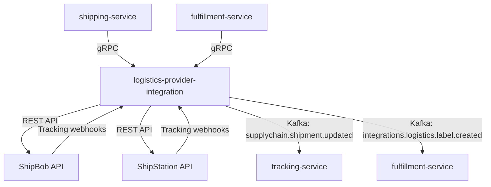

# logistics-provider-integration

> Provides unified logistics API adapters for ShipBob and ShipStation, supporting rate shopping, label creation, and shipment tracking.

## Overview

The logistics-provider-integration service abstracts the differences between third-party logistics (3PL) and shipping platform APIs behind a single internal interface. The fulfillment and shipping domains call this service to get live rate quotes, create shipments, purchase labels, and receive tracking updates — all without knowing which logistics provider is fulfilling a specific order. Provider routing is based on configuration per warehouse or SKU class.

## Architecture



## Tech Stack

| Component | Technology |
|---|---|
| Language | Go 1.23 |
| Protocol | gRPC (internal), HTTPS REST (ShipBob, ShipStation) |
| Build | `go build` |
| Container | Docker (multi-stage, non-root) |

## Responsibilities

- Expose a unified gRPC API for rate quoting, shipment creation, and label generation
- Route requests to the appropriate logistics provider adapter per warehouse config
- Return multi-carrier rate options so callers can perform rate shopping
- Create shipments and purchase labels from the winning rate selection
- Receive and normalize tracking update webhooks from each provider
- Push tracking events to the tracking-service via Kafka
- Handle label voiding for cancelled shipments
- Manage provider API credentials and handle token refresh where required

## API / Interface

| Method | Request | Response | Description |
|---|---|---|---|
| `GetRates` | `RateRequest` | `RateList` | Get carrier rate quotes for a shipment |
| `CreateShipment` | `ShipmentRequest` | `Shipment` | Create a shipment and purchase label |
| `VoidLabel` | `VoidRequest` | `VoidResponse` | Cancel a label for a shipment |
| `GetShipment` | `GetShipmentRequest` | `Shipment` | Fetch shipment status from provider |
| `TrackShipment` | `TrackRequest` | `TrackingInfo` | Get latest tracking events |
| `ListProviders` | `Empty` | `ProviderList` | List configured logistics providers |
| `SetProviderConfig` | `ProviderConfigRequest` | `ProviderConfig` | Add or update a provider configuration |

## Kafka Topics

| Topic | Role | Description |
|---|---|---|
| `supplychain.shipment.updated` | Producer | Tracking event received from logistics provider |
| `integrations.logistics.label.created` | Producer | Label successfully purchased; contains tracking number |
| `integrations.logistics.label.voided` | Producer | Label successfully voided |
| `integrations.logistics.shipment.failed` | Producer | Shipment creation failed at provider |

## Dependencies

**Upstream (calls this service)**
- `shipping-service` — rate shopping and label creation
- `fulfillment-service` — shipment creation for warehouse fulfillment

**Downstream (this service calls)**
- ShipBob REST API
- ShipStation REST API

## Environment Variables

| Variable | Default | Description |
|---|---|---|
| `SERVER_PORT` | `50174` | gRPC server port |
| `KAFKA_BOOTSTRAP_SERVERS` | `localhost:9092` | Kafka broker addresses |
| `DEFAULT_PROVIDER` | `SHIPSTATION` | Default logistics provider adapter |
| `SHIPBOB_PAT` | — | ShipBob Personal Access Token |
| `SHIPBOB_CHANNEL_ID` | — | ShipBob channel ID |
| `SHIPSTATION_API_KEY` | — | ShipStation API key |
| `SHIPSTATION_API_SECRET` | — | ShipStation API secret |
| `WEBHOOK_BASE_URL` | — | Public base URL for provider tracking webhooks |
| `RATE_CACHE_TTL_SECONDS` | `300` | Seconds to cache rate quotes |
| `LOG_LEVEL` | `info` | Logging level |

## Running Locally

```bash
docker-compose up logistics-provider-integration
```

## Health Check

`GET /healthz` → `{"status":"ok"}`

gRPC health: `grpc.health.v1.Health/Check` → `SERVING`
