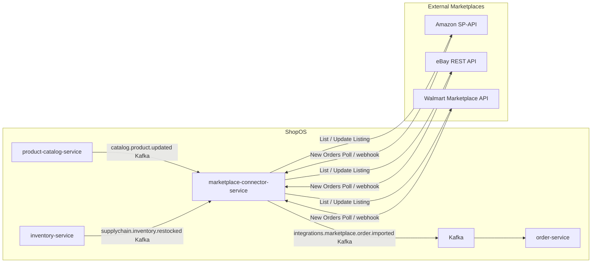

# marketplace-connector-service

> Synchronizes product listings, inventory levels, and orders across external marketplaces (Amazon, eBay, Walmart).

## Overview

The marketplace-connector-service is the multi-channel commerce hub that keeps ShopOS in sync with major external marketplaces. It pushes product catalog updates and real-time inventory changes outbound to each marketplace, and it imports orders placed on those channels back into the ShopOS order pipeline. Channel-specific adapters encapsulate each marketplace's API differences, allowing new channels to be added without changing the core sync logic.

## Architecture



## Tech Stack

| Component | Technology |
|---|---|
| Language | Go 1.23 |
| Protocol | Kafka (internal async) |
| External APIs | Amazon SP-API, eBay REST, Walmart Marketplace API |
| Build | `go build` |
| Container | Docker (multi-stage, non-root) |

## Responsibilities

- Maintain channel-specific product listings (title, description, images, price, attributes) in sync with the ShopOS catalog
- Push real-time inventory updates to all connected marketplace channels to prevent overselling
- Poll or receive webhooks for new and updated orders from each marketplace
- Map external order formats to the internal ShopOS order schema and emit to Kafka
- Handle marketplace-specific listing requirements (ASIN matching, eBay item specifics, Walmart item taxonomy)
- Track listing status per channel (active, suppressed, under review, removed)
- Manage channel credentials and OAuth token refresh lifecycles
- Emit error events when listings are suppressed or orders fail to import

## API / Interface

This service is Kafka-driven with no public gRPC API. Internal control operations are exposed via admin Kafka command topics.

| Kafka Command Topic | Description |
|---|---|
| `integrations.marketplace.listing.sync` | Trigger a full listing sync for a given channel |
| `integrations.marketplace.order.pull` | Trigger an immediate order import from a channel |

## Kafka Topics

| Topic | Role | Description |
|---|---|---|
| `integrations.marketplace.order.imported` | Producer | New marketplace order ready for order-service |
| `integrations.marketplace.listing.synced` | Producer | Listing pushed successfully to a channel |
| `integrations.marketplace.listing.failed` | Producer | Listing push failed (suppressed, rejected) |
| `integrations.marketplace.inventory.synced` | Producer | Inventory pushed to a channel |
| `catalog.product.updated` | Consumer | Triggers listing update on all channels |
| `catalog.product.created` | Consumer | Triggers new listing creation on all channels |
| `supplychain.inventory.restocked` | Consumer | Triggers inventory push to all channels |
| `supplychain.inventory.low` | Consumer | Triggers inventory update to prevent overselling |

## Dependencies

Upstream (calls this service)
- `product-catalog-service` — product data via Kafka
- `inventory-service` — inventory levels via Kafka

Downstream (this service calls)
- `order-service` — via Kafka for imported orders

## Environment Variables

| Variable | Default | Description |
|---|---|---|
| `KAFKA_BOOTSTRAP_SERVERS` | `localhost:9092` | Kafka broker addresses |
| `AMAZON_SELLER_ID` | — | Amazon Seller Central account ID |
| `AMAZON_CLIENT_ID` | — | Amazon SP-API LWA client ID |
| `AMAZON_CLIENT_SECRET` | — | Amazon SP-API LWA client secret |
| `AMAZON_REFRESH_TOKEN` | — | Amazon SP-API refresh token |
| `AMAZON_MARKETPLACE_ID` | — | Amazon marketplace ID (e.g., ATVPDKIKX0DER) |
| `EBAY_CLIENT_ID` | — | eBay OAuth2 client ID |
| `EBAY_CLIENT_SECRET` | — | eBay OAuth2 client secret |
| `EBAY_REFRESH_TOKEN` | — | eBay refresh token |
| `WALMART_CLIENT_ID` | — | Walmart Marketplace client ID |
| `WALMART_CLIENT_SECRET` | — | Walmart Marketplace client secret |
| `ORDER_POLL_INTERVAL_SECONDS` | `60` | Seconds between order polling cycles |
| `INVENTORY_SYNC_BATCH_SIZE` | `500` | Products per inventory push batch |
| `LOG_LEVEL` | `info` | Logging level |

## Running Locally

```bash
docker-compose up marketplace-connector-service
```

## Health Check

`GET /healthz` → `{"status":"ok"}`
