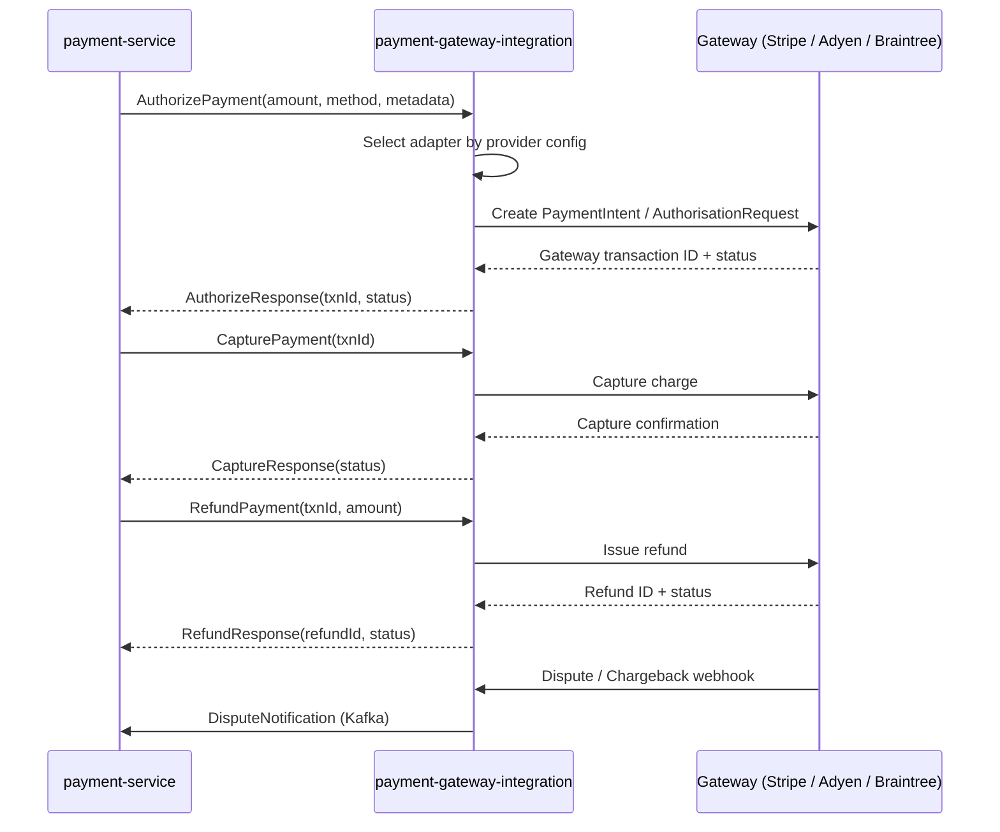

# payment-gateway-integration

> Provides a unified payment gateway adapter layer supporting Stripe, Adyen, and Braintree.

## Overview

The payment-gateway-integration service decouples the ShopOS payment-service from the specifics of individual payment gateway APIs. It exposes a single internal gRPC interface for charge, capture, refund, and dispute operations, and routes each call to the correct gateway adapter based on the configured provider for that merchant or payment method. This allows ShopOS to add or swap gateway providers without changing the commerce domain.

## Architecture



## Tech Stack

| Component | Technology |
|---|---|
| Language | Go 1.23 |
| Protocol | gRPC (internal), HTTPS REST (Stripe, Braintree, Adyen) |
| Build | `go build` |
| Container | Docker (multi-stage, non-root) |

## Responsibilities

- Expose a unified gRPC API for authorize, capture, void, and refund operations
- Route requests to the correct gateway adapter (Stripe, Adyen, Braintree) per merchant config
- Handle 3DS2 authentication challenge flows and return redirect URLs to payment-service
- Receive and validate gateway webhooks (payment confirmed, refund processed, dispute opened)
- Normalize gateway-specific error codes to a standard internal error taxonomy
- Persist gateway transaction IDs and correlation data for reconciliation
- Support multi-gateway fallback: retry on a secondary gateway if primary fails
- Manage gateway API key rotation without downtime

## API / Interface

| Method | Request | Response | Description |
|---|---|---|---|
| `AuthorizePayment` | `AuthorizeRequest` | `AuthorizeResponse` | Reserve funds on a payment method |
| `CapturePayment` | `CaptureRequest` | `CaptureResponse` | Capture a previously authorized charge |
| `VoidPayment` | `VoidRequest` | `VoidResponse` | Cancel an authorized payment |
| `RefundPayment` | `RefundRequest` | `RefundResponse` | Issue full or partial refund |
| `GetTransaction` | `TxnRequest` | `Transaction` | Fetch gateway transaction details |
| `ListGatewayConfigs` | `ListConfigRequest` | `GatewayConfigList` | List configured gateway providers |
| `SetGatewayConfig` | `SetConfigRequest` | `GatewayConfig` | Add or update a gateway configuration |

## Kafka Topics

| Topic | Role | Description |
|---|---|---|
| `integrations.payment.captured` | Producer | Payment successfully captured by gateway |
| `integrations.payment.failed` | Producer | Gateway payment failure after retries |
| `integrations.payment.refunded` | Producer | Refund confirmed by gateway |
| `integrations.payment.dispute.opened` | Producer | Chargeback or dispute received from gateway |

## Dependencies

Upstream (calls this service)
- `payment-service` — all payment operations are routed through this service

Downstream (this service calls)
- Stripe API (`api.stripe.com`)
- Adyen API (`checkout-test.adyen.com` / `checkout-live.adyen.com`)
- Braintree API (`api.braintreegateway.com`)

## Environment Variables

| Variable | Default | Description |
|---|---|---|
| `SERVER_PORT` | `50173` | gRPC server port |
| `KAFKA_BOOTSTRAP_SERVERS` | `localhost:9092` | Kafka broker addresses |
| `DEFAULT_GATEWAY` | `STRIPE` | Default gateway adapter to use |
| `STRIPE_SECRET_KEY` | — | Stripe API secret key |
| `STRIPE_WEBHOOK_SECRET` | — | Stripe webhook signing secret |
| `ADYEN_API_KEY` | — | Adyen API key |
| `ADYEN_MERCHANT_ACCOUNT` | — | Adyen merchant account name |
| `ADYEN_ENVIRONMENT` | `TEST` | `TEST` or `LIVE` |
| `ADYEN_WEBHOOK_HMAC_KEY` | — | Adyen HMAC key for webhook validation |
| `BRAINTREE_MERCHANT_ID` | — | Braintree merchant ID |
| `BRAINTREE_PUBLIC_KEY` | — | Braintree public key |
| `BRAINTREE_PRIVATE_KEY` | — | Braintree private key |
| `BRAINTREE_ENVIRONMENT` | `SANDBOX` | `SANDBOX` or `PRODUCTION` |
| `FALLBACK_GATEWAY` | — | Secondary gateway on primary failure (optional) |
| `LOG_LEVEL` | `info` | Logging level |

## Running Locally

```bash
docker-compose up payment-gateway-integration
```

## Health Check

`GET /healthz` → `{"status":"ok"}`

gRPC health: `grpc.health.v1.Health/Check` → `SERVING`
