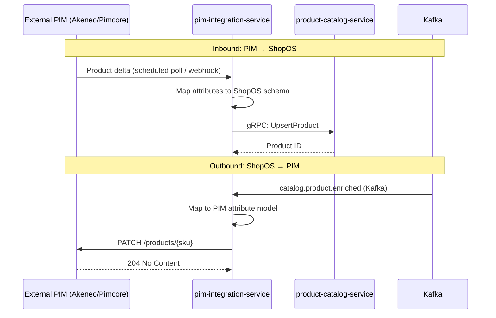

# pim-integration-service

> Bi-directional product data sync with PIM systems (Akeneo/Pimcore-compatible API). Maps external product attributes to ShopOS catalog schema.

## Overview

The pim-integration-service is a stateless adapter that bridges external Product Information Management (PIM) systems and the ShopOS catalog domain. It periodically polls (or receives webhooks from) Akeneo- and Pimcore-compatible PIM APIs, maps external product attribute models to ShopOS's internal catalog schema, and pushes updates to the product-catalog-service via gRPC. In the reverse direction, it receives enrichment-complete events from ShopOS and writes approved product data back to the PIM, keeping both systems in sync.

## Architecture



## Tech Stack

| Component | Technology |
|---|---|
| Language | Go |
| Database | None (stateless adapter) |
| Protocol | gRPC (internal), REST (PIM API) |
| Build Tool | go build |
| Container | Docker (multi-stage, non-root) |

## Responsibilities

- Poll PIM REST API on a configurable interval for product delta changes
- Accept inbound webhook calls from the PIM on attribute updates
- Map external product attribute families to ShopOS catalog schema
- Push mapped products to `product-catalog-service` via gRPC (upsert semantics)
- Consume `catalog.product.enriched` Kafka events and write enriched data back to PIM
- Handle attribute normalisation: units, localised strings, asset references

## API / Interface

```protobuf
service PimIntegrationService {
  rpc TriggerSync(TriggerSyncRequest) returns (SyncStatus);
  rpc GetSyncStatus(GetSyncStatusRequest) returns (SyncStatus);
  rpc MapProductAttributes(MapAttributesRequest) returns (MappedProduct);
  rpc ListAttributeMappings(ListMappingsRequest) returns (ListMappingsResponse);
  rpc UpsertAttributeMapping(AttributeMapping) returns (AttributeMapping);
}
```

## Kafka Topics

| Topic | Direction | Description |
|---|---|---|
| `catalog.product.enriched` | consume | Triggers outbound write back to PIM |
| `integrations.pim.synced` | publish | Emitted after each successful inbound sync batch |

## Dependencies

Upstream (callers)
- `product-catalog-service` — receives upserted product data from this adapter
- PIM webhook endpoint — triggers on-demand sync

Downstream (calls out to)
- External PIM API (Akeneo / Pimcore REST)

## Environment Variables

| Variable | Default | Description |
|---|---|---|
| `GRPC_PORT` | `50195` | Port the gRPC server listens on |
| `PIM_API_URL` | — | Base URL of the PIM REST API (required) |
| `PIM_API_KEY` | — | API key for PIM authentication (required) |
| `SYNC_INTERVAL_SECONDS` | `300` | Polling interval for product delta sync |
| `SYNC_BATCH_SIZE` | `500` | Products per sync batch |
| `KAFKA_BROKERS` | `localhost:9092` | Comma-separated Kafka broker list |
| `LOG_LEVEL` | `info` | Logging level |

## Running Locally

```bash
docker-compose up pim-integration-service
```

## Health Check

`GET /healthz` → `{"status":"ok"}`

gRPC health: `grpc.health.v1.Health/Check` → `SERVING`
