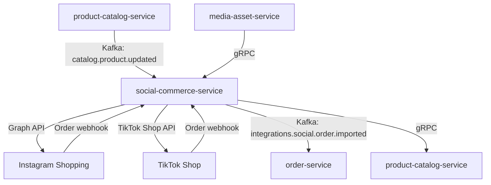

# social-commerce-service

> Integrates ShopOS with social commerce platforms (Instagram Shopping, TikTok Shop) for product catalog sync and order capture.

## Overview

The social-commerce-service bridges ShopOS and social shopping channels where product discovery and purchasing happen inside social media apps. It synchronizes the product catalog to Instagram and TikTok shop feeds, manages channel-specific product requirements (media formats, compliance attributes), and ingests orders placed through those channels into the ShopOS order pipeline. It also handles product tag linking so that social posts can be automatically tied to live catalog items.

## Architecture



## Tech Stack

| Component | Technology |
|---|---|
| Language | Node.js 20 (Express) |
| Protocol | gRPC (internal), Facebook Graph API + TikTok Shop API (external) |
| Build | npm |
| Container | Docker (multi-stage, non-root) |

## Responsibilities

- Sync ShopOS product catalog to Instagram and TikTok product feeds
- Map ShopOS product attributes to platform-specific requirements (Instagram Commerce, TikTok Product Catalog)
- Handle image and video asset requirements for social product cards
- Register and refresh OAuth tokens for connected social accounts
- Listen for product approval/rejection decisions from platform review pipelines
- Capture incoming orders from social checkout webhooks
- Normalize social orders to the ShopOS order schema and emit to Kafka
- Track product link health (broken tags, de-listed products) and alert

## API / Interface

| Method | Endpoint | Description |
|---|---|---|
| `POST` | `/v1/channels` | Register a new social channel connection |
| `GET` | `/v1/channels` | List connected social channels |
| `DELETE` | `/v1/channels/:channelId` | Disconnect a social channel |
| `POST` | `/v1/channels/:channelId/sync` | Trigger a full catalog sync to channel |
| `GET` | `/v1/products/:productId/status` | Listing approval status per channel |
| `POST` | `/v1/webhooks/instagram` | Instagram order/update webhook receiver |
| `POST` | `/v1/webhooks/tiktok` | TikTok order/update webhook receiver |

## Kafka Topics

| Topic | Role | Description |
|---|---|---|
| `integrations.social.order.imported` | Producer | Social order normalized and ready for order-service |
| `integrations.social.listing.approved` | Producer | Platform approved the product listing |
| `integrations.social.listing.rejected` | Producer | Platform rejected the listing with reason |
| `catalog.product.updated` | Consumer | Triggers listing update on all connected channels |
| `catalog.product.created` | Consumer | Triggers new product submission to channels |

## Dependencies

Upstream (calls this service)
- `product-catalog-service` — product data via Kafka
- `admin-portal` — channel management

Downstream (this service calls)
- `media-asset-service` — fetches product images and videos for channel upload
- `product-catalog-service` — fetches full product detail for catalog submission
- `order-service` — via Kafka for imported social orders

## Environment Variables

| Variable | Default | Description |
|---|---|---|
| `SERVER_PORT` | `50171` | gRPC / HTTP server port |
| `KAFKA_BOOTSTRAP_SERVERS` | `localhost:9092` | Kafka broker addresses |
| `INSTAGRAM_APP_ID` | — | Facebook App ID for Instagram Commerce |
| `INSTAGRAM_APP_SECRET` | — | Facebook App secret |
| `INSTAGRAM_CATALOG_ID` | — | Facebook Commerce catalog ID |
| `TIKTOK_APP_KEY` | — | TikTok Shop app key |
| `TIKTOK_APP_SECRET` | — | TikTok Shop app secret |
| `MEDIA_SERVICE_ADDR` | `media-asset-service:50140` | Address of media-asset-service |
| `CATALOG_SERVICE_ADDR` | `product-catalog-service:50070` | Address of product-catalog-service |
| `WEBHOOK_VERIFY_TOKEN` | — | Shared secret for webhook signature validation |
| `LOG_LEVEL` | `info` | Logging level |

## Running Locally

```bash
docker-compose up social-commerce-service
```

## Health Check

`GET /healthz` → `{"status":"ok"}`

gRPC health: `grpc.health.v1.Health/Check` → `SERVING`
