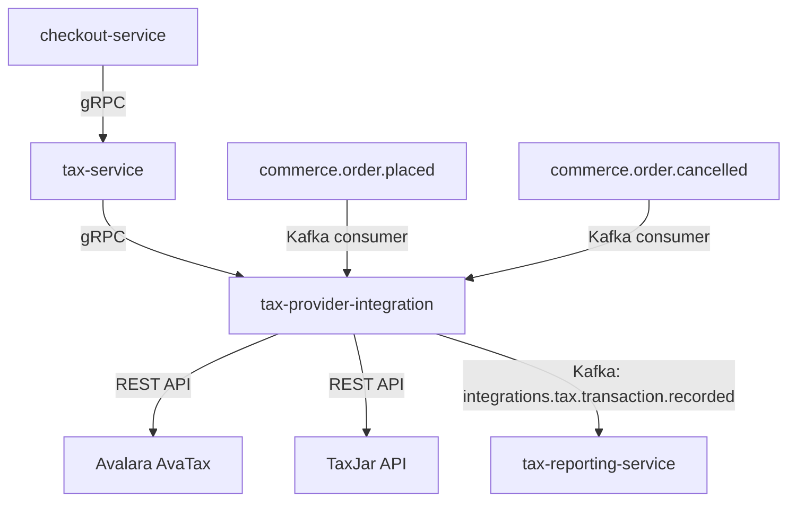

# tax-provider-integration

> Integrates with external tax engines (Avalara AvaTax, TaxJar) to provide real-time tax calculation and filing support.

## Overview

The tax-provider-integration service abstracts the ShopOS tax-service from the complexities of external tax compliance engines. It accepts real-time tax calculation requests from the commerce domain, delegates them to the configured provider (Avalara or TaxJar), and returns itemized tax breakdowns including jurisdiction, rate, and tax type. It also handles transaction recording for automated sales tax filing and manages nexus configuration per provider.

## Architecture



## Tech Stack

| Component | Technology |
|---|---|
| Language | Go 1.23 |
| Protocol | gRPC (internal), HTTPS REST (Avalara, TaxJar) |
| Build | `go build` |
| Container | Docker (multi-stage, non-root) |

## Responsibilities

- Accept real-time tax calculation requests and route to the configured provider
- Return itemized tax breakdowns: jurisdiction, rate, tax type (sales, VAT, GST)
- Support address validation as part of tax nexus determination
- Commit finalized transactions to the tax provider for filing records when an order is placed
- Void committed transactions when orders are cancelled or refunded
- Manage nexus jurisdiction registration per provider
- Expose nexus configuration APIs for the admin portal
- Cache repeated tax calculations for identical address/item combinations to reduce provider API calls

## API / Interface

| Method | Request | Response | Description |
|---|---|---|---|
| `CalculateTax` | `TaxCalculationRequest` | `TaxCalculationResponse` | Real-time tax estimate for a cart or order |
| `CommitTransaction` | `CommitRequest` | `TransactionRef` | Record finalized order with provider |
| `VoidTransaction` | `VoidRequest` | `VoidResponse` | Void a recorded transaction on cancel/refund |
| `ValidateAddress` | `AddressRequest` | `ValidatedAddress` | Normalize and validate a shipping address |
| `GetNexusJurisdictions` | `NexusRequest` | `NexusList` | List registered nexus jurisdictions |
| `AddNexus` | `AddNexusRequest` | `Nexus` | Register a new nexus jurisdiction |
| `GetProviderConfig` | `ConfigRequest` | `ProviderConfig` | Fetch current provider configuration |
| `SetProviderConfig` | `SetConfigRequest` | `ProviderConfig` | Update provider and credentials |

## Kafka Topics

| Topic | Role | Description |
|---|---|---|
| `integrations.tax.transaction.recorded` | Producer | Transaction committed to provider after order placed |
| `integrations.tax.transaction.voided` | Producer | Transaction voided at provider after cancellation |
| `integrations.tax.calculation.failed` | Producer | Provider call failed; fallback rate applied |
| `commerce.order.placed` | Consumer | Triggers transaction commit to provider |
| `commerce.order.cancelled` | Consumer | Triggers transaction void at provider |

## Dependencies

Upstream (calls this service)
- `tax-service` — all tax calculations are delegated here

Downstream (this service calls)
- Avalara AvaTax REST API (`rest.avatax.com`)
- TaxJar API (`api.taxjar.com`)
- `tax-reporting-service` — via Kafka for committed transaction records

## Environment Variables

| Variable | Default | Description |
|---|---|---|
| `SERVER_PORT` | `50175` | gRPC server port |
| `KAFKA_BOOTSTRAP_SERVERS` | `localhost:9092` | Kafka broker addresses |
| `TAX_PROVIDER` | `AVATAX` | Active provider adapter (`AVATAX` or `TAXJAR`) |
| `AVATAX_ACCOUNT_ID` | — | Avalara account number |
| `AVATAX_LICENSE_KEY` | — | Avalara license key |
| `AVATAX_COMPANY_CODE` | — | Avalara company code |
| `AVATAX_ENVIRONMENT` | `SANDBOX` | `SANDBOX` or `PRODUCTION` |
| `TAXJAR_API_TOKEN` | — | TaxJar API token |
| `TAXJAR_FROM_COUNTRY` | `US` | Default ship-from country code |
| `TAXJAR_FROM_ZIP` | — | Default ship-from ZIP code |
| `TAX_CACHE_TTL_SECONDS` | `300` | Seconds to cache repeated tax calculations |
| `FALLBACK_TAX_RATE` | `0.0` | Rate applied when provider is unavailable |
| `LOG_LEVEL` | `info` | Logging level |

## Running Locally

```bash
docker-compose up tax-provider-integration
```

## Health Check

`GET /healthz` → `{"status":"ok"}`

gRPC health: `grpc.health.v1.Health/Check` → `SERVING`
