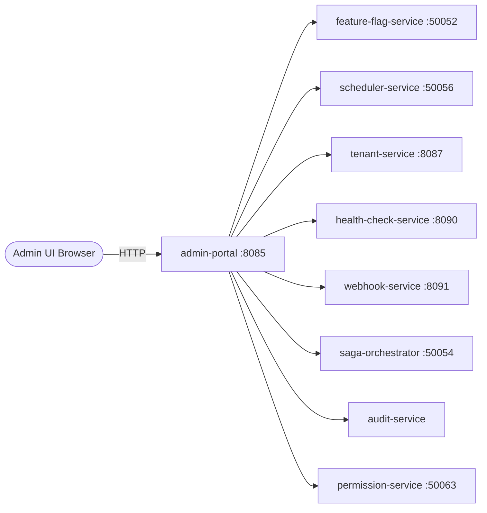

# Admin Portal

> Internal administration backend for managing platform operations, configuration, and users.

## Overview

The Admin Portal is a Java/Spring Boot service that provides the backend API for ShopOS internal tooling, giving operations, engineering, and support teams a unified interface to manage tenants, feature flags, scheduled jobs, audit logs, and service health. It aggregates management APIs from across the platform into a single, role-protected backend that serves the admin UI frontend. All actions performed via the admin portal are logged to the audit-service.

## Architecture



## Tech Stack

| Component | Technology |
|---|---|
| Language | Java |
| Database | — |
| Protocol | HTTP |
| Port | 8085 |

## Responsibilities

- Serve a REST API backing the admin UI for internal teams
- Aggregate management operations from feature flags, scheduler, webhooks, and sagas
- Enforce role-based access control via permission-service for all admin actions
- Provide tenant management create/read/update/deactivate operations
- Surface platform health status from health-check-service
- Expose audit log query endpoints for compliance and security teams
- Proxy saga inspection and manual retry operations to saga-orchestrator

## API / Interface

| Method | Path | Description |
|---|---|---|
| GET | `/admin/v1/tenants` | List all tenants |
| POST | `/admin/v1/tenants` | Create a new tenant |
| PUT | `/admin/v1/tenants/:id` | Update tenant configuration |
| GET | `/admin/v1/feature-flags` | List all feature flags |
| POST | `/admin/v1/feature-flags` | Create a feature flag |
| GET | `/admin/v1/jobs` | List all scheduled jobs |
| POST | `/admin/v1/jobs/:id/trigger` | Manually trigger a scheduled job |
| GET | `/admin/v1/sagas` | List in-flight sagas |
| POST | `/admin/v1/sagas/:id/retry` | Retry a failed saga |
| GET | `/admin/v1/audit` | Query the audit log |
| GET | `/admin/v1/health` | Platform-wide health summary |
| GET | `/healthz` | Health check |

## Kafka Topics

N/A — the Admin Portal operates synchronously over HTTP and gRPC.

## Dependencies

Upstream (services this calls):
- `feature-flag-service` (platform) — flag management
- `scheduler-service` (platform) — job management
- `saga-orchestrator` (platform) — saga inspection and retry
- `health-check-service` (platform) — platform health
- `webhook-service` (platform) — webhook subscription management
- `tenant-service` (platform) — tenant management
- `audit-service` (platform) — audit log queries
- `permission-service` (identity) — admin RBAC enforcement

Downstream (services that call this):
- Admin UI frontend
- Internal ops tooling and scripts

## Environment Variables

| Variable | Default | Description |
|---|---|---|
| `PORT` | `8085` | HTTP listening port |
| `FEATURE_FLAG_SERVICE_ADDR` | `feature-flag-service:50052` | Address of feature-flag-service |
| `SCHEDULER_SERVICE_ADDR` | `scheduler-service:50056` | Address of scheduler-service |
| `SAGA_ORCHESTRATOR_ADDR` | `saga-orchestrator:50054` | Address of saga-orchestrator |
| `HEALTH_CHECK_SERVICE_ADDR` | `health-check-service:8090` | Address of health-check-service |
| `WEBHOOK_SERVICE_ADDR` | `webhook-service:8091` | Address of webhook-service |
| `TENANT_SERVICE_ADDR` | `tenant-service:8087` | Address of tenant-service |
| `PERMISSION_SERVICE_ADDR` | `permission-service:50063` | Address of permission-service |
| `LOG_LEVEL` | `INFO` | Logging level |

## Running Locally

```bash
# From repo root
docker-compose up admin-portal

# OR hot reload
skaffold dev --module=admin-portal
```

## Health Check

`GET /healthz` → `{"status":"ok"}`
