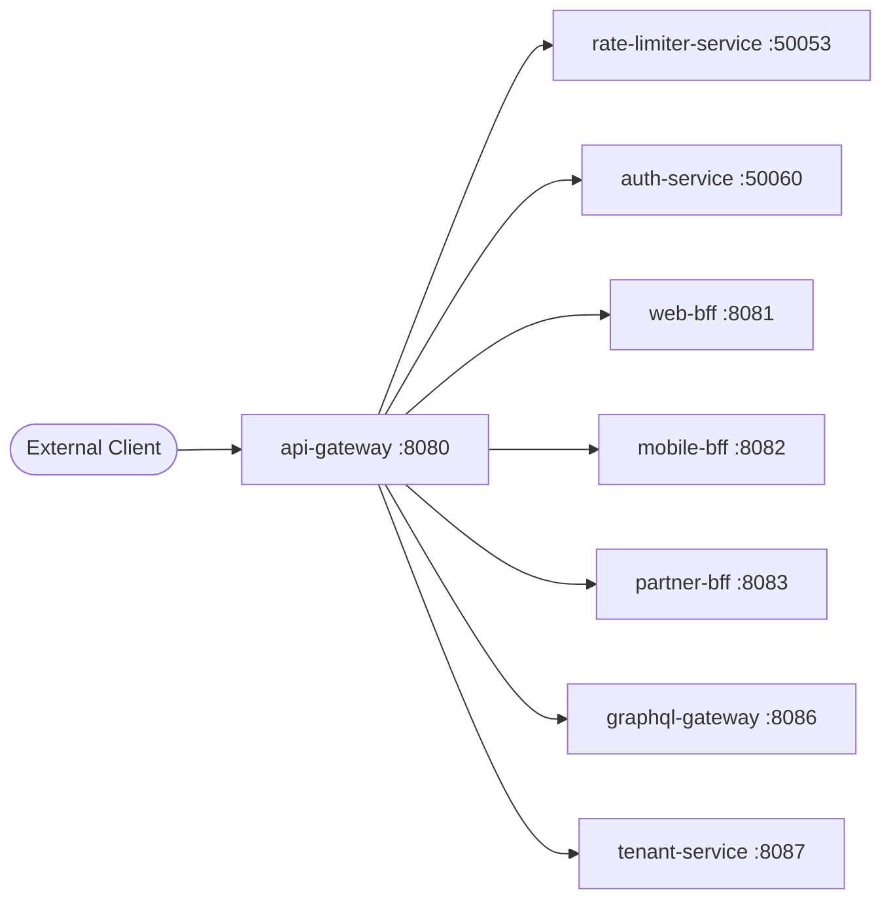

# API Gateway

> Single entry point for all external traffic into the ShopOS platform.

## Overview

The API Gateway is the front door of the ShopOS platform, receiving all inbound HTTP and gRPC traffic from web, mobile, and partner clients. It handles cross-cutting concerns such as authentication token validation, rate limiting enforcement, and request routing to downstream BFF or microservices. It integrates with the rate-limiter-service and delegates auth checks to the identity domain before forwarding requests.

## Architecture



## Tech Stack

| Component | Technology |
|---|---|
| Language | Go |
| Database | — |
| Protocol | HTTP / gRPC |
| Port | 8080 |

## Responsibilities

- Route inbound HTTP and gRPC requests to the correct BFF or internal service
- Enforce authentication by validating JWT tokens with auth-service
- Delegate rate limit checks to rate-limiter-service per client IP and API key
- Perform TLS termination for external traffic
- Inject request metadata (tenant ID, trace ID, user ID) into upstream headers
- Aggregate and return structured error responses
- Expose request metrics for Prometheus scraping

## API / Interface

| Method | Path | Description |
|---|---|---|
| ANY | `/api/v1/*` | Proxy to web-bff |
| ANY | `/mobile/v1/*` | Proxy to mobile-bff |
| ANY | `/partner/v1/*` | Proxy to partner-bff |
| ANY | `/graphql` | Proxy to graphql-gateway |
| GET | `/healthz` | Gateway health check |
| GET | `/metrics` | Prometheus metrics endpoint |

## Kafka Topics

N/A — the API Gateway does not produce or consume Kafka events directly.

## Dependencies

Upstream (services this calls):
- `auth-service` (identity) — token validation
- `rate-limiter-service` (platform) — rate limit enforcement
- `tenant-service` (platform) — tenant resolution from hostname or header
- `web-bff` (platform) — web client routing target
- `mobile-bff` (platform) — mobile client routing target
- `partner-bff` (platform) — partner client routing target
- `graphql-gateway` (platform) — GraphQL routing target

Downstream (services that call this):
- All external clients (browsers, mobile apps, partner systems)

## Environment Variables

| Variable | Default | Description |
|---|---|---|
| `PORT` | `8080` | HTTP listening port |
| `AUTH_SERVICE_ADDR` | `auth-service:50060` | Address of auth-service |
| `RATE_LIMITER_ADDR` | `rate-limiter-service:50053` | Address of rate-limiter-service |
| `TENANT_SERVICE_ADDR` | `tenant-service:8087` | Address of tenant-service |
| `WEB_BFF_ADDR` | `web-bff:8081` | Address of web-bff |
| `MOBILE_BFF_ADDR` | `mobile-bff:8082` | Address of mobile-bff |
| `PARTNER_BFF_ADDR` | `partner-bff:8083` | Address of partner-bff |
| `GRAPHQL_GATEWAY_ADDR` | `graphql-gateway:8086` | Address of graphql-gateway |
| `TLS_CERT_FILE` | `` | Path to TLS certificate |
| `TLS_KEY_FILE` | `` | Path to TLS private key |
| `LOG_LEVEL` | `info` | Logging level (debug/info/warn/error) |

## Running Locally

```bash
# From repo root
docker-compose up api-gateway

# OR hot reload
skaffold dev --module=api-gateway
```

## Health Check

`GET /healthz` → `{"status":"ok"}`
