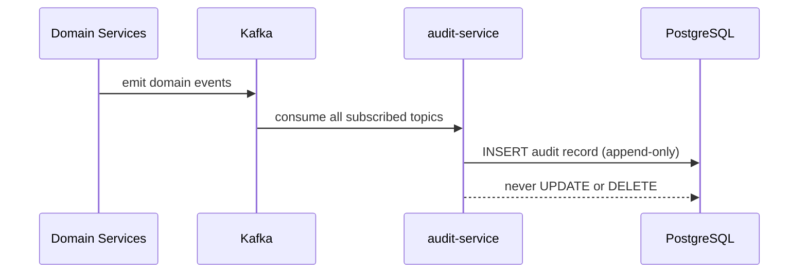

# Audit Service

> Immutable, append-only audit log for all business-critical events across ShopOS.

## Overview

The Audit Service consumes domain events from Kafka across all business domains and writes them to an immutable audit log in Postgres, providing a tamper-evident record of every significant action in the platform. It is used for compliance reporting, security investigations, and regulatory requirements such as GDPR data access logging. Records are never updated or deleted; they are retained according to configurable retention policies and can be queried by admin and compliance teams.

## Architecture



## Tech Stack

| Component | Technology |
|---|---|
| Language | Java |
| Database | PostgreSQL |
| Protocol | Kafka |
| Port | — |

## Responsibilities

- Consume all significant domain events from Kafka across every business domain
- Persist normalised audit records with actor, action, resource, timestamp, and payload
- Guarantee append-only writes — no updates or deletes permitted on audit records
- Support structured querying by actor, resource type, time range, and event type
- Enforce configurable data retention policies with archival to cold storage
- Provide a REST query API for admin and compliance tooling (via admin-portal)

## Kafka Topics

| Topic | Producer/Consumer | Description |
|---|---|---|
| `identity.user.registered` | Consumer | Logs user registration events |
| `identity.user.deleted` | Consumer | Logs GDPR deletion requests |
| `commerce.order.placed` | Consumer | Logs order creation events |
| `commerce.order.cancelled` | Consumer | Logs order cancellation events |
| `commerce.payment.processed` | Consumer | Logs payment processing events |
| `commerce.payment.failed` | Consumer | Logs payment failure events |
| `security.fraud.detected` | Consumer | Logs fraud detection alerts |
| `security.login.failed` | Consumer | Logs authentication failures |
| `supplychain.shipment.created` | Consumer | Logs shipment creation events |

## Dependencies

**Upstream** (services this calls):
- `Kafka` — source of all domain events
- `PostgreSQL` — immutable audit record storage

**Downstream** (services that call this):
- `admin-portal` (platform) — audit log queries for ops and compliance teams
- `gdpr-service` (identity) — data access audit trail

## Environment Variables

| Variable | Default | Description |
|---|---|---|
| `DB_HOST` | `postgres` | PostgreSQL host |
| `DB_PORT` | `5432` | PostgreSQL port |
| `DB_NAME` | `audit_service` | Database name |
| `DB_USER` | `shopos` | Database user |
| `DB_PASSWORD` | `` | Database password (required) |
| `KAFKA_BROKERS` | `kafka:9092` | Comma-separated Kafka broker addresses |
| `KAFKA_CONSUMER_GROUP` | `audit-service` | Kafka consumer group ID |
| `RETENTION_DAYS` | `2555` | Days to retain audit records (default 7 years) |
| `LOG_LEVEL` | `info` | Logging level |

## Running Locally

```bash
# From repo root
docker-compose up audit-service

# OR hot reload
skaffold dev --module=audit-service
```

## Health Check

`GET /healthz` → `{"status":"ok"}`
