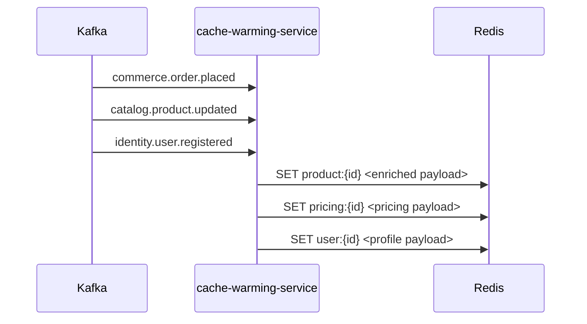

# Cache Warming Service

> Pre-populates Redis caches proactively from Kafka domain events to reduce cold-start latency.

## Overview

The Cache Warming Service listens to high-value Kafka topics across the platform and pre-computes and loads frequently accessed data into Redis before a user request triggers a cache miss. This eliminates cold-start latency spikes after deployments, cache evictions, or Redis restarts. It is a stateless consumer that transforms Kafka domain events into cache writes, covering product catalog, pricing, user sessions, and inventory data.

## Architecture



## Tech Stack

| Component | Technology |
|---|---|
| Language | Go |
| Database | Redis |
| Protocol | Kafka (consumer) |
| Port | — |

## Responsibilities

- Consume domain events from Kafka topics to detect data changes
- Fetch full entity details from the owning service on change events
- Write pre-serialised, TTL-bearing cache entries to Redis
- Handle cache invalidation by deleting stale keys before re-population
- Implement back-off and retry logic for Redis write failures
- Support selective warming via topic and entity-type configuration

## Kafka Topics

| Topic | Producer/Consumer | Description |
|---|---|---|
| `catalog.product.updated` | Consumer | Warms product catalog cache on product change |
| `catalog.inventory.updated` | Consumer | Warms inventory level cache |
| `commerce.order.placed` | Consumer | Warms user order history cache |
| `identity.user.registered` | Consumer | Pre-warms user profile cache |
| `commerce.pricing.updated` | Consumer | Warms pricing cache on price changes |

## Dependencies

Upstream (services this calls):
- `Redis` — cache write destination
- `product-catalog-service` (catalog) — fetches full product payload for cache population
- `pricing-service` (catalog) — fetches pricing payload
- `inventory-service` (catalog) — fetches stock levels
- `user-service` (identity) — fetches user profile for cache population

Downstream (services that call this):
- None — this is a pure consumer/writer service

## Environment Variables

| Variable | Default | Description |
|---|---|---|
| `KAFKA_BROKERS` | `kafka:9092` | Comma-separated Kafka broker addresses |
| `KAFKA_CONSUMER_GROUP` | `cache-warming-service` | Kafka consumer group ID |
| `REDIS_ADDR` | `redis:6379` | Redis server address |
| `REDIS_PASSWORD` | `` | Redis auth password |
| `CACHE_DEFAULT_TTL` | `300s` | Default TTL for warmed cache entries |
| `CATALOG_SERVICE_ADDR` | `product-catalog-service:50070` | Address of product-catalog-service |
| `PRICING_SERVICE_ADDR` | `pricing-service:50073` | Address of pricing-service |
| `INVENTORY_SERVICE_ADDR` | `inventory-service:50074` | Address of inventory-service |
| `USER_SERVICE_ADDR` | `user-service:50061` | Address of user-service |
| `LOG_LEVEL` | `info` | Logging level |

## Running Locally

```bash
# From repo root
docker-compose up cache-warming-service

# OR hot reload
skaffold dev --module=cache-warming-service
```

## Health Check

`GET /healthz` → `{"status":"ok"}`
