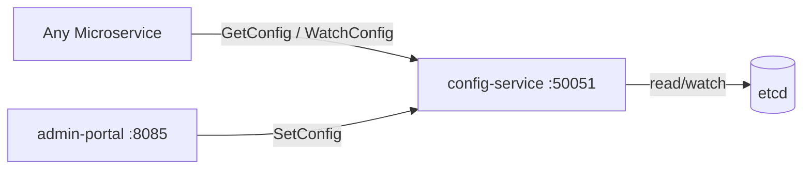

# Config Service

> Centralised distributed configuration store with hot-reload support.

## Overview

The Config Service provides a single source of truth for runtime configuration across all ShopOS microservices, backed by etcd for strongly consistent, watch-based key-value storage. Services connect via gRPC to fetch their configuration at startup and subscribe to change notifications for hot-reload without redeployment. It supports namespaced keys per environment, tenant, and service, enabling granular configuration control.

## Architecture



## Tech Stack

| Component | Technology |
|---|---|
| Language | Go |
| Database | etcd |
| Protocol | gRPC |
| Port | 50051 |

## Responsibilities

- Store and serve runtime configuration as typed key-value entries
- Support hierarchical key namespacing: `{env}/{service}/{key}`
- Deliver change notifications to subscribers via gRPC server-side streaming
- Enforce access control so services can only read their own namespace
- Provide atomic compare-and-swap operations for safe distributed config updates
- Maintain configuration version history for audit and rollback

## API / Interface

### gRPC Methods (`proto/platform/config.proto`)

| Method | Type | Description |
|---|---|---|
| `GetConfig` | Unary | Fetch a single config value by key |
| `GetConfigBulk` | Unary | Fetch multiple config values by prefix |
| `SetConfig` | Unary | Write or update a config value (admin only) |
| `DeleteConfig` | Unary | Remove a config entry (admin only) |
| `WatchConfig` | Server streaming | Stream config change events for a key prefix |

## Kafka Topics

N/A — the Config Service uses gRPC streaming for change propagation, not Kafka.

## Dependencies

Upstream (services this calls):
- `etcd` — persistent key-value storage backend

Downstream (services that call this):
- All platform microservices — fetch runtime configuration on startup and via watch

## Environment Variables

| Variable | Default | Description |
|---|---|---|
| `GRPC_PORT` | `50051` | gRPC listening port |
| `ETCD_ENDPOINTS` | `etcd:2379` | Comma-separated etcd endpoints |
| `ETCD_DIAL_TIMEOUT` | `5s` | etcd connection dial timeout |
| `CONFIG_NAMESPACE` | `shopos` | Root namespace prefix for all keys |
| `LOG_LEVEL` | `info` | Logging level |

## Running Locally

```bash
# From repo root
docker-compose up config-service

# OR hot reload
skaffold dev --module=config-service
```

## Health Check

`GET /healthz` → `{"status":"ok"}`
