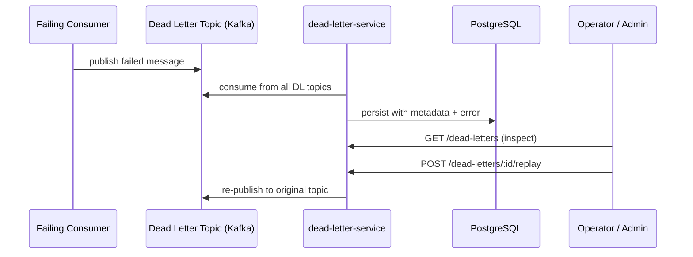

# Dead Letter Service

> Captures, stores, and enables reprocessing of failed Kafka messages across the platform.

## Overview

The Dead Letter Service acts as the platform-wide safety net for Kafka messages that could not be processed successfully after all retry attempts by their intended consumers. Failed messages are routed to dedicated dead letter topics, consumed by this service, and persisted in Postgres with full metadata including the original topic, partition, offset, error reason, and payload. Engineers can inspect, replay, or discard dead-lettered messages via an HTTP API, preventing data loss from transient downstream failures.

## Architecture



## Tech Stack

| Component | Technology |
|---|---|
| Language | Go |
| Database | PostgreSQL |
| Protocol | Kafka |
| Port | — |

## Responsibilities

- Consume from all dead letter Kafka topics across every domain
- Persist dead-lettered messages with metadata: original topic, partition, offset, consumer group, error, and timestamp
- Expose a queryable REST API for inspecting failed messages by topic, time range, or error type
- Support manual replay of individual messages or batches back to the original topic
- Support permanent discard of messages deemed unrecoverable
- Track replay outcomes and prevent infinite replay loops via attempt counters
- Alert when dead letter queue depth exceeds configurable thresholds

## API / Interface

| Method | Path | Description |
|---|---|---|
| GET | `/api/v1/dead-letters` | List dead-lettered messages with filters |
| GET | `/api/v1/dead-letters/:id` | Get a specific dead-lettered message |
| POST | `/api/v1/dead-letters/:id/replay` | Replay a message to its original topic |
| POST | `/api/v1/dead-letters/replay-batch` | Replay a filtered batch of messages |
| DELETE | `/api/v1/dead-letters/:id` | Permanently discard a message |
| GET | `/api/v1/dead-letters/stats` | Dead letter queue depth stats per topic |
| GET | `/healthz` | Health check |

## Kafka Topics

| Topic | Producer/Consumer | Description |
|---|---|---|
| `*.dead-letter` | Consumer | Consumes from all dead letter topics (wildcard pattern) |
| Original topics | Producer | Publishes replayed messages back to their source topic |

## Dependencies

Upstream (services this calls):
- `Kafka` — source of dead letter messages and replay target
- `PostgreSQL` — persistent storage for dead-lettered message records

Downstream (services that call this):
- `admin-portal` (platform) — dead letter inspection and replay UI
- Operations engineers — manual replay and triage workflows

## Environment Variables

| Variable | Default | Description |
|---|---|---|
| `DB_HOST` | `postgres` | PostgreSQL host |
| `DB_PORT` | `5432` | PostgreSQL port |
| `DB_NAME` | `dead_letter_service` | Database name |
| `DB_USER` | `shopos` | Database user |
| `DB_PASSWORD` | `` | Database password (required) |
| `KAFKA_BROKERS` | `kafka:9092` | Comma-separated Kafka broker addresses |
| `KAFKA_CONSUMER_GROUP` | `dead-letter-service` | Kafka consumer group ID |
| `DL_TOPIC_PATTERN` | `.*\.dead-letter` | Regex pattern to match dead letter topics |
| `MAX_REPLAY_ATTEMPTS` | `3` | Maximum replay attempts per message |
| `LOG_LEVEL` | `info` | Logging level |

## Running Locally

```bash
# From repo root
docker-compose up dead-letter-service

# OR hot reload
skaffold dev --module=dead-letter-service
```

## Health Check

`GET /healthz` → `{"status":"ok"}`
