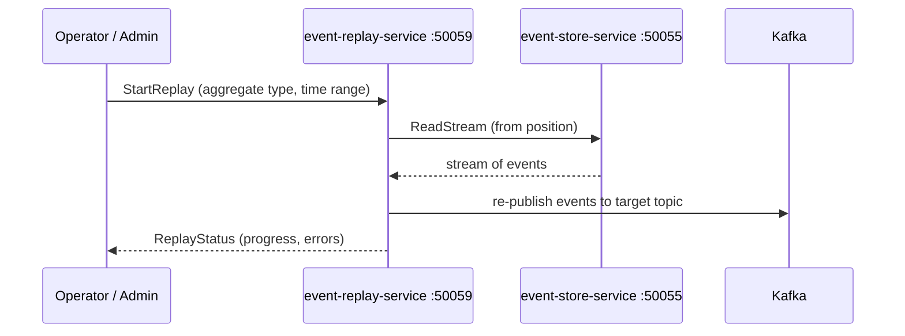

# Event Replay Service

> Replays events from the event store to rebuild projections, re-process logic, or recover from failures.

## Overview

The Event Replay Service reads persisted event streams from the event-store-service and re-publishes them to Kafka or re-drives them through service handlers, enabling read model rebuilding after schema migrations, recovery from downstream processing failures, and backfilling new consumers with historical event data. Replay operations are controlled and audited, with configurable speed throttling to avoid overwhelming downstream services.

## Architecture



## Tech Stack

| Component | Technology |
|---|---|
| Language | Go |
| Database | PostgreSQL |
| Protocol | gRPC |
| Port | 50059 |

## Responsibilities

- Read event streams from event-store-service by aggregate type, ID, or time range
- Re-publish replayed events to configurable Kafka topics for downstream reprocessing
- Track replay job state and progress in Postgres
- Throttle replay throughput to configurable events-per-second rates
- Support partial replays: replay only events of specific types or within a time window
- Prevent duplicate replay of the same event range via idempotency keys
- Expose replay job status and history to the admin portal

## API / Interface

### gRPC Methods (`proto/platform/event_replay.proto`)

| Method | Type | Description |
|---|---|---|
| `StartReplay` | Unary | Initiate a replay job with target and filter parameters |
| `StopReplay` | Unary | Halt an in-progress replay job |
| `GetReplayStatus` | Unary | Query progress and statistics for a replay job |
| `ListReplayJobs` | Unary | List all replay jobs with status |
| `GetReplayHistory` | Unary | Retrieve completed replay job details |

## Kafka Topics

| Topic | Producer/Consumer | Description |
|---|---|---|
| Configurable target topic | Producer | Replayed events are published here (defined per replay job) |

## Dependencies

Upstream (services this calls):
- `event-store-service` (platform) — source of events to replay
- `PostgreSQL` — replay job state and progress persistence
- `Kafka` — target for re-published replay events

Downstream (services that call this):
- `admin-portal` (platform) — replay job management
- Operations engineers — projection rebuild and failure recovery workflows

## Environment Variables

| Variable | Default | Description |
|---|---|---|
| `GRPC_PORT` | `50059` | gRPC listening port |
| `DB_HOST` | `postgres` | PostgreSQL host |
| `DB_PORT` | `5432` | PostgreSQL port |
| `DB_NAME` | `event_replay_service` | Database name |
| `DB_USER` | `shopos` | Database user |
| `DB_PASSWORD` | `` | Database password (required) |
| `EVENT_STORE_ADDR` | `event-store-service:50055` | Address of event-store-service |
| `KAFKA_BROKERS` | `kafka:9092` | Comma-separated Kafka broker addresses |
| `DEFAULT_THROTTLE_RPS` | `500` | Default max events per second during replay |
| `LOG_LEVEL` | `info` | Logging level |

## Running Locally

```bash
# From repo root
docker-compose up event-replay-service

# OR hot reload
skaffold dev --module=event-replay-service
```

## Health Check

`GET /healthz` → `{"status":"ok"}`
