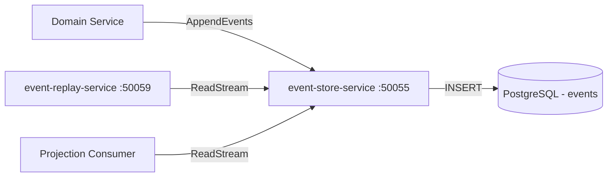

# Event Store Service

> Append-only event log providing the foundation for event sourcing across ShopOS.

## Overview

The Event Store Service maintains an immutable, ordered log of domain events for any aggregate in the platform, enabling event sourcing patterns where the current state of an entity is derived by replaying its event history. Events are written atomically with optimistic concurrency checks and stored in Postgres. Consumers can read event streams by aggregate ID or subscribe to a stream projection for read model rebuilding and event replay.

## Architecture



## Tech Stack

| Component | Technology |
|---|---|
| Language | Go |
| Database | PostgreSQL |
| Protocol | gRPC |
| Port | 50055 |

## Responsibilities

- Accept and durably append domain events with optimistic concurrency version checks
- Serve event streams by aggregate ID and aggregate type with offset-based pagination
- Guarantee strict ordering of events within a single aggregate stream
- Reject writes that violate expected version numbers to prevent lost-update anomalies
- Support global event log reading for projection rebuilding and audit purposes
- Provide snapshot storage to optimise replay of long aggregate histories

## API / Interface

### gRPC Methods (`proto/platform/event_store.proto`)

| Method | Type | Description |
|---|---|---|
| `AppendEvents` | Unary | Append one or more events to an aggregate stream |
| `ReadStream` | Server streaming | Stream events for a given aggregate ID from a position |
| `ReadAllEvents` | Server streaming | Stream the global event log from a given position |
| `GetStreamMetadata` | Unary | Retrieve version and event count for an aggregate |
| `SaveSnapshot` | Unary | Store a snapshot of an aggregate at a version |
| `GetSnapshot` | Unary | Retrieve the latest snapshot for an aggregate |

## Kafka Topics

N/A — the Event Store Service stores events durably in Postgres. Downstream publication to Kafka is the responsibility of individual domain services or the event-replay-service.

## Dependencies

Upstream (services this calls):
- `PostgreSQL` — durable append-only event storage

Downstream (services that call this):
- `event-replay-service` (platform) — reads and replays events
- `saga-orchestrator` (platform) — optional event appending
- Domain services implementing event sourcing (order-service, payment-service, etc.)

## Environment Variables

| Variable | Default | Description |
|---|---|---|
| `GRPC_PORT` | `50055` | gRPC listening port |
| `DB_HOST` | `postgres` | PostgreSQL host |
| `DB_PORT` | `5432` | PostgreSQL port |
| `DB_NAME` | `event_store` | Database name |
| `DB_USER` | `shopos` | Database user |
| `DB_PASSWORD` | `` | Database password (required) |
| `MAX_EVENTS_PER_BATCH` | `500` | Maximum events accepted in a single AppendEvents call |
| `LOG_LEVEL` | `info` | Logging level |

## Running Locally

```bash
# From repo root
docker-compose up event-store-service

# OR hot reload
skaffold dev --module=event-store-service
```

## Health Check

`GET /healthz` → `{"status":"ok"}`
