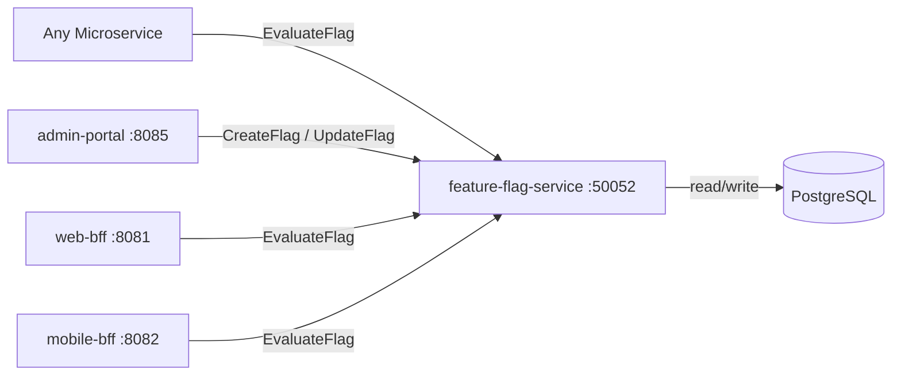

# Feature Flag Service

> Centralised feature toggle management for controlled rollouts and A/B experiments.

## Overview

The Feature Flag Service enables engineering and product teams to control feature availability at runtime without code deployments. It persists flag definitions and targeting rules in Postgres and serves evaluation results to any service in the platform via gRPC. Flags can target individual users, tenants, percentage rollouts, or arbitrary attribute-based rules, making it the backbone for canary releases and A/B experimentation.

## Architecture



## Tech Stack

| Component | Technology |
|---|---|
| Language | Go |
| Database | PostgreSQL |
| Protocol | gRPC |
| Port | 50052 |

## Responsibilities

- Store and version feature flag definitions with targeting rules
- Evaluate flags per request against user, tenant, and attribute context
- Support rollout strategies: boolean on/off, percentage rollout, user allowlist, attribute match
- Provide a bulk evaluation endpoint to resolve multiple flags in one call
- Emit flag change events so dependent services can invalidate local caches
- Record flag evaluation counts for analytics and kill-switch monitoring

## API / Interface

### gRPC Methods (`proto/platform/feature_flag.proto`)

| Method | Type | Description |
|---|---|---|
| `EvaluateFlag` | Unary | Evaluate a single flag for a given context |
| `EvaluateFlags` | Unary | Bulk-evaluate all flags for a given context |
| `CreateFlag` | Unary | Create a new feature flag definition |
| `UpdateFlag` | Unary | Update flag rules or status |
| `DeleteFlag` | Unary | Remove a feature flag |
| `ListFlags` | Unary | List all flags with pagination |

## Kafka Topics

N/A — the Feature Flag Service notifies dependents via gRPC streaming watch, not Kafka.

## Dependencies

**Upstream** (services this calls):
- `PostgreSQL` — flag definitions and targeting rule persistence

**Downstream** (services that call this):
- `web-bff` (platform) — feature gating for web UI flows
- `mobile-bff` (platform) — feature gating for mobile app flows
- `ab-testing-service` (commerce) — experiment flag evaluation
- Any microservice requiring feature-controlled code paths

## Environment Variables

| Variable | Default | Description |
|---|---|---|
| `GRPC_PORT` | `50052` | gRPC listening port |
| `DB_HOST` | `postgres` | PostgreSQL host |
| `DB_PORT` | `5432` | PostgreSQL port |
| `DB_NAME` | `feature_flags` | Database name |
| `DB_USER` | `shopos` | Database user |
| `DB_PASSWORD` | `` | Database password (required) |
| `LOG_LEVEL` | `info` | Logging level |

## Running Locally

```bash
# From repo root
docker-compose up feature-flag-service

# OR hot reload
skaffold dev --module=feature-flag-service
```

## Health Check

`GET /healthz` → `{"status":"ok"}`
