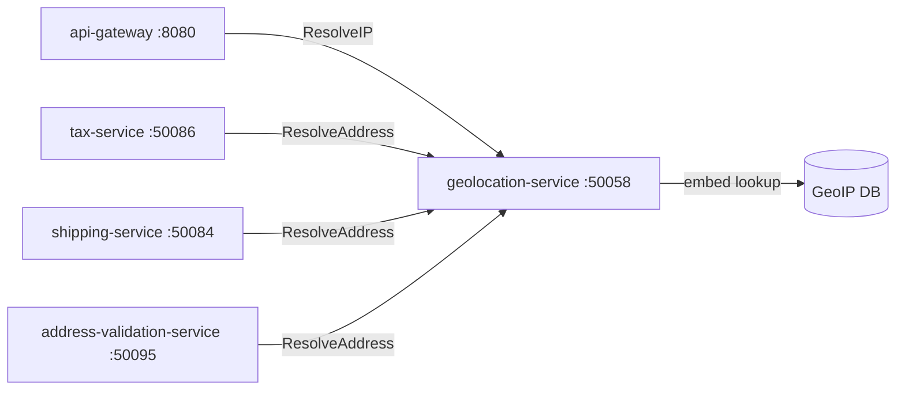

# Geolocation Service

> IP address and postal address geolocation lookups for regionalisation and localisation.

## Overview

The Geolocation Service resolves IP addresses and postal addresses to geographic coordinates, country, region, city, and timezone data, enabling downstream services to personalise content, apply the correct tax jurisdiction, enforce regional restrictions, and route traffic intelligently. It uses an embedded GeoIP database for low-latency IP lookups and can optionally call an external geocoding provider for precise address-to-coordinate resolution.

## Architecture



## Tech Stack

| Component | Technology |
|---|---|
| Language | Go |
| Database | — |
| Protocol | gRPC |
| Port | 50058 |

## Responsibilities

- Resolve IPv4 and IPv6 addresses to country, region, city, and timezone
- Resolve postal addresses to latitude/longitude coordinates
- Return currency code and locale recommendation based on detected geography
- Support bulk lookup for efficient batch resolution by upstream services
- Update the embedded GeoIP database on a scheduled refresh cycle
- Cache recently resolved lookups in memory to reduce repeated DB scans

## API / Interface

### gRPC Methods (`proto/platform/geolocation.proto`)

| Method | Type | Description |
|---|---|---|
| `ResolveIP` | Unary | Resolve an IP address to geolocation data |
| `ResolveIPBulk` | Unary | Resolve a list of IP addresses in one call |
| `ResolveAddress` | Unary | Geocode a postal address to coordinates and region |
| `GetTimezone` | Unary | Get IANA timezone for a country/region code |
| `GetCurrency` | Unary | Get default currency for a country code |

## Kafka Topics

N/A — the Geolocation Service operates entirely synchronously via gRPC.

## Dependencies

Upstream (services this calls):
- Embedded GeoIP database (MaxMind GeoLite2 or equivalent) — IP geolocation data
- Optional external geocoding API — postal address resolution

Downstream (services that call this):
- `api-gateway` (platform) — IP geolocation for request routing and locale detection
- `tax-service` (commerce) — jurisdiction resolution for tax calculation
- `shipping-service` (commerce) — origin/destination coordinate resolution
- `address-validation-service` (commerce) — coordinate enrichment

## Environment Variables

| Variable | Default | Description |
|---|---|---|
| `GRPC_PORT` | `50058` | gRPC listening port |
| `GEOIP_DB_PATH` | `/data/GeoLite2-City.mmdb` | Path to GeoIP database file |
| `GEOIP_DB_REFRESH_INTERVAL` | `24h` | How often to refresh the GeoIP database |
| `GEOCODING_API_URL` | `` | Optional external geocoding API URL |
| `GEOCODING_API_KEY` | `` | API key for external geocoding provider |
| `CACHE_SIZE` | `10000` | In-memory LRU cache size for IP lookups |
| `LOG_LEVEL` | `info` | Logging level |

## Running Locally

```bash
# From repo root
docker-compose up geolocation-service

# OR hot reload
skaffold dev --module=geolocation-service
```

## Health Check

`GET /healthz` → `{"status":"ok"}`
