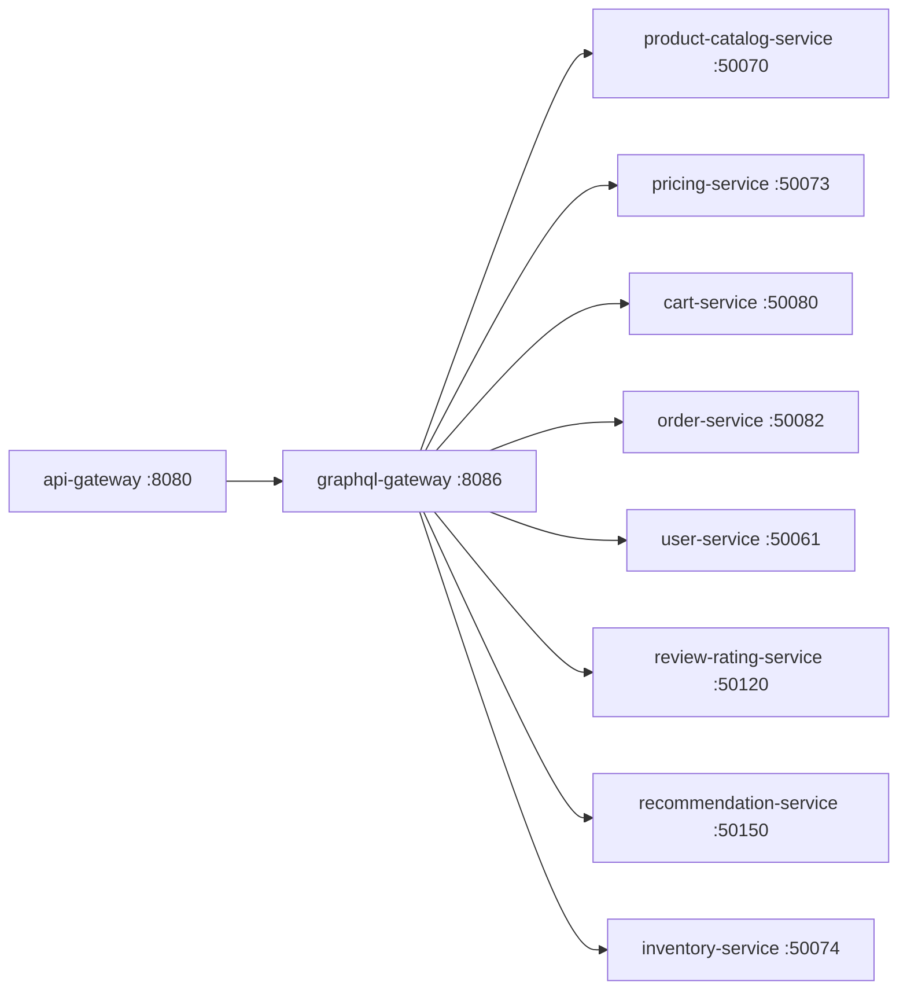

# GraphQL Gateway

> Unified GraphQL API that federates data from all ShopOS microservices into a single schema.

## Overview

The GraphQL Gateway exposes a single GraphQL endpoint that composes data from the entire ShopOS platform, allowing frontend teams and API consumers to request exactly the fields they need across multiple domains in one round trip. It uses schema stitching and federation to assemble sub-graphs from catalog, commerce, identity, and other domains, delegating field resolution to the appropriate microservices via gRPC. It is the preferred API surface for flexible, client-driven data fetching.

## Architecture



## Tech Stack

| Component | Technology |
|---|---|
| Language | Go |
| Database | — |
| Protocol | HTTP (GraphQL over HTTP) |
| Port | 8086 |

## Responsibilities

- Serve a federated GraphQL schema unifying all domain sub-graphs
- Resolve queries and mutations by delegating to gRPC microservices
- Implement DataLoader-style batching to avoid N+1 query patterns
- Enforce field-level authorisation based on the caller's identity and permissions
- Support subscriptions for real-time updates via WebSocket
- Provide GraphQL introspection and an embedded GraphiQL IDE in development
- Cache frequently requested query results at the resolver level using Redis

## API / Interface

| Method | Path | Description |
|---|---|---|
| POST | `/graphql` | Execute GraphQL queries and mutations |
| GET | `/graphql` | GraphiQL IDE (development only) |
| WS | `/graphql/ws` | GraphQL subscriptions over WebSocket |
| GET | `/healthz` | Health check |

### Sample GraphQL Query

```graphql
query ProductPage($id: ID!) {
  product(id: $id) {
    id
    name
    price { amount currency }
    inventory { available }
    reviews(limit: 5) { rating body }
    recommendations { id name }
  }
}
```

## Kafka Topics

N/A — the GraphQL Gateway resolves queries synchronously via gRPC and does not interact with Kafka directly.

## Dependencies

Upstream (services this calls):
- `product-catalog-service` (catalog) — product queries
- `pricing-service` (catalog) — pricing data
- `inventory-service` (catalog) — stock data
- `cart-service` (commerce) — cart queries and mutations
- `order-service` (commerce) — order queries
- `user-service` (identity) — user profile queries
- `review-rating-service` (customer-experience) — review data
- `recommendation-service` (analytics-ai) — recommendation queries

Downstream (services that call this):
- `api-gateway` (platform) — routes GraphQL traffic here
- Frontend applications and third-party consumers using GraphQL

## Environment Variables

| Variable | Default | Description |
|---|---|---|
| `PORT` | `8086` | HTTP listening port |
| `CATALOG_SERVICE_ADDR` | `product-catalog-service:50070` | Address of product-catalog-service |
| `PRICING_SERVICE_ADDR` | `pricing-service:50073` | Address of pricing-service |
| `INVENTORY_SERVICE_ADDR` | `inventory-service:50074` | Address of inventory-service |
| `CART_SERVICE_ADDR` | `cart-service:50080` | Address of cart-service |
| `ORDER_SERVICE_ADDR` | `order-service:50082` | Address of order-service |
| `USER_SERVICE_ADDR` | `user-service:50061` | Address of user-service |
| `REVIEW_SERVICE_ADDR` | `review-rating-service:50120` | Address of review-rating-service |
| `RECOMMENDATION_SERVICE_ADDR` | `recommendation-service:50150` | Address of recommendation-service |
| `GRAPHIQL_ENABLED` | `false` | Enable GraphiQL IDE (development only) |
| `LOG_LEVEL` | `info` | Logging level |

## Running Locally

```bash
# From repo root
docker-compose up graphql-gateway

# OR hot reload
skaffold dev --module=graphql-gateway
```

## Health Check

`GET /healthz` → `{"status":"ok"}`
