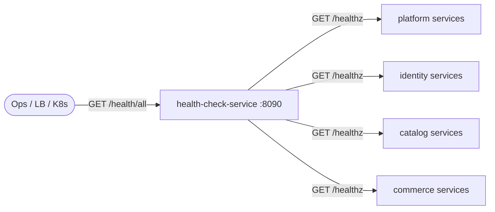

# Health Check Service

> Aggregates and exposes the health status of all ShopOS services in one place.

## Overview

The Health Check Service acts as a platform-wide health aggregator, polling or receiving health signals from every microservice and exposing a unified status dashboard via HTTP. It is the single endpoint that load balancers, Kubernetes liveness probes, and on-call engineers use to determine overall platform health. Individual service statuses are stored in memory with configurable TTLs, and the service alerts when any component degrades below acceptable thresholds.

## Architecture



## Tech Stack

| Component | Technology |
|---|---|
| Language | Go |
| Database | — |
| Protocol | HTTP |
| Port | 8090 |

## Responsibilities

- Periodically poll `/healthz` endpoints of all registered microservices
- Aggregate results into a single platform-wide health summary
- Classify services as `healthy`, `degraded`, or `unreachable`
- Expose per-service and overall status via a REST API
- Support dynamic service registration so new services are included without config redeploys
- Integrate with alerting pipelines to fire notifications on status changes

## API / Interface

| Method | Path | Description |
|---|---|---|
| GET | `/health/all` | Full status report for all registered services |
| GET | `/health/service/:name` | Status for a specific service |
| GET | `/health/summary` | Counts of healthy / degraded / unreachable services |
| POST | `/health/register` | Register a new service for monitoring |
| DELETE | `/health/register/:name` | Deregister a service |
| GET | `/healthz` | Health check for this service itself |

## Kafka Topics

N/A — the Health Check Service uses HTTP polling, not Kafka.

## Dependencies

Upstream (services this calls):
- All registered microservices — polled via their `/healthz` HTTP or gRPC health endpoints

Downstream (services that call this):
- Kubernetes liveness and readiness probes
- Load balancers and ingress controllers
- Admin Portal and on-call monitoring dashboards

## Environment Variables

| Variable | Default | Description |
|---|---|---|
| `PORT` | `8090` | HTTP listening port |
| `POLL_INTERVAL` | `15s` | How often to poll each service |
| `POLL_TIMEOUT` | `3s` | Per-service poll timeout |
| `SERVICE_REGISTRY` | `` | Path to YAML file listing all services to monitor |
| `LOG_LEVEL` | `info` | Logging level |

## Running Locally

```bash
# From repo root
docker-compose up health-check-service

# OR hot reload
skaffold dev --module=health-check-service
```

## Health Check

`GET /healthz` → `{"status":"ok"}`
