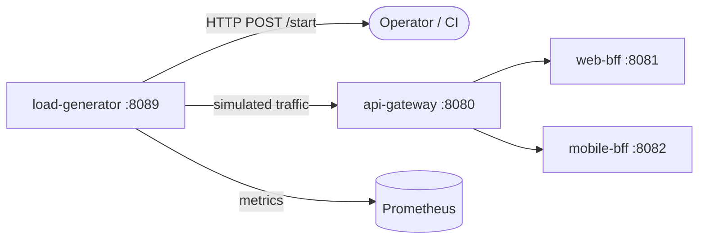

# Load Generator

> Synthetic traffic generator for performance testing and chaos engineering.

## Overview

The Load Generator is a Python service that produces configurable synthetic load against the ShopOS platform, simulating realistic user journeys such as browsing, adding to cart, and placing orders. It is used for performance benchmarking, load testing before deployments, chaos experiment baseline establishment, and continuous soak testing in non-production environments. Traffic profiles are defined as YAML scenarios and loaded at runtime without service restarts.

## Architecture



## Tech Stack

| Component | Technology |
|---|---|
| Language | Python |
| Database | — |
| Protocol | HTTP |
| Port | 8089 |

## Responsibilities

- Execute configurable traffic scenarios against the api-gateway
- Simulate realistic user journeys: browse → search → add to cart → checkout
- Support concurrent virtual user ramp-up and sustained load profiles
- Record request latency, error rate, and throughput per scenario step
- Expose live test progress and metrics via a REST control API
- Integrate with CI pipelines to run smoke load tests post-deployment

## API / Interface

| Method | Path | Description |
|---|---|---|
| GET | `/scenarios` | List available traffic scenarios |
| POST | `/scenarios/:name/start` | Start a load scenario |
| POST | `/scenarios/:name/stop` | Stop a running scenario |
| GET | `/scenarios/:name/status` | Get current run status and metrics |
| GET | `/metrics` | Prometheus metrics for test runs |
| GET | `/healthz` | Health check |

## Kafka Topics

N/A — the Load Generator produces HTTP traffic, not Kafka events.

## Dependencies

Upstream (services this calls):
- `api-gateway` (platform) — target for all synthetic traffic

Downstream (services that call this):
- CI/CD pipelines — trigger load tests post-deployment
- Operations teams — manual performance and chaos baseline testing

## Environment Variables

| Variable | Default | Description |
|---|---|---|
| `PORT` | `8089` | HTTP listening port |
| `TARGET_BASE_URL` | `http://api-gateway:8080` | Base URL of the target platform |
| `SCENARIOS_DIR` | `/scenarios` | Directory containing YAML scenario definitions |
| `DEFAULT_VIRTUAL_USERS` | `10` | Default number of concurrent virtual users |
| `DEFAULT_DURATION` | `60s` | Default scenario run duration |
| `LOG_LEVEL` | `info` | Logging level |

## Running Locally

```bash
# From repo root
docker-compose up load-generator

# OR hot reload
skaffold dev --module=load-generator
```

## Health Check

`GET /healthz` → `{"status":"ok"}`
