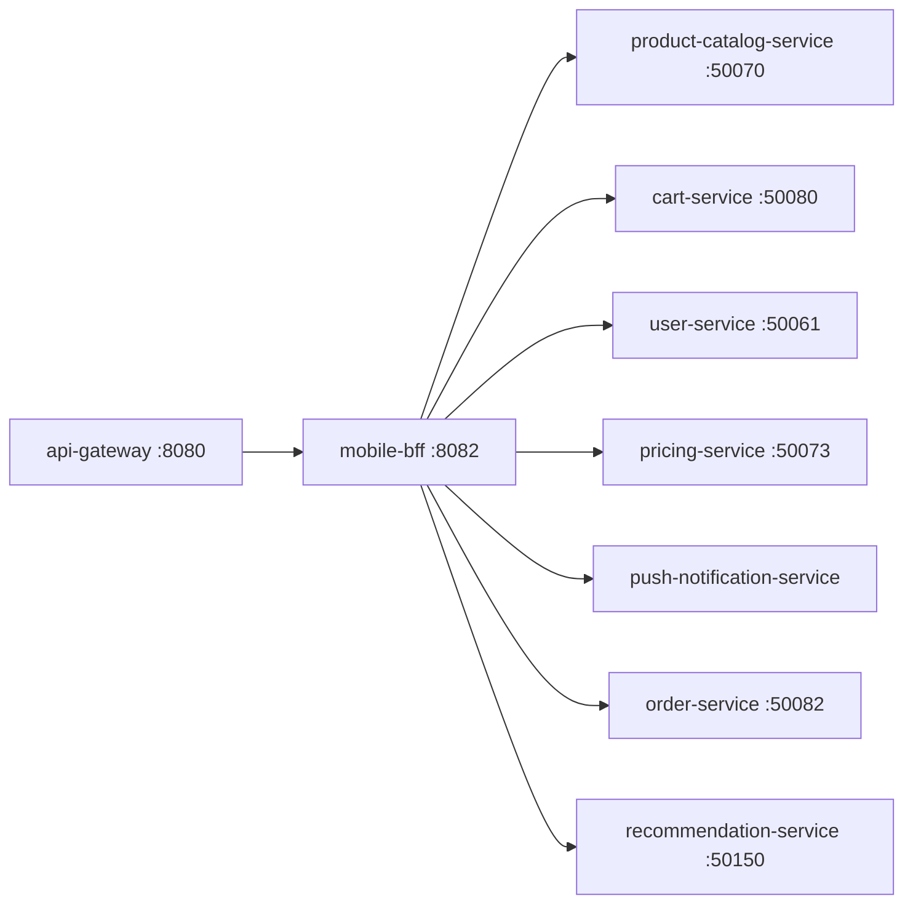

# Mobile BFF

> Backend-for-Frontend optimised for iOS and Android mobile clients.

## Overview

The Mobile BFF is a Node.js service purpose-built for mobile app consumers of the ShopOS platform. It delivers lean, bandwidth-conscious JSON payloads by stripping fields unnecessary for mobile views and compressing responses aggressively. It mirrors the same domain aggregation as the Web BFF but with mobile-specific endpoint shapes, reduced image resolutions, and offline-sync support hooks.

## Architecture



## Tech Stack

| Component | Technology |
|---|---|
| Language | Node.js |
| Database | — |
| Protocol | REST |
| Port | 8082 |

## Responsibilities

- Deliver mobile-optimised response payloads with minimal field sets
- Aggregate product, cart, user, and order data into single-fetch endpoints
- Serve lower-resolution image URLs for mobile bandwidth constraints
- Support offline-sync delta endpoints for incremental data updates
- Forward push notification device token registration to push-notification-service
- Handle mobile-specific pagination using cursor-based strategies

## API / Interface

| Method | Path | Description |
|---|---|---|
| GET | `/mobile/v1/feed` | Personalised home feed (products + banners) |
| GET | `/mobile/v1/products/:id` | Slim product detail optimised for mobile |
| GET | `/mobile/v1/cart` | Cart summary for mobile checkout flow |
| POST | `/mobile/v1/cart/items` | Add item to cart |
| GET | `/mobile/v1/account` | Minimal user profile for mobile header |
| POST | `/mobile/v1/devices/register` | Register device token for push notifications |
| GET | `/mobile/v1/orders` | Cursor-paginated order history |
| GET | `/healthz` | Health check |

## Kafka Topics

N/A — the Mobile BFF is a synchronous aggregation service and does not interact with Kafka directly.

## Dependencies

**Upstream** (services this calls):
- `product-catalog-service` (catalog) — product data
- `pricing-service` (catalog) — pricing data
- `cart-service` (commerce) — cart state
- `order-service` (commerce) — order history
- `user-service` (identity) — user profile
- `push-notification-service` (communications) — device token registration
- `recommendation-service` (analytics-ai) — personalised feed

**Downstream** (services that call this):
- `api-gateway` (platform) — routes mobile client traffic here

## Environment Variables

| Variable | Default | Description |
|---|---|---|
| `PORT` | `8082` | HTTP listening port |
| `CATALOG_SERVICE_ADDR` | `product-catalog-service:50070` | Address of product-catalog-service |
| `PRICING_SERVICE_ADDR` | `pricing-service:50073` | Address of pricing-service |
| `CART_SERVICE_ADDR` | `cart-service:50080` | Address of cart-service |
| `ORDER_SERVICE_ADDR` | `order-service:50082` | Address of order-service |
| `USER_SERVICE_ADDR` | `user-service:50061` | Address of user-service |
| `PUSH_SERVICE_ADDR` | `push-notification-service:4000` | Address of push-notification-service |
| `RECOMMENDATION_SERVICE_ADDR` | `recommendation-service:50150` | Address of recommendation-service |
| `LOG_LEVEL` | `info` | Logging level |

## Running Locally

```bash
# From repo root
docker-compose up mobile-bff

# OR hot reload
skaffold dev --module=mobile-bff
```

## Health Check

`GET /healthz` → `{"status":"ok"}`
