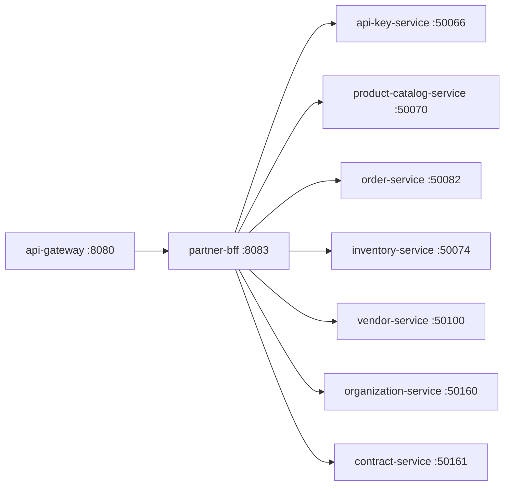

# Partner BFF

> Backend-for-Frontend for external partner and B2B API consumers.

## Overview

The Partner BFF provides a stable, versioned REST interface tailored for third-party integrators, marketplace partners, and B2B customers consuming the ShopOS platform programmatically. It aggregates data from catalog, commerce, supply-chain, and B2B domains while enforcing partner-level API key authentication and scoped data access. Response schemas are kept stable across platform refactors to avoid breaking partner integrations.

## Architecture



## Tech Stack

| Component | Technology |
|---|---|
| Language | Go |
| Database | — |
| Protocol | REST |
| Port | 8083 |

## Responsibilities

- Provide versioned, stable REST endpoints for partner system integrations
- Validate partner API keys via api-key-service before processing requests
- Aggregate catalog, inventory, and order data into partner-friendly payloads
- Enforce per-partner data scoping so partners only access their own records
- Rate limit partner API consumers in coordination with rate-limiter-service
- Translate platform-internal models into standardised partner API contracts

## API / Interface

| Method | Path | Description |
|---|---|---|
| GET | `/partner/v1/products` | List products available to the partner |
| GET | `/partner/v1/products/:id` | Product detail with stock levels |
| GET | `/partner/v1/orders` | Orders scoped to the partner's organisation |
| POST | `/partner/v1/orders` | Submit a new order on behalf of a B2B buyer |
| GET | `/partner/v1/inventory` | Inventory levels for partner-accessible SKUs |
| GET | `/partner/v1/contracts` | Active contracts for the calling partner |
| GET | `/healthz` | Health check |

## Kafka Topics

N/A — the Partner BFF is a synchronous aggregation layer and does not interact with Kafka directly.

## Dependencies

Upstream (services this calls):
- `api-key-service` (identity) — partner API key validation
- `product-catalog-service` (catalog) — product data
- `inventory-service` (catalog) — stock levels
- `order-service` (commerce) — order management
- `vendor-service` (supply-chain) — vendor/partner records
- `organization-service` (b2b) — B2B organisation context
- `contract-service` (b2b) — partner contract terms

Downstream (services that call this):
- `api-gateway` (platform) — routes partner traffic here

## Environment Variables

| Variable | Default | Description |
|---|---|---|
| `PORT` | `8083` | HTTP listening port |
| `API_KEY_SERVICE_ADDR` | `api-key-service:50066` | Address of api-key-service |
| `CATALOG_SERVICE_ADDR` | `product-catalog-service:50070` | Address of product-catalog-service |
| `INVENTORY_SERVICE_ADDR` | `inventory-service:50074` | Address of inventory-service |
| `ORDER_SERVICE_ADDR` | `order-service:50082` | Address of order-service |
| `VENDOR_SERVICE_ADDR` | `vendor-service:50100` | Address of vendor-service |
| `ORG_SERVICE_ADDR` | `organization-service:50160` | Address of organization-service |
| `CONTRACT_SERVICE_ADDR` | `contract-service:50161` | Address of contract-service |
| `LOG_LEVEL` | `info` | Logging level |

## Running Locally

```bash
# From repo root
docker-compose up partner-bff

# OR hot reload
skaffold dev --module=partner-bff
```

## Health Check

`GET /healthz` → `{"status":"ok"}`
