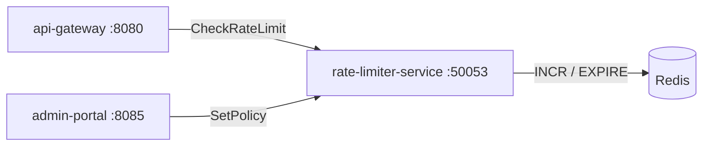

# Rate Limiter Service

> Sliding-window rate limiting per client, IP, and API key across the platform.

## Overview

The Rate Limiter Service protects ShopOS services from traffic spikes, abuse, and denial-of-service scenarios by enforcing configurable request quotas using a sliding window algorithm backed by Redis. The api-gateway consults this service on every inbound request to check and decrement client allowances. Limits are configurable per client ID, IP address, API key, and endpoint tier, allowing fine-grained throttling policies without code changes.

## Architecture



## Tech Stack

| Component | Technology |
|---|---|
| Language | Go |
| Database | Redis |
| Protocol | gRPC |
| Port | 50053 |

## Responsibilities

- Implement sliding window rate limiting using Redis sorted sets
- Enforce per-client, per-IP, and per-API-key quotas independently
- Support tiered limit policies (free, standard, premium) per client
- Return remaining quota and reset time in every response for client feedback
- Allow dynamic policy updates without service restart via admin API
- Track and expose per-client request counts as Prometheus metrics

## API / Interface

### gRPC Methods (`proto/platform/rate_limiter.proto`)

| Method | Type | Description |
|---|---|---|
| `CheckRateLimit` | Unary | Check and decrement quota for a client identifier |
| `GetQuotaStatus` | Unary | Retrieve current quota usage without decrementing |
| `SetPolicy` | Unary | Create or update a rate limit policy |
| `DeletePolicy` | Unary | Remove a rate limit policy |
| `ListPolicies` | Unary | List all active policies |

## Kafka Topics

N/A — the Rate Limiter Service operates synchronously and does not use Kafka.

## Dependencies

**Upstream** (services this calls):
- `Redis` — atomic counter storage for sliding window state

**Downstream** (services that call this):
- `api-gateway` (platform) — pre-request rate limit enforcement

## Environment Variables

| Variable | Default | Description |
|---|---|---|
| `GRPC_PORT` | `50053` | gRPC listening port |
| `REDIS_ADDR` | `redis:6379` | Redis server address |
| `REDIS_PASSWORD` | `` | Redis auth password |
| `DEFAULT_LIMIT` | `1000` | Default requests per window per client |
| `DEFAULT_WINDOW` | `60s` | Default sliding window duration |
| `LOG_LEVEL` | `info` | Logging level |

## Running Locally

```bash
# From repo root
docker-compose up rate-limiter-service

# OR hot reload
skaffold dev --module=rate-limiter-service
```

## Health Check

`GET /healthz` → `{"status":"ok"}`
