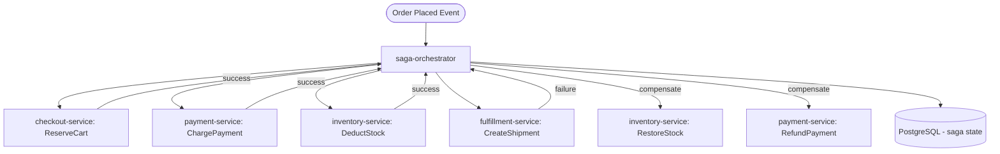

# Saga Orchestrator

> Manages distributed multi-step transactions across microservices using the Saga pattern.

## Overview

The Saga Orchestrator coordinates long-running distributed transactions that span multiple microservices — such as order placement, which must atomically involve checkout, payment, inventory reservation, and fulfillment. It persists saga state to Postgres for durability and drives each step by issuing gRPC commands to participant services, listening for outcome events on Kafka, and triggering compensating transactions on failure. This ensures eventual consistency without distributed locks or two-phase commit.

## Architecture



## Tech Stack

| Component | Technology |
|---|---|
| Language | Go |
| Database | PostgreSQL |
| Protocol | gRPC / Kafka |
| Port | 50054 |

## Responsibilities

- Define and execute saga workflows composed of ordered steps and compensations
- Persist saga instance state and step outcomes durably in Postgres
- Drive forward steps by calling participant services via gRPC
- Consume Kafka outcome events to advance or roll back saga state
- Execute compensating transactions in reverse order on step failure
- Expose saga status queries so the admin portal can inspect in-flight transactions
- Implement idempotency guards to handle duplicate event delivery safely

## API / Interface

### gRPC Methods (`proto/platform/saga.proto`)

| Method | Type | Description |
|---|---|---|
| `StartSaga` | Unary | Initiate a named saga with initial payload |
| `GetSagaStatus` | Unary | Retrieve current state of a saga instance |
| `ListSagas` | Unary | Paginated list of saga instances with filter |
| `RetrySaga` | Unary | Manually retry a stuck saga from its last failed step |
| `CancelSaga` | Unary | Abort a saga and trigger compensations |

## Kafka Topics

| Topic | Producer/Consumer | Description |
|---|---|---|
| `commerce.order.placed` | Consumer | Triggers the order saga workflow |
| `commerce.payment.processed` | Consumer | Advances saga after payment step |
| `commerce.payment.failed` | Consumer | Rolls back saga on payment failure |
| `supplychain.inventory.reserved` | Consumer | Advances saga after inventory step |
| `commerce.order.fulfilled` | Producer | Emitted when the saga completes successfully |
| `commerce.order.cancelled` | Producer | Emitted when the saga rolls back completely |

## Dependencies

Upstream (services this calls):
- `checkout-service` (commerce) — cart reservation step
- `payment-service` (commerce) — charge step
- `inventory-service` (catalog) — stock deduction step
- `fulfillment-service` (supply-chain) — shipment creation step
- `event-store-service` (platform) — optional event appending for sourcing

Downstream (services that call this):
- `admin-portal` (platform) — saga inspection and manual retry

## Environment Variables

| Variable | Default | Description |
|---|---|---|
| `GRPC_PORT` | `50054` | gRPC listening port |
| `DB_HOST` | `postgres` | PostgreSQL host |
| `DB_PORT` | `5432` | PostgreSQL port |
| `DB_NAME` | `saga_orchestrator` | Database name |
| `DB_USER` | `shopos` | Database user |
| `DB_PASSWORD` | `` | Database password (required) |
| `KAFKA_BROKERS` | `kafka:9092` | Comma-separated Kafka broker addresses |
| `KAFKA_CONSUMER_GROUP` | `saga-orchestrator` | Kafka consumer group ID |
| `LOG_LEVEL` | `info` | Logging level |

## Running Locally

```bash
# From repo root
docker-compose up saga-orchestrator

# OR hot reload
skaffold dev --module=saga-orchestrator
```

## Health Check

`GET /healthz` → `{"status":"ok"}`
