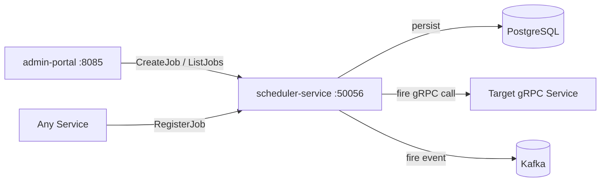

# Scheduler Service

> Cron-style distributed job scheduling for time-triggered platform tasks.

## Overview

The Scheduler Service provides a durable, distributed cron scheduler for the ShopOS platform, enabling any service to register time-triggered jobs that fire reliably even across pod restarts and cluster disruptions. Job definitions, schedules, and execution history are persisted in Postgres. When a job fires, the service calls a configured gRPC endpoint or emits a Kafka event, making it the central clock for recurring platform operations such as report generation, cache refreshes, and subscription billing cycles.

## Architecture



## Tech Stack

| Component | Technology |
|---|---|
| Language | Go |
| Database | PostgreSQL |
| Protocol | gRPC |
| Port | 50056 |

## Responsibilities

- Store and evaluate cron expressions for registered jobs
- Trigger job execution by invoking configured gRPC endpoints or publishing Kafka messages
- Ensure at-most-once delivery through distributed locks during the fire window
- Persist execution history and outcomes for auditing and alerting
- Support one-time scheduled jobs (fire-at) alongside recurring cron jobs
- Expose pause, resume, and manual trigger controls for operational flexibility

## API / Interface

### gRPC Methods (`proto/platform/scheduler.proto`)

| Method | Type | Description |
|---|---|---|
| `RegisterJob` | Unary | Register a new cron or one-time job |
| `UpdateJob` | Unary | Modify a job's schedule or target |
| `DeleteJob` | Unary | Remove a scheduled job |
| `TriggerJob` | Unary | Manually fire a job immediately |
| `PauseJob` | Unary | Suspend a job without deleting it |
| `ResumeJob` | Unary | Resume a paused job |
| `ListJobs` | Unary | Paginated list of all registered jobs |
| `GetJobHistory` | Unary | Execution history for a specific job |

## Kafka Topics

| Topic | Producer/Consumer | Description |
|---|---|---|
| `platform.scheduler.job.fired` | Producer | Emitted when a job is triggered via Kafka dispatch mode |

## Dependencies

**Upstream** (services this calls):
- `PostgreSQL` — job definition and execution history storage
- Kafka — event delivery for Kafka-mode job dispatch
- Target gRPC services — called directly for gRPC-mode job dispatch

**Downstream** (services that call this):
- `subscription-billing-service` (commerce) — registers billing cycle jobs
- `reporting-service` (analytics-ai) — registers scheduled report jobs
- `admin-portal` (platform) — job management UI

## Environment Variables

| Variable | Default | Description |
|---|---|---|
| `GRPC_PORT` | `50056` | gRPC listening port |
| `DB_HOST` | `postgres` | PostgreSQL host |
| `DB_PORT` | `5432` | PostgreSQL port |
| `DB_NAME` | `scheduler_service` | Database name |
| `DB_USER` | `shopos` | Database user |
| `DB_PASSWORD` | `` | Database password (required) |
| `KAFKA_BROKERS` | `kafka:9092` | Comma-separated Kafka broker addresses |
| `LOCK_TTL` | `30s` | Distributed lock TTL for job fire window |
| `LOG_LEVEL` | `info` | Logging level |

## Running Locally

```bash
# From repo root
docker-compose up scheduler-service

# OR hot reload
skaffold dev --module=scheduler-service
```

## Health Check

`GET /healthz` → `{"status":"ok"}`
